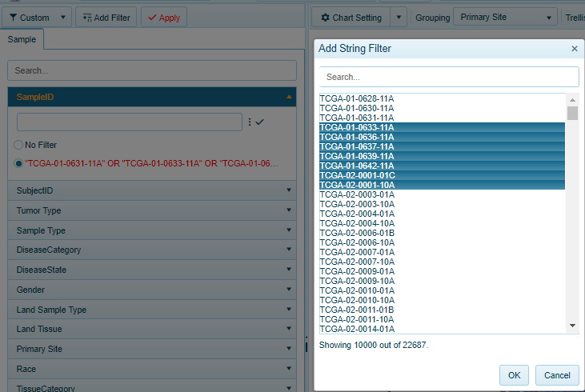
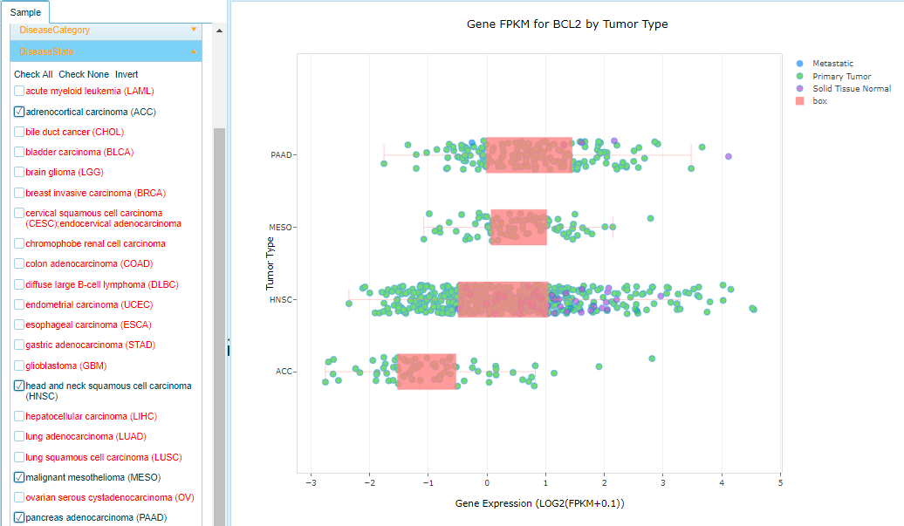
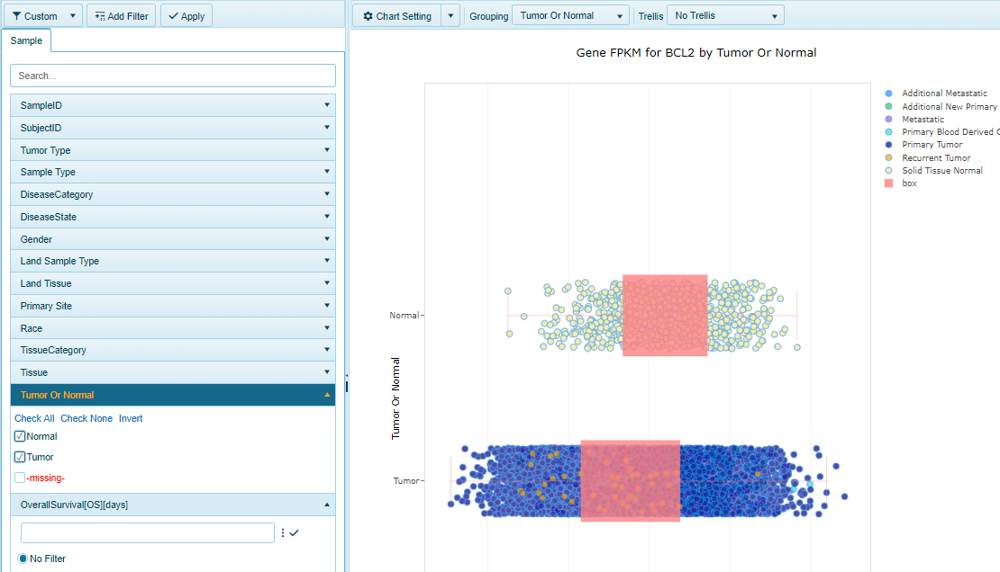

# Filtering Samples using the Metadata

There are a number of views in which users can apply filtering at the Sample level using metadata attributed to the samples. The Land Explorer will display 10-15 (at most) of the most commonly used metadata for users to filter their samples. Additional filters can be added by the user to dig deeper into the data [Add Filters](../../Using Land Explorer/Filters/Filters.md#available-filters) This page will describe some of the key metadata that exists in the Land commonly used for filtering samples.

## Sample ID

## Subject ID (Subject Treatment)

## Tumor Type

Within the OncoLand Collection, and specifically within TCGA, tumor abbreviations are used to group the samples in the Land by default.

## Sample Type

## Disease Category

## Disease State

## Land Sample Type

## Land Tissue

## Primary Site

## Race

## Tissue Category

## Tissue

## Tumor Or Normal

