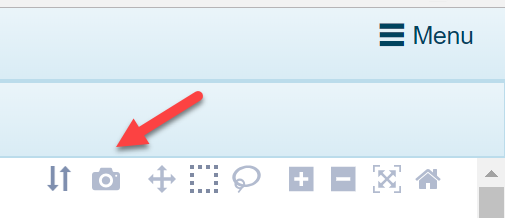

# Generate View Link

## Share View with others

Once a user creates an interesting visualization that they would like to share with colleagues, there are a couple of options to share this data. The user can simply export the view using the buttons on the upper right of the screen:

Alternatively, by clicking on Menu --> Generate View Link:

A user can create a hyperlink that can be shared to other users with access to the Land Explorer. The link will be copied and pasted to the clipboard and can be shared instantly. This a particularly useful option to provide someone that may want to further customize the visualization, but without having to filter down to the samples of interest.

## Customized View Generation

The link created through the option described above (Generate View Link) also can function as a way for users to generate a landing page that is pre-filtered to the samples, view and grouping they would like to use.

For example, the partial link below contains information related to Land, Gene, View, Grouping and Filters:

MainPage?**landName**=HumanDisease_B37&**geneID**=il6%2C&
**viewID**=RnaSeq_Transcript.GeneVariable&
**grouping**=DiseaseState&**trellis**=No+Trellis&
**filters**=Sample%7CDiseaseCategory%7Carthritis%0D%0Anormal+control

The resulting view will reflect all the customizations performed by the previous user:

If this user (or another user) wants to recreate this view, but for say another gene, the link can be modified to change the **geneID** in the link above. Alternatively, you can simply search the alternate gene name in the view that appears when you use the previous link.
