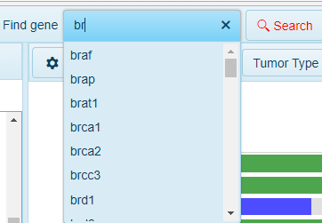
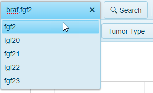
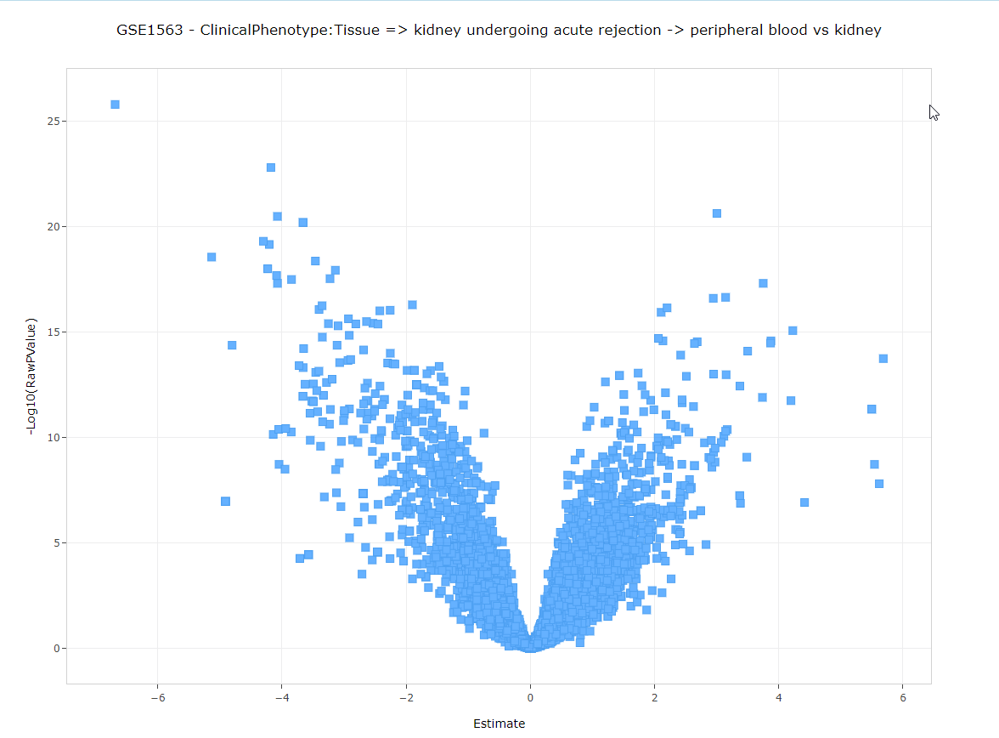

# Search Bar

The Search Bar at the top of the Land Explorer page can search a number of things within the Land:

The search bar is interactive and dynamic. Entering the first 2-3 characters in a search will automatically populate results in the search bar:

 

Within the search bar, users can search:

## Gene

The most common search item in the search bar is a gene search. Typing in the gene name, users can find entries that match the gene of interest and click. Afterward, the Search button will change font color to red. Clicking on the Search button will take users to the default gene-level view (usually [Gene FPKM](../../Land Views/Gene Level Views/RnaSeqQuantification.md#Gene FPKM View)):

## Multiple Genes  

Users can search additional genes in the search bar (with options becoming available for each additional search as well):

## Comparison

Another search users can perform to quickly identify a comparison of interest, is to search for a specific GSE accession number. In the example below, searching GSE1563 populates the search bar drop-down with 10 comparisons that were performed for this study within HumanDisease_B37:

Clicking on any of these comparsions will take you to a [Volcano Plot](../../Land Views/Comparison Level Views/Volcano_Plot.md) view:

