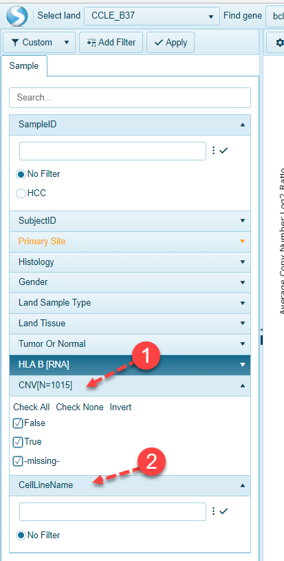

# Sample Filters

## Sample filters in Land Portal

All Samples, Comparisons, and Projects within OmicSoft Land's are associated with extensive metadata, which can be used to filter Land data to find the samples users are interested in.

Basickly, there are two types of sample filters users could apply to Land data, String filters, or check box options.

### Apply String filter to Sample IDs in Land Portal

In CCLE_B37 Land Portal, string filters could be used on Sample IDs, and Subject IDs, as shown in the demo, after applying "HCC" as the filter, only sample IDs started with "HCC" will show up in the scatter plot. After selecting all the data dots in the scatter plot, detail information about these samples could be found in the data table.

### Apply Check Box filter to Primary Sites in Land Portal

Check Box options are available for Primary Site, Histology, Gender, Land Sample Type, Land Tissuee, and Tumor Or Normal categories. As shown in the demo screenshot, after checking 5 primary sites, the samples with corresponding primary sites are shown in the scatter plot.

## Add filters based on Meta Data and/or Data Aviailability

Extra filters could be added to the Sample Filter options, for example, after adding **CNV** and **CellLineName**, two extra filters showed up under **Sample** tab, one string filter and one Check box filter:

