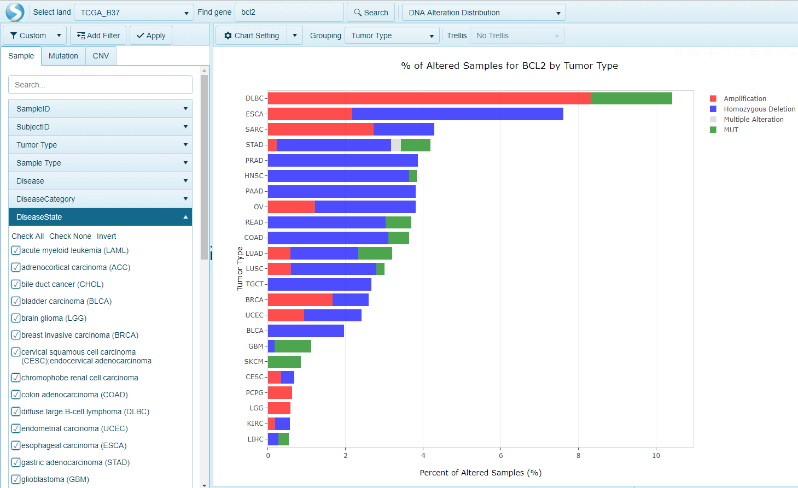

# Alteration Distribution

## DNA Alternation Distribution View in Land Portal

Alteration distribution view shows alterations of all genes searched in the current view, limited to DNAseq alterations (mutations and copy number).

There will be one bar for each combination of Group (e.g Tumor Type), gene and alteration type (mutation or CNV).

Samples will be colored by alteration type (mutation, amplification, deletion, multiple alteration). Summary information (% samples mutated) will also be given. By default, Alteration.Omicprint and Alteration.Distribution are using GISTIC2 calling method with only "Amplification" and "Homozygous Deletion" checked. Multiple alteration represents more than one type of alteration type in the sample.
