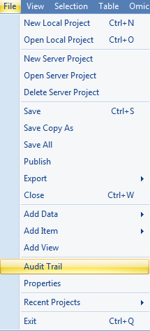
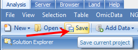

# Audit trail

*Array Studio* tracks all analysis steps done in a project, using its *Audit Trail* feature. This is important for many company s data integrity needs, and can also be used by the individual users to see what types of changes and procedures were made to the project and to rerun the exact analysis ran previously. To see the audit trail for the MicroArray tutorial project, go to **File Menu | Audit Trail** to open the *Audit Trail* window.

The *Audit Trail* can be accessed using the *File | Audit Trail* option. Open the *Audit Trail* window now.

The *Audit Trail* window contains two tabs: **List** and **All Scripts**.

The *List* tab shows a step-by-step list of everything that was performed. Clicking on an individual step shows the **OmicScript** for that step at the bottom. The *OmicScript* specifies input data and options that Array Studio needs to run the module. The *List* can be exported using the **Export List** button or the **Save All scripts** button.

Notice that for each step, an optional **Description** can be entered to describe what was done at that step and other comments.

Selecting an item in the List will provide the details for the script and also activate the **Run Script** button at the bottom of the window to allow the user to quickly rerun any script in the Audit Trail.

Switch to the **All Scripts** tab to view all the scripts of actions and changes made to your *Project*. It can also be exported at any time.

Notice that in the *Script* below that first a new project was created, followed by importation of Affymetrix CEL files and MAS report generation, etc.

Click **Save** button to save the current project. Close the *Array Studio* software by clicking on the red button on top right of the window or go to *File* *Menu* *| Close*.

 Congratulations! You are done with the analysis. You can reopen this project later on to get back to the same state as you saved. This includes all views, filters, analyses, etc.

**Thank you for** **using** **Array Studio.**

**Please contact Omicsoft Support (** support@omicsoft.com  **) or Omicsoft Sales (** sales@omicsoft.com  **) for sales-related questions.**
