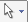
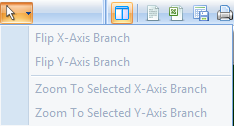
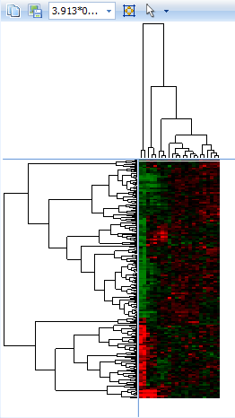
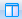
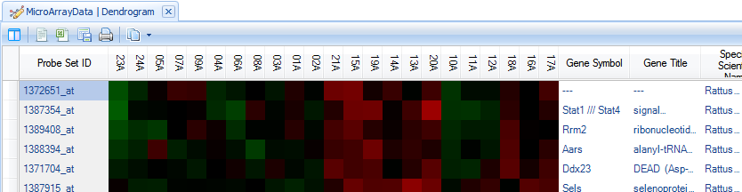
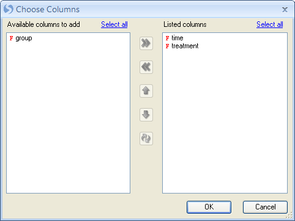
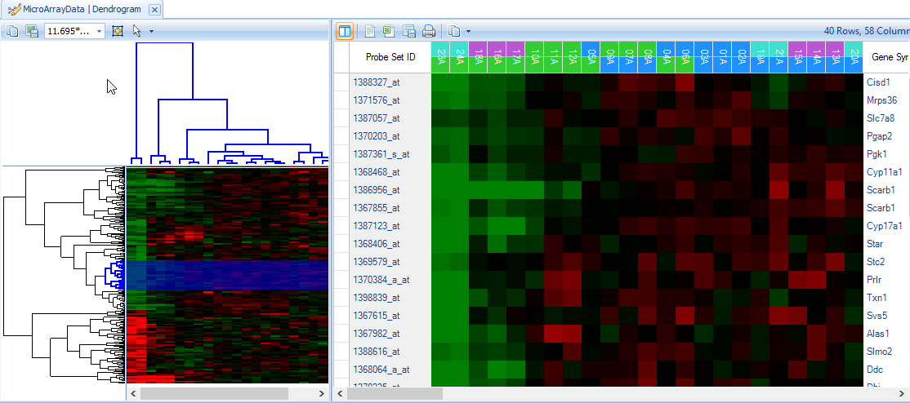
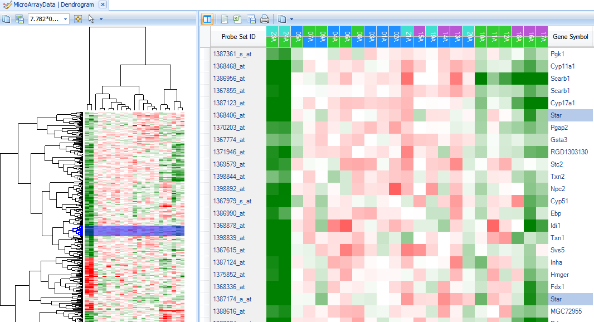
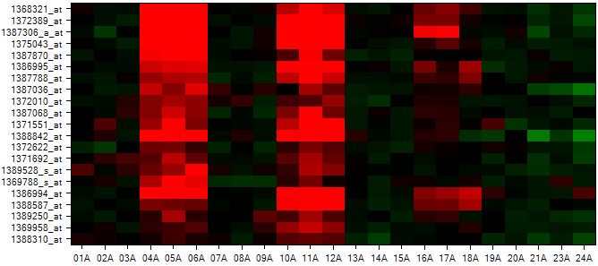

# Data Exploration

Array Studio has the ability to perform further analysis on a list or lists of genes. It has the ability to upload pathways and lists to Ingenuity Pathway Analysis (IPA),  as well as to check gene ontologies and find out if any significant ontology exists. IPA requires the user to have an account so that it is not covered in this tutorial.

## Hierarchical clustering

Hierarchical clustering can provide an overview of the data, and can easily be performed in Array Studio. Go to the **OmicData | Pattern** menu. The **OmicData | Pattern** menu contains a number of different pattern detection techniques that can be used in Array Studio. This includes *Find Neighbors, Correlate Covariate, Hierarchical Clustering, NMF Clustering, Cluster Variables, Cluster Observations*, and *Gene Shaving*. *Cluster Variable and Cluster Observations* include PAM, CAST, K-means, and SOM for clustering algorithms.

*Array Studio* can handle (with a regular computer) *Hierarchical Clustering* up to 30,000 variables in a few minutes. In comparison, the popular gene clustering program from Eisen, Gene Cluster, can only cluster up to 9,999 variables.

For the purposes of this tutorial, we will cluster the already created List, *18 -> DBP vs control.Sig296*, as an example.

In the Microarray *Workflow*, select **Hierarchical Clustering**, or go to the **OmicData | Pattern | Hierarchical Clustering** to open *Hierarchical Clustering*.

   

Once the *Hierarchical Clustering window* opens, ensure that *MicroArrayData* is selected under *Input/Output | Data*.

Next, ensure that the *18 -> DBP vs. Control.Sig* 296 is selected so that only probesets in this list are used for clustering (*Customized Variables*). Ensure that *MicroArray Data.Observation23(23)* is selected under *Customized Observations*, excluding the outlier filtered out by PCA.

Under *Options* , ensure that *Compute Observation tree* and *Compute variable tree* are both selected. Array Studio gives the option of only clustering the observations, variables, or both. Both the observation tree and the variable tree contain options for *Link* and *Distance* for the clustering. *Link* includes options of *Ward*, *Single*, *Complete*, *Average*, *Mcquitty*, *Median*, and *Centroid*. *Distance* includes options of *Euclidean*, *Maximum*, *Manhattan*, *Canberra*, *Binary*, *Pearson* (uncentered correlation), and *Correlation*.

*Link Options*

*Distance Options*

*Generate classic dendrogram view* will generate the dendrogram view in the old Array Studio 1.0 format. Uncheck this box as the new improved dendrogram viewer is preferred by most users.

---
!!! note
    for correlation distance, there is no need to normalize the data.
---

Click *Submit* to begin clustering. This process should take approximately 3 seconds.

A new view will be generated in the *Solution Explorer*, called *Dendrogram*.

There are two visible windows in this *View*. The left window contains the dendrogram, while the right window contains a zoomed-in view of the dendrogram.

If the entire cluster is not visible in the left window, there are two options. First, the window size can be adjusted by dragging in between the left window and the right window.

More conveniently, the pixel size can be automatically adjusted using the toolbar at the top of the left window

Use either the pixel size dropdown box (x*y)

or clicking the **Fit Dendrogram to Window**  button.

The  button provides other options for viewing the dendrogram

Click the *Fit Dendrogram to Window*  button now. Resize the left window and click the  button again if the data looks too small or distorted. When finished, the left window should look similar to below.

The left window view (heatmap thumbnail with dendrogram) is linked to the right window view. Clicking on a branch of the dendrogram will bring those specific rows and observations up in the right window. Branches on both the Y-axis and X-axis can be clicked on, individually and together.

Click on a small branch in the left window (Y-axis). Note that the branch, when selected, turns to blue color.

Now notice the right hand window. The right hand window contains a *HeatmapTableView* of the rows (probesets) selected in the left hand dendrogram view.

Initially, all the columns will not be visible in the view . If necessary, shrink the column widths so that all columns are visible by grabbing between two columns on the header row and shrinking the column.

It may also help to hide the left hand window by clicking the **Hide Thumbnail**  button on the toolbar.

Notice that scrolling to the right shows the annotation for each probeset.

To change the annotation columns displayed, click the **Specify Annotation Columns** button in *View Controller | Task | Data*.

Next, use the *Change ColorBars* under **View Controller | Task | Customize** **| Change ColorBars** to open up a window for selecting columns for color bars.

 Choose *time*, then *treatment* to create color bars on that heatmap. Click *OK* to continue.

Notice that the ColorBars appear over the heatmap to label different Time and Treatment groups.

To view the legend, switch the *View Controller* to the **Legend** tab. Notice that *Time and Treatment* are separated on the legend for each viewing. Click on **with border** or **without border** to switch the status of copied legend (whether to have border). Click on **Copy Legend** to copy the legend.

Note: Right-clicking on anything in the Legend colors will allow the user to change colors for the chart or the color bars.

Sometimes the user might want to find a particular probeset or gene in the dendrogram, in order to see other genes clustered around it. To do this, first re-expand the left window thumbnail view using the *Show Thumbnail*  button. Expand the left-window so that it splits about half the screen with the right-hand heatmap window. If necessary, click the *Fit Dendrogram to Window*  button in order to see the entire dendrogram.

Using the *Select* button on the main toolbar, type the gene name **Star** and change the dropdown box to the **Gene Symbol** selection, and then press Enter.

This ensures that Array Studio will select *Star* in the column *Gene Symbol*.

Click select by clicking on the binoculars button  .

Notice that in the left-hand dendrogram thumbnail view, two lines have been selected towards the middle of the dendrogram (indicated by the blue selection lines)

In the right-hand heatmap view, only the probesets containing **Star** in *Gene Symbol* are now shown.

 To see those genes found around Star in the Dendrogram, click on a branch of the dendrogram near the blue selection line.

On the right panel, scroll until the *Star* probeset is found, and notice the genes that are similar in pattern to *Star*.

In particular, it appears that the genes *Scarb1, Cyp17a1, and Stc2* cluster around *Star*, as well as others.

As the last step in hierarchical clustering, the user can choose to change the coloring scheme of the heatmaps. This is accomplished by clicking **Change Color Properties** in the *View Controller | Task* tab.

Click on the **Middle value color** and change it to white.

 Close the *Color Properties* dialog and notice the heatmaps are instantly updated.

## Pattern Matching (Find Neighbors)

Array Studio includes a number of pattern detection modules and we will discuss one of them, **Find Neighbors**, which allows the user to find neighbors for a variable or an observation based on correlations. By default, the currently selected variable or observation (if multiple variables or observations are selected, the first one) will be used as the input for this module, and the user can easily change that input.

The *Find Neighbors* module can be run by clicking on the **Find Neighbors** in the **Microarray Workflow | Pattern recognition**, or by going to the **OmicData Menu | Pattern | Find Neighbors**. Now click *Find neighbors* to open this module.

This opens the *Find Neighbors* dialog window:

*   Under the *Input/Output* section, the user has an option for *Project* and Data (Choose     *Tutorial MicroArray* and *MicroArray Data* now).

*   Ensure that all variables are selected under the *Variables* section.

*   The user can choose to *Find Neighbors* using the data in a specific list of samples. Choose the *List MicroArray Data.Observation23* to only run the *Find Neighbors* module on the 23 chips in the *List* (with outlier 22A removed).

*   Leave the **Output name** blank and allow Array Studio to assign the default name.

*   For the *Options* section, type **1368321_at** into the *Find neighbors for* text box.     This is the probeset for **Egr1**, and had this probeset been selected in the view prior to opening this window, Array Studio would have selected it by default. Instead, the top probeset on the selected list was the default option.

*   Ensure that **Variable** is selected (this module can work on observations as well).

*   **Correlation method** contains options for *Pearson*, *Spearman*, and *Kendall* correlations. Ensure that *Pearson* is selected.

*   **Correlation direction** allows the closest neighbors to be found for Positive, Negative, or both directions. Positive is the default option.

*   Array Studio includes the option to either search for a fixed number of neighbors or by a p value cutoff of the correlations. For this practice, ensure that **Fixed neighbor number** is selected and type **20** into the box. If specified a cutoff for **With P-value <,**     correlation test pvalues will be used to search the neighbors.

*   Array Studio allows the user to either output a **HeatmapView** for the *Find Neighbors* or a **ProfileView**, which can be specified in **Output view**. Ensure that *HeatmapView* is selected now.

Click *Submit* to continue.

In the *Solution Explorer*, a new *Omic data* named **1368321_at.Neighbors** is created under the **Pattern** folder. Two new views are created (**Neighbors** a *HeatmapView* and **Table**  a *TableView*).

A *HeatmapView* entitled Neighbors is shown by default in the *view window*. If the window does not appear as below (no rows shown), ensure that no filters are set in the *View Controller | Variables* tab by clicking the **Clear All** **Filters**  button in *View Controller*.

While interesting, the above view is not all that useful without color bars to indicate the classification of each chip. This can be accomplished using the **Change X-Axis ColorBars** item in **View Controller | Task | Customize** tab. Click *Change X-Axis ColorBars* now to open the *Choose Columns* window.

Move *treatment and time* to the right-hand *Listed columns* section to create color bars for each column. Click *OK* to continue.

The heatmap is updated to include the color bars.

In order to get a better idea of the pattern, we need to order the heatmap columns in a reasonable way. Click **Sort Heatmap columns** in **View Controller | Task | Data**.

First sort by *time* then sort by *treatment*.

 

Now the heatmap columns are sorted appropriately as can be seen from the color bars.

Choose the **Legend** tab in the *View Controller* to view the legend for the chart.

The chart can be opened in PowerPoint at any time using the *Open Current View in PowerPoint* or *Open All Charts in PowerPoint* button.

Besides just showing the *Probeset ID*, the chart can also show additional columns of annotation.

Click **Change Y-Axis Labels** in **View Controller | Task | Customize** now to open the **Choose Columns** **window**.

Move *Gene Symbol* to the *Listed columns* section and click *OK* to continue.

The chart is updated, now showing the *Gene Symbol* instead of *Probeset ID*.

## Gene ontology analysis

Array Studio provides an internal gene ontology analysis. The gene ontology analysis takes lists of probesets and, using online Gene Ontology annotation, reports back the number of probesets found in each of the classes with the given ontology. This can be used, for example, to figure out if a particular class within ontology is over-represented in a particular treatment.

*Gene Ontology* analysis can be found in the **OmicData Menu | Annotation | Gene Ontology**. This opens the *Gene Ontology Classification Window*.

The *Gene Ontology Classification* window contains a number of options.

*   First, select the *Project* and *Data* to be used for classification (choose *Tutorial MicroArray* and *MicroArray Data*).

*   Next, choose **Lists for classification**. In this case, we are interested in comparing the four estimates (*1 ->DBP vs control*, *3 -> DBP vs control*, *6-> DBP vs control*, *18 -> DBP vs control*). Choose these lists now and click **OK**.

*   Choose **GO term columns**: because the user may choose to import customized annotation, the possibility exists that the user may wish to specify the columns that contain gene ontology terms. By default, Array Studio imports 3 columns of annotation with gene ontology terms. Array Studio automatically recognizes that **Gene Ontology Biological Process**, **Gene Ontology Cellular Component**, and **Gene Ontology Molecular Function** all contain GO terms. Ensure that all 3 columns are selected.

*   Set the level of classification using the **Classification level (0-6)** box. The higher the level (6 being the highest), the more specific the GO classification. For instance, Level 0 is the least specific, and will have general categories of *Biological Process*, *Cellular Component*, and *Molecular Function*. On the other hand, level 6 will be extremely specific, for instance: cyclooxygenase pathway and GTP cyclohydrolase activity. For this exercise, leave the *Classification level* set to 3. This is the default setting, and may prove to be the most interesting for most practices.

*   **Biological process**, **molecular function**, and **cellular component** checkboxes are provided if the user wishes to only specify a specific type of gene ontology. Many times customized annotations will include all three types in one column of annotation, and thus these checkboxes are provided for such cases. Leave all three checkboxes selected for this tutorial.

*   Gene ontology is constantly being updated. This box **Update frequency (days)** sets the frequency that Array Studio should check for new ontology information. By default, this is set to 30 days. When run, if Array Studio has downloaded new annotation in the past 30 days, it will skip the download step and immediately begin classifying the lists.

*   If users check the **Calculate p-values (assumes variable independence)**, the software     will calculate a p-value for each GO category. This is based on Fisher s Exact Test, and it     assumes variable independence. Check this box now.

*   The **Choose Universal List** dropdown box is active only when *Calculate p-values* is selected. It can be used to choose the **Universal List** used for a Fisher's Exact Test.     For instance, the user may choose to use the entire chip (all) for calculating of p-values, or only look at a list of probesets of interests.

*   The **Multiplicity** dropdown box is active only when *Calculate p-values* is selected.     It can be used to set the multiplicity adjustment for the Fisher s Exact Test, and contains the standard multiplicity adjustment types found elsewhere in Array Studio.

Click **Submit** to continue.

If the gene ontology has not been updated or it has been more than 30 days old (true for all first-time users of Array Studio), the gene ontology will be updated first, and then the module will run.

When finished, a new *Table*, titled **MicroArrayData.GeneOntologyReport** is created in the *Solution Explorer* under the **Ontology** tab, and the *Table* view is opened in the center *Data View* window.

---
!!! note
    *Note:* Due to the constantly updating nature of the Gene Ontology database, the number of rows in the example shown below and the number of rows when the user runs the tutorial may differ. This is expected.
---

The *Table* contains 10 columns. The first column contains the category (the gene ontology), the second column contains the GOTerm, with the other columns containing the number of probesets, in each list or universal list [all], belonging to each category and the corresponding Fisher Exact test p-values.

As in all *views* in Array Studio, details can be provided on demand and are fully interactive. Clicking on a particular cell, for instance, in *3 -> DBP vs control*, actin filament-based process, will provide inference report details about the probesets contained in that category in the *Details Window*.

Details for multiple cells can be obtained by holding "Shift" or "Ctrl" buttons and selecting multiple cells.
