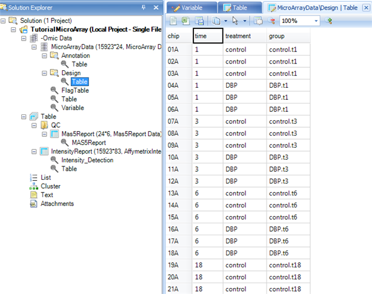
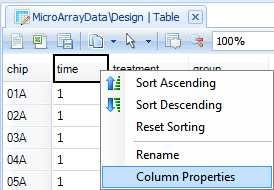
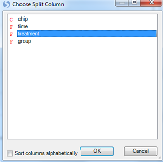
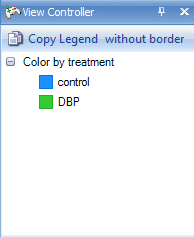
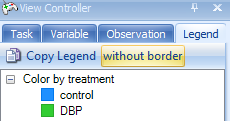
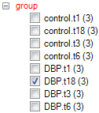
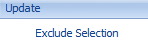

# Data Visualization and Quality Control

*Array Studio* contains a large collection of visualizations and Quality Control (QC) modules for MicroArray Data. Two commonly used visualizations and one quality control method are described in this chapter.

## The VariableView

Once a dataset has been imported, one of the first tasks for a user might be to visualize the results of a particular gene or genes. This can be accomplished in a number of different ways in *Array Studio*, but the most unique way is *VariableView*.

The *VariableView* allows the user to visualize one chart for each variable in the dataset. So, for this dataset, there will be 15,923 charts available for visualization. However, this view can be used to visualize millions of variables.

To add a *VariableView*, go to the *Solution Explorer*. For the **MicroArrayData** dataset, right-click on **MicroArrayData** and select *Add View* from the dropdown box.

Alternatively, click **Add View** from the toolbar.

This opens the *Add View* window, which lists all the different types of views available for a *Data* object.

Choose *VariableView* from the *Choose View Type* box. Notice that a preview of the view is shown in the *Preview* box. Click *OK* to add the view.

After adding it, a new view will appear in the main view window. In addition, this new view will appear in the *Solution Explorer*, as shown below.

Scroll through all 15,923 charts in the *VariableView* to see that *Array Studio* can easily handle the visualization for all the variables in the dataset.

On the X-Axis, each of the 24 chips are shown, while the Y-Axis represents the intensity values (values are log2 transformed). Each point on the chart represents the intensity value of that chip for that variable (probeset).

However, the power of the *VariableView* lies in its ability to be customized. By itself, the view picture below is somewhat non-informative. Unless the user knows what group each chip belongs to, and what gene each probeset represents, further customization is required.

The *Task* tab in the *View Controller* of the *VariableView* (pictured below), will be used to customize this view. The first step in customizing the view is to start from the top of the *Task* tab and work downwards, completing the customization. In the *Data* section of the *Task* tab of the *View Controller*, click **Specify Title Columns** now.

This opens the *Specify Title Columns* window:

This window allows the user to specify which columns from the attached *Annotation table* should be used to identify each chart. Scroll through the *Available columns* to find *Gene Title* and *Gene Symbol* . Move these two columns to the *Listed columns* box, so that *Probe Set ID, Gene Title, and Gene Symbol* are all listed. Click *OK* to continue.

Notice that the charts have been updated to reflect the additional title information, from the *Gene Title* and *Gene Symbol* columns ( if there is no associated gene for a probe set, the fields show up as "-,-").

For the purposes of this tutorial, go to the *Variable* tab of the *View Controller*, and once again filter *Gene Symbol*, using **^EGR1$** as the filter, as shown below. Note: All of the customizations performed on this view will apply to all variables, however we will concentrate on visualizing **EGR1** for demonstration purposes.

 

Notice that the view is now updated to reflect the filter, and only shows one chart. The number of charts currently visible is shown directly above the view.

Now go back to the *Task* tab of the *View Controller*.

The next step is to **Specify Profile Column** . This allows the user to group the data points by a particular column of the *Design Table*. Remember, the *Design Table* contained columns for *Time, Treatment* , and *Group* . So, theoretically, it might be good to specify profile column as *Group* . However, looking ahead one step, notice that there is another option, called **Specify Split Column**. This allows the user to split their grouping twice, and is what will occur in this case.

Clicking **Specify Profile Column** opens the *Choose Profile Column* window. Choose *time* and click *OK*.

The chart is updated so that each *time* is shown on the X-Axis. However, notice that the X-Axis does not look quite right. *Time*, in this case, should be a category, rather than a numeric value.

 

*Array Studio* has parsed the *time* column as a numeric value, whereas the intended use was that of a *Factor*.

This can be changed by editing the column type for the *time* column in the *Design Table*.

To do this, first open the *TableView* for the *Design Table* by expanding the **Design** node of the Microarray dataset, and double-clicking on the *Table* for the *Design*. The main view window is updated to show the *Design Table*

Right click on the *time* column, and choose *Column Properties* (this can also be accessed by going to the **Table Menu | Columns | Column Properties**.

In this window, properties can be set for each column in the *Design Table*. Click on the *time* column, and then change the *Column Type* from *Integer* to *Factor*, as shown below.

Close the window when finished.

Switch back to the *VariableView* by clicking the tab in the main view window

or by double-clicking on it in the *Solution Explorer*.

Notice that the view is automatically updated, and that the X-Axis now uses a category scale, so that the 4 time points in the experiment are laid out in order along the X-Axis.

Now click **Specify Split Column** from the *Task* tab of the *View Controller*. This opens the *Choose Split Column* window.

The purpose of the *Split Column* is to further split the data, so that each *Profile Column* is split by the *Split Column*. Thus, for this tutorial, each time point will be split into the two levels of treatment (DBP and Control).

Click *OK* to return to the chart.

The *VariableView* is updated to reflect the splitting of the data. Notice that for each time point, there are now two colors (green and blue). To find out what the colors represent, go to  *View Controller*.

Note that the blue color represents the control group, the green color represents the DBP treatment group.

The user can always open the charts in PowerPoint by clicking the **Open in PowerPoint** button in the main view window, above the chart. The number of charts that can be opened is determined by the maximum number of slides allowed in a single PowerPoint file.

Click the **Open in PowerPoint** button now, and then select **Open Current View in PowerPoint**. This will open the view, along with the legend, in PowerPoint. *Note:* if the user already has a PowerPoint presentation open, *Array Studio* will prompt the user as to whether it should create a new presentation, or append the chart to an older presentation.

The color of the legend (or shapes, fill properties, etc..) can be changed in the *View Controller* by right clicking on items.

The *Task* tab of the *View Controller* can be used to further customize the *VariableView*.

Select the Task tab, and click the **Specify Transformation** option to open the *List* window. This window will specify the type of transformation that is performed on the values shown in the chart. By default, no transformation is performed on the values. However, because the values are Log2 transformed, the user may wish to see the un-logged values. Select *Exp2* to un-log the data.

Click *OK* to return to the *VariableView*.

Notice the scale is now an unlogged (linear) scale.

There are a number of further customizations that can be done to the chart, so Omicsoft encourages the user to try some of the customizations on their own.

But first, click the **Change Profile Gallery** button, in the *Customize* section of the *Task* tab of the *View Controller* to open the *Change Profile Gallery* window.

The *Change Gallery* window allows the user to specify the type of gallery shown for the *VariableView*. By default, the view we have been looking at so far is *Scatter*. Other available options include *Line, Scatter, LineScatter, Bar, BoxPlot, DotPlot, RBoxPlot*, and *ColorBar*.

Choose *Bar* now and click *OK* to return to the *VariableView*.

The chart is updated to show a mean summarization, via a bar graph, of each group, as shown below. The user may be interested to know that the type of summarization can be changed by selecting **Specify Mean Summarization** in the *Data* section of the *Task* tab of the *View Controller*.

Error bars can be shown for each bar on the chart, by selecting **Show Error Bars** from the *Customize* section in the *Task* tab of the *View Controller*.

Select this now, and notice that the chart is updated to reflect the error bars. The type of error bar summarization can also be changed by selecting **Specify Error Summarization** in the *Data* section of the *Task* tab in the *View Controller*. The bar graph can be further customized using the customizations in the *Task* tab of the *View Controller*. For example, to better visualize the error bars, select **View Controller | Task | Properties | Change Fill Properties** and adjust the opacity:

*Array Studio* also includes the ability to generate on-the-fly p-values for every variable in the *VariableView*.

This can be accomplished by choosing **Show Summary Information** from the *Customize section* in the *Task* tab of the *View Controller*. Click this now, and see that the chart now shows multiple on-the-fly p-values.

Because the user has specified both a *Profile Column* and a *Split Column*, *Array Studio* runs a two-way ANOVA on each variable, and generates p-values for each factor (time, treatment), as well as the interaction between the two treatments.

It is clear from the p-values generated for this chart that this variable has significantly changing data for all three tests (time, treatment, and time*treatment).

While this on-the-fly generation of p-values should not be used as a substitute for a full analysis, it can be used to get a quick read on whether or not a particular gene of interest is significantly changing in an experiment.

Before continuing, make sure to *Clear all filters* in the *Variable* tab of the *View Controller*.

##The Pairwise ScatterView

After the initial visualization of the data, the user may be interested in looking at some quality control parameters. (The previous generated views can be used later on, after more detailed analyses, in order to look at differentially expressed genes)

The *PairwiseScatterView* provides a way for the user to easily visualize replicates.

To add a *PairwiseScatterView*, go to the *Solution Explorer*, and right-click on the Microarray dataset.

Click **Add View** and select **PairwiseScatterView** from the list of views. Once added, the main view window should look similar to the following screenshot. Note: If plots are blank, clear any applied filters from the View Controller.

In this screenshot, 3 chips are shown by default (in the example below 01A, 02A and 03A). This view provides a way for the user to look at both a ScatterView of the chips against each other, as well as an MA Plot for each chip against each other.

The MA Plots are contained in the upper-right of the *PairwiseScatterView*, and the regular *ScatterViews* are contained in the lower-left of the *PairwiseScatterView*. (see References for details)

An **r** value (Pearson correlation) for each chip-to-chip comparison is shown on each chart.

Go to the *Observation* tab of the *View Controller*.

Expand the *group* column, and choose *dbp.t18*.

The chart is updated to only show the 3 chips belonging to the *dbp.t18* group. Notice that, unlike the first group we visualized, the correlation of chip 22A to the other chips in its group is not as good. This is the first indication that this group may be a technical outlier.

Finally, remove or reset the checkBox filter so that the analysis workflow can continue.

## Principal component analysis of RMA signals

After looking at the correlation of biological replicates, the next step in quality control could be principal component analysis.

Principal component analysis can be used to detect outliers in a dataset, to detect outliers among treatment groups, and to get a general idea of the distribution for the data. To run a principal component analysis on a MicroArray dataset, go to the **Microarray Workflow**, and select **Principal component analysis** from the **Quality control** section of the *Workflow* window. Alternatively, go to the **OmicData Menu | QC | Principal Component Analysis** to open the *Principal Component Analysis* window.

The *Principal Component Analysis* window, like most analysis windows in *Array Studio*, contains an *Input/Output* section. In this section, the user picks the *Project* and *Data* on which to run the analysis, as well as the *Variables* and *Observations* on which to run the analysis. This allows the user to specify if analyses should be run on all, selected, visible, or particular *Customized Lists* of *Variables* or *Observations*.

Ensure that the correct project (*TutorialMicroArray* in this example) is selected under the *Input/Output | Project* drop-down box and *MicroArrayData* is selected under *Data* drop-down box. Ensure that *All variables* is selected for *Variables*. Ensure that *All observations* is selected for *Observations*. Leave *Output Name* blank, as by default the outputted plots will be called *Microarray.PcaScores*.

Under options, change the *Group* to *'group'* to indicate the biological group information.

Array Studio can generate 2D(3D) PCA plots if **Component number** is set to 2(3). Setting the number of principal components visualized (Component number) to 4 or more will generate a pairwise scatterview plot of the PCA. For this example, we will generate a 3D plot by setting this value to 3.

Ensure that **Scale variables**, **Output scores**, and **Calculate Hotelling T2** are selected, with an **Alpha level** of 0.05. Click *Submit*. Remember that all the details about this module, including input, output and parameter explanations can be retrieved by clicking the **Help** button.

A dialog box will open showing the progress of the PCA. This should take approximately 1 or 2 seconds.

When complete, a new view will be created, as well as a new *Table object* in the **QC** folder of the *Solution Explorer* with associated views.

The *Table* section of the Solution Explorer will need to be expanded, as well as the automatically generated QC folder and the new table. This is an example of a type of Table data, as opposed to the  Omic data that we have been working with before. Table data has a flat two-way structure (rows and columns), while  Omic data contains multiple levels (Data, Design, and Annotation).

Switch to the view *MicroArrayData.PcaScores* -> *PcaScores* to look at the score plot. First, notice that on the X and Y axis, the variance of each component is explained (equivalent of R 2 value). Component 1 (x-axis) explains 36.43 % of the variance in the data. Component 2 represents 11.77% of the variance in the data. And Component 3 represents an additional 8.41%. To adjust the visualization by adding or removing principal components, use the *Specify Columns* option under *Task* -> *Data* in the *View Controller*.

Users can use the **Trackball** button  to rotate the 3D plot. At first glance, it is clear that there is one outlier in the chart.

Click on the **Change Symbol Properties** in the task tab.

Change the **Labels** section to *All*, then the *By* drop-down box to *chip*. Then close the dialog box.

The labels reveal that chip 22A is the outlier sample.

Check the *View Controller* to see the legend for the chart. This *Legend* will also be included if the user chooses to open the view of this chart in PowerPoint or Excel. Again, remember that right-clicking on an item in the Legend allows the user to "Change Color".

 *Array Studio* supports a unique feature to quickly and easily re-run a principal component analysis with selected outliers removed. First, use the **Select** button  to select sample 22A (either click directly on the data point, or left-click and drag, or right-click and use the *Lasso* to drag around the sample). When selected, the point will turn red.

In the *View Controller*, select the *Task* tab. Then, under the **Update** tab, select the **Exclude Selection** button.

This triggers the principal component analysis to re-run, with newly generated *PCAScores* in the *Solution Explorer*.

The newly generated *PcaScores* plot is shown below. A quick way to distinguish between the original and re-run analyses is by looking at the number of samples analyzed, which is listed next to the object title in the *Solution Explorer*. 

**Important:** *Array Studio* has also added a new *List*, called MicroArrayData.Observation23. This is a list of the remaining 23 chips (after the outlier, 22A, has been removed). This *List* can be used for all further downstream analysis, to automatically exclude chip 22A.

Expand the **List** section in *Solution Explorer* now to see the newly generated list.

