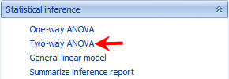
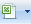
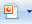
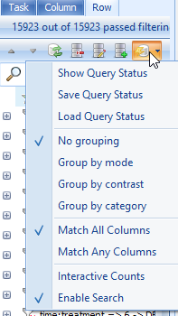
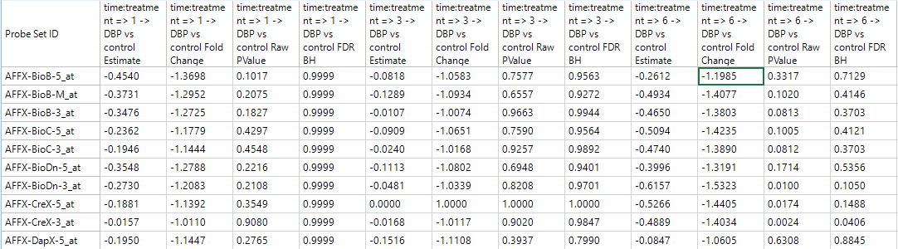
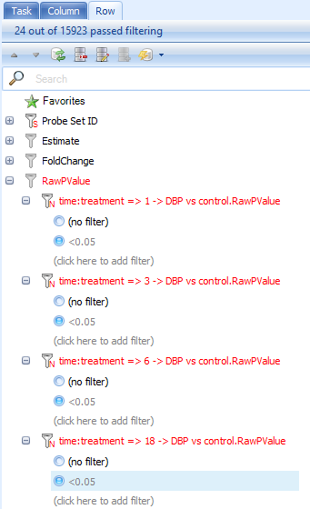
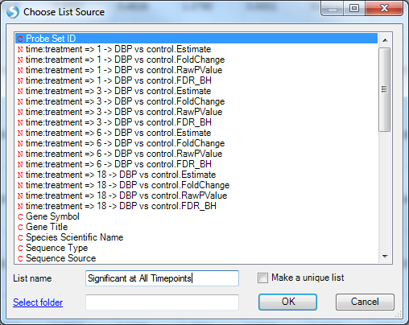
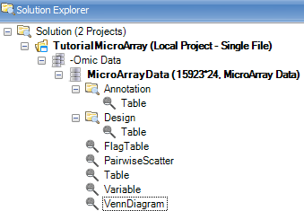
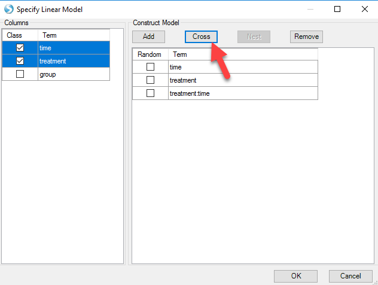
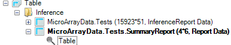

# Differential Expression

*Array Studio* contains a number of different modules for performing univariate analysis/differential expression, including One-Way ANOVA, Two-Way ANOVA, and the more advanced General Linear Model, as well as a few others.

## Two-Way ANOVA

*Two-Way ANOVA* can be used to research the effects of multiple factors on expression data. The design of the experiment in this tutorial is set-up so that the user will perform a *Two-Way ANOVA*.

For this tutorial, we are interested in generating contrasts for each time point, in comparing the DBP (treatment) group to the control group. The first factor in the ANOVA is *time* while the second factor is *treatment*. Thus, we should be able to generate four contrasts, and associating fold changes, p-values, estimates, etc.

While the *General Linear Model* could easily be used instead (and provide more customization of the results), it is a much more straightforward process for the novice user to use the *Two-way ANOVA* module.

To run the *Differential Expression-Two Way ANOVA* module, go to the **Statistical Inference** section of the workflow, and select **Two-Way ANOVA**. Alternatively, the same module can be selected by going to the **OmicData Menu | Inference | Standard Tests | Two-way ANOVA**.

This opens the *Two-way Analysis of Variance* window:

As with other analysis windows, the user must first set the *Project* and *Data* on which to run the analysis, in the *Input/Output* section.

*   Make sure *TutorialMicroArray* is chosen as the project and *MicroArrayData* is chosen as the input data.

*   For *Variables* , ensure that *All Variables* is selected.

*   For *Observations*, choose **Customized observations** , then click the **Select** button to choose the list **MicroArrayData.Observation23**. This ensures that the statistical tests are only run on the 23 observations that passed the PCA quality control.

*Array Studio* will attempt to automatically populate the **Factor 1** and **Factor 2** dropdown boxes, using the first two *Factor* type columns in the design table. For this tutorial, this should correctly populate *Factor 1* as *time* and *Factor 2* as *treatment*.

*   For generating the comparisons, the **For each** box is used. The factor chosen for *Factor 1* will automatically be populated into the *For each* box, and cannot be changed, unless the user changes the *Factor 1* column.

*   To figure out what comparisons will be generated, read the **For each**, **Compare to** boxes together. So, *For each: time¸ Compare to*: control will generate a contrast comparing DBP to control at each time point.

*   Ensure that the *Compare to* dropdown box is set to *control*.

*   The option to **Include interaction term** should be enabled, however if users wish to run a two-way ANOVA without the interaction, this is available here as well.

*   **Comparison** specifies the multiple comparison procedure. Options include *Control*, *Dunnett* and *Tukey*.

*   **By** - Allows the user to select an additional categorical variable to subset the data set before running ANOVA.

*   **Multiplicity** adjustments for the comparisons can be set as well, with the default adjustment being FDR_BH (options include *None*, *FDR_BH*, *FDR_BY*, *Bonferonni*, *Sidak*, *StepDownBonferroni*, *StepDownSidak*, *StepUp*, *QValue*, *QValue41*). The *multiplicity* adjustment will calculate an *Adjusted p-value* column in the result report.

*   **FC Transformation** specifies how the Fold Change is calculated based on estimate.     Fold change is defined as the unlogged estimate. By default, it is Exp2: sign(estimate)\*2^abs(estimate). User also has the options of Exp, Exp10 and Ratio.

*   The **Alpha level**, or p-value cutoff, is used in the automatic generation of *Lists* for each contrast. If a *multiplicity* adjustment is set to anything other than *None*, these lists will be generated for probesets that have an adjusted p-value less than this value (by default 0.05).

*   **Report F-Test Pvalues** will report the p-values for the F-tests (i.e. one p-value each for time, treatment, and treatment*time). Leave this box unchecked as we are more interested in specific estimates.

*   **Generate LSMean data** will generate a new *Data* object, where each observation is the LSMean of the interaction of *Factor 1* and *Factor 2* group (i.e. in this case, the LSMean     *data* would have 8 observations, one for each *time*treatment* group). For this tutorial, leave this box unchecked.

*   If *Generate LSMean data* is checked, **Append LSMeans to the inference report** becomes available. This will append the *LSMeans data*, for each interaction group, to the inference report. This can be used to see the adjusted mean intensity levels of each group for any potential differentially expressed probesets (i.e. some users prefer to ignore lower-expressing probesets, and this provides the user with a way to filter by these values).

*   **Generate estimate data** will generate a *Data* object containing one observation per contrast. So, in the case of this tutorial, the new *Estimate data* would contain four observations, one for each of the four comparisons being generated. For the purposes of this tutorial, leave this box unchecked.

*   **Split the significant list by change direction** will split each generated significant list (based on the alpha level value) by direction of change.

For users familiar with SAS Code, clicking the **Show SAS Code** button will generate the equivalent SAS code in a text file (the SAS code can only be used to run one probeset at a time).

To run the differential expression, click the **Submit** button.

## The VolcanoPlotView and Inference Report

After running the *Two-way ANOVA* (the computing time should be 1-3 seconds), a *Table* is generated under the **Inference** folder of the Solution Explorer, **MicroArray Data.Tests** (expand the Inference folder to see this). This table contains the information generated by the *Two-way ANOVA*. As can be observed in the *Solution Explorer*, this table contains 15923 rows (for the 15923 probesets) and 51 columns (35 from the original *Annotation* and 16 new columns).

Also notice that a number of new *Lists* have been automatically generated by the *Two-way ANOVA*. These *Lists* can be used for purposes of filtering, and also in the next section, for generating a *Venn Diagram*. These lists were generated using an adjusted p-value cutoff of 0.05 (this was set in the previous dialog menu). If the user preferred to automatically generate lists using raw p-value, then no multiplicity adjustment test should have been specified.

By default, a *VolcanoPlotView* will be generated for the *Inference Table*. It should be the view visible in the main view window. If not, double-click on it in the *Solution Explorer* or switch to the view in the main *Data View* window.

After opening the *view VolcanoPlot*, notice that four *volcano plots* have been created in this view, one for each comparison generated by the *Two-Way ANOVA* window.

To change all graphs to the same scale, click *Use Uniform Scale* icon on the toolbar (as shown below).

The graph should be updated instantly.

Looking in the *toolbar*, the user should recognize many of the icons from previous views.

 **Open Current view as picture**: will open current visible view in the default picture viewer

**Open Current view in Excel:** will open current visible view in Microsoft Excel

**Open All Charts in Excel:** will open all opened views in Microsoft Excel

**Open Current view in Excel (Editable)**: will open current visible view in Microsoft Excel and allow the user to edit the graphics (in Office 2003 and above)

**Open All Charts in Excel (Editable)**: will open all opened views in Microsoft Excel and allow the user to edit the graphics (in Office 2003 and above)

**Open Current view in PowerPoint**: will open current visible view in Microsoft PowerPoint

**Open All Charts in PowerPoint**: will open all opened views in Microsoft PowerPoint

**Open Current view in PowerPoint (Editable)** : will open current visible viewin Microsoft PowerPoint and allow the user to edit the graphics (in Office 2003 and above)

**Open All Charts in PowerPoint (Editable)**: will open current visible view in Microsoft PowerPoint and allow the user to edit the graphics (in Office 2003 and above)

 **Copy Current View**: will copy current view to the clipboard

 **Save Current View**: will save the current visible view as an image file (default is pdf but other formats include png, emf, gif, jpg, tif, bmp)

 **Print Current View**: will print the current view

**Print All Charts**: will print charts that are currently opened

 **Select**: allow the user to lasso multiple selections

 **Zoom in**: will zoom in the table using lasso

 **Full Screen**: will open the view in full screen mode

 **Refresh Chart and Undo all Zooms/Pans**: Returns view to the original format

**Specify Layout** *(rows*columns)*: To specify layout by rows and columns. For instance, if the user was only interested in seeing one column per view in order to see a particular view in greater detail, this would be set to 3*1 (3 rows*1 column). Each column represents a view.

 **Use Uniform Scale**: when selected, will use the same scale (x and y-axis) for all graphs.

The *VolcanoPlotView* shows the * Log10* *P-value* on the y-axis and the *Estimate* (*Estimate* is defined as the statistically adjusted difference between the means of the two groups being compared) on the x-axis. Thus, the most significant probesets are higher on the y-axis, while the most positive or negative genes can be found at the extremes of the x-axis. Similar to all views in Array Studio, the *VolcanoPlotView* is fully interactive. Selecting a particular point or points on the plot brings up the details of that probeset (based on its annotation) in the *Details* window at the bottom of the screen.

The *View Controller | Task* under *VolcanoPlotView* mode gives the user options to *Change Chart Properties* (which includes renaming the title of the chart as well as the x and y-axis titles, and many other options), *Change Symbol Properties*, and *Change To Quality-First Mode*. The VolcanoPlot will often default to what is known as a "Speed-First Mode", where it is updated quickly when any changes are applied to the view (i.e. layout, specify columns). This mode is particularly useful when dealing with large numbers of variables. Users can toggle between this mode and *Quality-First* mode by clicking the option in the *View Controller*:

Switch to *Quality-First* mode now and select *Change Symbol Properties*. To enlarge the data points in the volcano plot and allow for better visualization, users can slide the button in Size. Users can also add labels to all data points, or only those selected. In this example, choose selected and use the drop-down menu to label by Probe Set ID:

Now, move the mouse around the volcano plot named *1 DBP vs. Control*. Notice that a red square encompasses each individual point on the graph. This can be used to select an individual probeset from the graph, and retrieve information in the *Details Window*. Now, click on the data point that is in the upper most right corner of this plot. The point should now turn red, as it has been selected and labeled.

Make sure that the *Details Window* is visible down below. If it has been closed, go to *View | Show Details Window*. If necessary, drag the border between the main *Data View Window* and the *Details Window* to expand the size of the *Details Window*. After selecting the upper right-hand data point, check the *Details Window*. Notice that the *Details Window* now contains the information of *Estimates*, *Fold Changes*, *Raw P-values*, and *Adjusted P-values* for each comparison.

Scroll right in the *Details Window* to see the rest of the annotation columns.

Because the test report is a type of *Table*, it also allows the user to use the *View Controller | Column* and *Row* tabs to filter the data by any column or row (includes the *Two-Way ANOVA* generated columns, as well as the gene *annotation* columns).

Click the *Options* icon in the *Row* tab 

This allows the user to group the filters by either mode (i.e. p-value, fold-change, estimate, etc.) or contrast (time point 1 DBP vs. control, time point 2 DBP vs. control, etc.). Try grouping the p-values by *mode* now, and notice the effect on the filters.

Notice that the Estimates for each comparison are now grouped together, as are the FoldChange, RawPValue, and AdjustedPValue columns. This is especially helpful for organizing filters in studies where a large number of contrasts have been generated.

Also, note that the filter can be set to **Match All Column** or **Match Any Columns** . By default, the filter uses *Match All Columns* , ensuring that all filters will be matched when set. However, choosing *Match Any Columns* will allow the user to get results matching any of the filters.

The *Table View* for the inference report is also automatically generated by the *Two-way ANOVA*, as a *TableView* named *Report*. Open this view now by double clicking in the *Solution Explorer*.

A *TableView* is now shown in the main view window, containing the columns generated by the *Two-way ANOVA*, as well as the *annotation* columns. For this particular dataset, there are 15923 rows of probesets, with 51 columns of *annotation*.

Notice that this includes *annotation* columns for *Estimate* columns, *Fold Change* columns, *Raw p-value* columns, and *Adjusted p-value* columns for each comparison made by the *Two-way ANOVA*.

Click *Specify Columns* in the *View Controller | Task* tab.

A *Choose Columns* window allows the user to specify the columns for view in the table. This can be useful, as the user may want to create different *Table Views* for the report, each containing different information. Columns can be removed, added, or the order of the columns can be changed.

Click *OK* to return to the *TableView* of the report.

The **View Controller | Row** tab can be used, just as in the *VolcanoPlotView,* to filter the data. Expand the *RawPValue* filter section, then expand *1 DBP vs. Control.RawPValue* filter and enter **<.05** to filter all probesets to only include those that have a *RawPValue* of less than 0.05 for *1 DBP vs. Control*.

Do the same for the filter of *3 DBP vs. Control.RawPValue* filter, *6 DBP vs. control.RawPValue* and *18 DBP vs. Control.RawPValue*, filter. This will show only those genes with *p-values* less than 0.05 in four comparisons.

Look at the top right of the table view to see the number of rows remaining after filtering (or just look at the top of the *View Controller*). In this case, 24 probesets have p-values less than 0.05 at all 4 time points.

Go to the *Add Item* drop-down button in the tool strip. Choose *Add List From Visible rows* to add a new *List* containing only those rows visible from the filter.

The *Choose List Source* window opens. This allows the user to create a list using any of the different columns in the *Table*. The name of the list can be set as well as the organized folder location for the list.

Here we use *Probe Set ID* to generate the list, notice that each line has a unique Probe set ID so the list would not contain any repeated probe set IDs. However, if you choose other IDs such as Gene Name to build the list, it may have repeated IDs since mulitple rows may share the same gene name. In this case, users can check the *Make a unique list* so that the repeat IDs would only show up once in the list.

Choose *Probe Set ID*, name the list *Significant at All Timepoints*, and click *OK* to continue.

Notice that a new list has been created.

## The Venn diagram view

Array Studio also has the ability to easily create a *Venn Diagram*. The *Venn Diagram* could utilize the *Lists*, either created by the user or by *Array Studio* and the *Two Way ANOVA* (or other statistical inference module), to segment the data points.

To add a *Venn Diagram View*, first go to the *Solution Explorer* and the *-Omic Data* section. Right click on *MicroarrayData* and select **Add View** from the menu.

Select *VennDiagramView* from the list of choices. Notice that the *Preview* window automatically creates a simple *Venn Diagram*, using only the first *List* in the *Lists* tab of the *Solution Explorer*. This will be changed in the following steps. Click *OK* to add the *View*.

Notice that a new view, called *Venn Diagram*, is now visible in the *Solution Explorer Window*, as well as in the main view window.

Now the *Venn Diagram* view only contains one list.

The user can add more lists by using the **Specify Data Source** option in the *Task* tab of the *View Controller*. However, it is much easier to do this using drag-and-drop.

Note: Array Studio can handle up to six lists. However, only 4 lists can be shown in one chart at a time. So, if the user enters more than 4 lists, *Array Studio* will create every combination of those lists, and one chart for each combination will be shown in the *View*.

To drag-and-drop to the Venn Diagram view, go to the *List* in *Solution Explorer*, and choose the lists of all four time points (use shift or control-click to choose multiple lists at the same time). Now, drag these lists into the main view window, which is then updated to include the four lists in the *Diagram*.

Like every other view in Array Studio, the *Venn Diagram* view is also fully interactive. Click on the number 29 in the intersection of the 3 lists. First, note that parentheses now appears after the number 29 so that it looks like 29(29). This indicates that the user has selected the 29 genes found in that intersection.

Look at the *Details Window* and notice that 29 probesets are now listed in the *Details Window*.

Similar to every other view, the *Venn Diagram* view can be exported to other programs using the toolbar.

## The General Linear Model

If users have a complicated design table (such as some large clinical experiment) involving many factors, they can use General linear model function to build some complicated statistical model.

Users can find the function of General linear model here:

Or through windows here:

Two-Way ANOVA is a specific case of General model, here we can get the same results using General linear model:

Just like in Two Way ANOVA, users can specify the observations by list to do the analysis based the 23 observations.

After that, users can specify the model by selecting the time and treatment and clicking **Add**. The interaction term "time:treatment" is made by selecting both classes and clicking the  Cross  button as shown below.

Notice that array studio would automatically treat numeric variables such as time as continuous factor, so users have to check the **Class** box to convert time as categorical factor.
After clicking **OK**, users can specify the Test. Here we choose the option **Specify Test**:

Here we want to compare control to case for each time point, so users can specify the test by first checking the option *For each* and selecting *time* from the drop-down menu. Under the *Compare to* drop-down menu, select *control*. Once these options are entered, click the **Add** button and the four comparisons will be populated as below:

After clicking **OK**, and **Submit**, users will get the same results with 2-way ANOVA.

## Summarize Inference Report

Sometimes, a user wishes to count the number of variables, or probesets, corresponding to a set of criteria for each comparison in an analysis.  For instance, the user might want to see how many variables have a p-value <0.05/Fold change >2, p-value<0.05/Fold change >3, p-value<0.05/Fold change>4,  p-value<0.05/Fold change<-2, p-value<0.05/Fold change <-3, and p-value<0.05/Fold change <-4 for each of the four comparisons.

This can be done manually by creating filters for each of these different criteria and counting the number of genes fitting that criteria.

Alternatively, and the faster approach, the user can use the **Summarize Inference Report** module, by switching from *Solution Explorer* to *Workflow* and clicking on *Summarize inference report*, or by going to the **OmicData Menu | Inference | Summarize Inference Report**.

This opens the *Summarize Inference Report* window.

In this window, the user needs to first set the *Project* and *Inference test* object, on which to run the module. Choose **TutorialMicroArray** and **MicroArrayData.Tests**. Ensure that *All rows* is selected for *Rows*, and that all 4 estimates are selected for *Estimates*.

Under *Options*, the user just needs to add the conditions of interest. For example, in order to add a condition whereby the Raw Pvalue<0.05 and the Fold change>2, ensure that both of these boxes are checked, and that the **Fold change >** box contains 2 while the **<** box is empty.

Click the *Add button* to add this to the *Conditions* section. Double-click the name of the condition to rename it (FC>2).

Repeat this process until conditions have been added, whereby all have Raw Pvalue<0.05, but with FC>2, FC>3, FC>4, FC<-2, FC<-3, and FC<-4.

There should be a total of 6 conditions in the *Conditions* box.

The module will generate (interactive) counts of variables that meet these conditions for each of the 4 estimates/contrasts selected.

Optionally, the user can select the *Generate lists based on conditions* checkbox (under the **Advanced** tab) to automatically generate one *List* for each condition/estimate. For this tutorial, leave this unchecked, as it will generate 19 *Lists*.

Click *Submit* to run the module.

A new *Table* will be generated in the *Solution Explorer*, called *MicroArray Data.Tests.SummaryReport*, as well as a *TableView*.

The generated *TableView*, as shown below, contains the count, for each estimate, of the 6 different criteria.

This *TableView* is fully interactive, as selecting one or multiple cells shows the associated variables in the *Details Window*. In addition, *Array Studio* automatically updates the *Details Window* to only show the results of the particular tests for the selected estimate(s). In other words, if the user selects a summary count for certain condition(s) for 1 DBP vs. Control, only 1 DBP vs. Control columns (and annotation) will be shown in the *Details Window*. This is done so that the user can easily export the results for that particular comparison.

