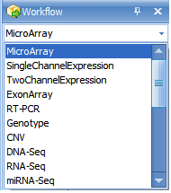
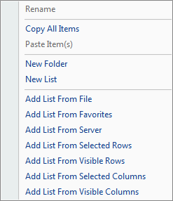
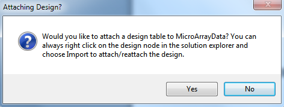
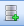

# Importing a Dataset

## Downloading the DBPTS dataset

For this tutorial, the following materials will be required: 24 .CEL files from the DBPTS Time Series dataset (Platform: Affymetrix RAE230A), as well as the included dbpts.design file, derived from the sample information for this dataset. The DBPTS dataset is available at:
[^link^](http://omicsoft.com/downloads/data/tutorial/Microarray_dbpts.zip )

After downloading the single .zip file, unzip the file to a folder to be used for this tutorial. The DBP Time Series data set contains information for 15923 probesets in a 2 by 4 factorial experiment. There are treatment (DBP) and control groups, measured at four different times (1 hr, 3 hr, 6 hr, and 18 hr). The experiment measures the intensity of gene expression level of 15923 probesets, with three replicates for each combination of treatment and time. This is NOT a repeated measure experiment, as different samples were used for different time points. The primary interest of this experiment is to find probesets that are differentially expressed under two conditions (treatment and control) at the 4 different time points.

The tutorial also contains a design file. The dbpts.design file contains the design information for the study, including columns for *chip, time, treatment, and group.* A design table can be created at any time by a user, using Microsoft Excel or Array Studio. As a rule, the design table must contain a first column, usually deemed *Chip* for Affymetrix platforms, that contains the exact file names of the chips used in the experiment, without the .CEL file extensions. Additional columns usually include *treatment, time, etc.* (anything pertinent to the experiment). If you forget to include a particular column at the time of the creation of the design table, it can be edited later on.

## The Workflow Window/ The Solution Explorer

When Array Studio is first installed, it will be similar to below.

If you have previously opened projects in Array Studio, you will see the **Last Opened Projects** window. If so, just click cancel so that Array Studio looks similar to below.

Notice at the top there will be four tabs: Analysis, Server, Land and Browser. This tutorial will focus on Analysis.

The **Workflow Window** should be visible on the left side of the screen. If the **Workflow Window** is not visible, go to the **View Menu | Show Workflow** or click on **Workflow** at the bottom left. The **Workflow Window** should appear similar to the screenshot below.

Tips: One can always go back to windows in the original setting by selecting the Menu **View | Reset Windows**.

The **Workflow Window** provides users, especially new users, with a  guide  to running different types of analysis. Clicking the **Workflow** dropdown box shows all available workflows (Microarray, Single Channel Expression, Two Channel Expression, Exon Array, RT-PCR, Genotype, CNV, DNA-Seq, RNA-Seq, and miRNA-Seq:

Make sure that Microarray is selected now.

Notice that the Microarray Workflow is separated into different categories, including **Getting started**, **Manage data**, **Preprocess**, **Quality control**, **Statistical inference**, and **Pattern recognition**.

While it is possible to access all of these functions via the menu commands in *Array Studio*, the *Workflows* are designed to make it easier for new users to work through their data.

The first section of the Microarray Workflow is the **Getting Started** section. In this section, it is suggested that the user either create a new project or open a previously created project.

To create a new project, click the **New Project** button in the Workflow, or the *New* button on the toolbar, or go to **File** Menu, then click **New Project**. This opens the *New Project* window:

*Array Studio* allows the user to create two different project types: a simple project, in which all the outputs are saved in a single file (recommended for microarray and RT-PCR projects), or a distributed project, where the output is saved in separate files (recommended for exon array, CNV, genotyping and NGS projects). This project type is based on the organization of the data to be analyzed.

Since this project is a microarray project, choose **Create a simple project** now. Then, click the **Browse** button to select a location and enter the name for the project. Once this is complete, click *OK* to continue.

Besides the *Workflow Window* on the left hand side of the screen, *Array Studio* also contains the *Solution Explorer*. The *Solution Explorer* is used to organize each project, and within each project, dataset, results table, etc., that is generated while analyzing and visualizing a project.

Another way to create a new project is by this icon in the Analysis tab:

Note that users can choose to create different projects: Local project as mentioned above and server project. A server project is a distributed project saved on server. Once the user is connected to server, the option of creating a new server project will become available. This project type is based on the location (local computer or server) where the data will be analyzed.

When users want to create a server project, some basic metadata need to be provided:

The interface of creating of a new local project is different from creating a new server project, but the rest of the steps, such as data import and data analysis, share the same interface. The "local" or "server" project types tell Array Studio where to run the analysis. If it is a local project, Array Studio runs the analysis on the local machine; if it is a server project, Array Studio would run the analysis on the server. Server projects are recommended when dealing with larger datasets, as server-based analyses allow the user to run jobs on a remote server (Linux or Windows), which usually has more computing power than a desktop computer.

The analyses in this tutorial are performed as a local project, but these can also be followed as a server project if the user is connected to ArrayServer.

To switch to the *Solution Explorer*, choose the *Solution Explorer* tab, which should be found at the bottom of the *Workflow Window* . If the *Solution Explorer* tab is not visible, switch to it by going to the **View Menu | Show Solution Explorer**.

The *Solution Explorer* will be empty, containing slots for *List, Cluster, Text* and *Attachment*. You can right-click on *List, Cluster, Text* and *Attachment* for additional options for each. For instance, right-clicking on *List* will bring up options to add a new List, add list from file, etc. A *List* can be used to filter the data, by either *Variables* (in the case of microarray data, this would be probesets), or *Observations* (in the case of microarray data, this would be chips or samples).

 Right Clicking on List brings up this menu:

## Adding Microarray Data/Chip Normalization

At this point, we are ready to add microarray data to the *Solution Explorer*. This can be done in a variety of ways, but the easiest way is to first switch back to the *Workflow Window*, by selecting the *Workflow* tab at the bottom of the *Solution Explorer*. Alternatively, go to **View Menu | Show Workflow** to show the *Workflow Window*.

Next, choose **Add Expression Data**, from the **Manage Data** section of the workflow. Alternatively, data can be added by going to the **File Menu | Add Data |Add Omic Data | Add Expression Data** or by clicking the **Add Data** button on the tool strip, and choosing **Add Omic Data | Add Expression Data**.

A dialog box will open asking the user to specify the expression data source. Many different sources of data are available to choose from in Array Studio and can be seen in the dialog window below.

For this tutorial, the 24 Affymetrix .CEL files downloaded earlier will be used. Select **Affymetrix .CEL files (3 IVT, or Gene Arrays)** and click *OK*.

The *Extract Affymetrix CEL file* window appears:

Click the **Add** button to select the CEL files for extraction. Navigate to the location of the CEL files, and then click *Open* to continue.

Check that there are 24 .CEL files listed for extraction by looking in the upper left corner of the dialog box.

Under *Options* , the user will be shown the *Array type* of the CEL files that are being imported. The user has the option to select an alternative CDF (Affymetrix Library) file.

The user can also select from the following Options:

*   The choice of analysis methods include: **RMA, GCRMA2, MAS5** and **OMICSOFT** (see reference for details).

*   For experiments performed at different times, the **Scale RMA/GCRMA signals** can be used to scale all chips to a particular **Target intensity**.

*   For MAS5 extractions, as well as when the **Scale RMA/GCRMA signals** box is checked, a number can be entered into the **Target intensity** box.

*   A log-2 transformation can be performed on the signal matrix data upon extraction. If the user unchecks the **Perform log-2 transformation on the signal matrix** box, a log-2 transformation can still be performed at a later stage.

*   If checked, the **Import Sample Information from ARR files** option will automatically import sample information (design table) from any ARR files found in the same directory as the selected CEL files if they were generated by Affymetrix's *Expression Console*.

*   The **Generate MAS5 QC Report** checkbox (available after adding CEL files), allows the user to automatically generate a MAS5 Report, without going through the separate menu option (**Tools |Affymetrix | Generate Affymetrix MAS5 QC Report**), however it offers fewer options than the regular menu item. The **Select controls** button allows the user to select the control genes for calculating 3 /5  ratios in the report (i.e. GAPDH, beta-actin, etc.).

*   The **Generate detection flag with p-value <** checkbox allows the user to automatically generate a detection flag value based on a cutoff value specified (default of <0.05). Selecting this option will generate a table with values of 0 (meaning not present with a p-value <0.05) or 1 (present with a p-value <0.05). The resulting "FlagTable" view is hidden, but can be added by right click on **MicroArrayData | Add View | FlagTableView**. The detection flag table can be used in **MicroArray | Preprocess | Filter By Flags**.

*   Selecting **Report intensity + detection p-values** will automatically generate an "IntensityReport" data object with an associated "Intensity_Detection" view and table.

*   A CEL Report (Probe level) can also be generated, if Generate CEL Report box is checked. This can be done with the separate menu option **Tools | Affymetrix |Generate Affymetrix CEL report**.

*   Optionally, a model based QC report can be generated as well. This is discussed further in the online help.

*   Finally, the user can generate CHP files while extraction takes place, using the **Write CHP files** checkbox.

Click on the **Help** button on the bottom left of the window to open the wiki page for *Extract Affymetrix CEL Files*. The wiki page describes the function input and output of this module, and explains all the options and parameters used in this module. Every analysis module in Array Studio has this *Help* button to link to the corresponding wiki page.

When complete, the window should look similar to the following screenshot.

Click **Submit** to start the RMA intensity signal matrix extraction. Data extraction will begin and take approximately 30 seconds.

When complete, *Array Studio* will prompt the user to attach a design table. Click **Yes** now to attach the design table that was packaged with the CEL files. If **No** was selected instead, the design table can always be attached by right clicking on the design node for the project in the *Solution Explorer* and choosing **Import** to attach/reattach the design.

The *Specify Table Source* window will open. As *dbpts.design.txt* is a tab-delimited text file, choose *Tab delimited file* and click *OK* to continue.

Choose *dbpts.design* and click *Open* to continue the attachment process.

Specify the location of the Design table file. Once the design table is imported, a "Specify Options" window will appear. Here the user can select the options to **Append to the existing covariate table** (if one exists) and to **Use the name order in the new covariate table**. Leave these options as default.

Selecting "OK" will then proceed with the data parsing and creation of the Design table.

## The TableView

At this point, the screen should look similar to below. On the left, the *Solution Explorer* will show an Annotation (automatically downloaded according to chip type) and Design Table (just imported) along with the Microarray Data type in Table format. Also, in the Table Data type, there will be a Mas5Report (under QC) and IntensityReport as chosen in the output of the previous command. In the center of the screen, a table view called *Table* should be visible. Scroll through the dataset to see how quickly *Array Studio* is able to scroll. *Array Studio* is able to easily handle millions of rows and columns in the *TableView*.

Now switch back to the *Solution Explorer*.

In Array Studio, the Solution Explorer will contain two types of data (-Omic data and Table data). These are organized separately in the Solution Explorer for each project. Open the  Omic data node now, followed by the MicroArrayData node.

In the main view window, click on the  button on the right top corner to close the current view, **MicroarrayData|Table.** Then double-click in the **Solution Explorer | Tutorial | -Omic Data |MicroArrayData | Table** to reopen the *TableView*.

Moving the mouse over any of the icons in the toolbar will give a short description of the button.

**Open as Text**: will open current visible table in the default text editor (e.g. Notepad)

**Open in Excel**: will open current visible table in Microsoft Excel

**Save as Text/object**: will open dialog box to save current visible table as Text, Excel or Omicsoft object

**Sort Table**: will sort the view, opening the Sort window. The Sort window allows the user to sort by up to four different columns, in either ascending or descending order.

Note that the sorting mentioned above only applies to the current view, and not the actual data. So if the current Table View is closed, it would need to be sorted again.

For more advanced features including sorting of the actual data instead of the view, use the menu, **Omic** **Data | Manipulation | Sort Variables**.

**Filter**: Filter table by different rows

**Copy Table to Clipboard**: will copy current visible table to clipboard.

**Additional Tools**: contains a popup menu for additional tools:

**Find/Replace**: find or replace cells in the table (this is not allowed with  Omic data but can be used with regular table data.

**Match Selected Cells**: select one or multiple cells in the table. Then click Match Selected Cells to find all of the other cells in the table that match the selected cells.

**Next Selected Row**: finds the next row in the table from that of the currently selected row.

**Previous Selected Row**: finds the previous row in the table from that of the previously selected row.

**Go to Row**: allows the user to input either the row name or the row index (starting from 1) and Array Studio will automatically scroll to the row in the table.

**Zoom out**: will zoom out the table.

**Specify Zoom Factor**: click to specific zoom factor

**Zoom in**: will zoom in the table.

**Fit window to full screen**

## Details Window/Web Details

The *TableView*, and all other views in *Array Studio*, are fully interactive. Clicking on particular column headers or row headers will bring up details about those observations or variables in the *Details Window*.

In the *TableView*, click the column header cell for 02A. The green color here shows that this field has been selected. To remove the selection, click the toolbar "Clear" 

If the *Details Window* is not shown at the bottom of the screen, go to **View Menu | Show Details Window** now to show it.

Once visible, the *Details Window* should update with information about the selected observation, 02A.

The user can also click on the header cell for any variable. Do this now, and notice that the *Details Window* updates with the automatically downloaded gene annotation for that particular probeset.

Besides the *Details Window*, *Array Studio* also contains **Web Details On-Demand**, which is located by right-clicking on the variable name (i.e.: *Probeset ID*) within the *Details Window*. *Web Details* allow the user to connect to online websites for further information about a particular variable or probeset.

In the *Details Window*, right-click on the row header cell that was previously selected.

This should bring up a list of different *Web Details* that are available. Depending on the probeset picked, this list could be longer or shorter than that shown below.

Scroll to a probeID that does not begin with AFFX, right click and choose the UCSC link.

This should open a new window in *Internet Explorer*.

 

## The MAS5 Report and Intensity Report

Under the **Table | QC** folder of the *Solution Explorer*, there is a MAS5 report telling us the *RawQ, ScaleFactor, Background, BackgroundStdDev, PresentPercentage* and *AverageSignal* of each chip.

The **IntensityReport** under *Table* folder of the *Solution Explorer* gives a visualization of detection pvalue against probe set intensity.

## The View Controller

The *View Controller* is an extremely important feature for the visualizations in Array Studio. Its purpose is to allow the user to customize the views on the screen. If you do not see *View Controller*, go to the menu **View | Show View Controller**.

The view controller should now be visible on the right side of the screen.

Click the pin button  so that it is facing downwards.  This ensures that the *View Controller* remains in constant view. If the pin is facing to the left, the *View Controller* (and any other window i.e. *Solution Explorer, Details Window, etc.* ) will auto hide itself when it loses the mouse focus. When the user rolls the mouse pointer over the hidden view, it will reappear. Keep the *View Controller* with the pin facing downwards so that the *View Controller* is visible at all times.

As can be seen from the picture above, the *View Controller* contains three tabs. The *Task* tab contains all the settings for modifying the properties of the current view. One option is *Summarize By Group*: this allows the user to do a quality control check of the expression levels of each time point and treatment to ensure that there are no outliers among the expression profiles. To compare gene expression between sample groups and treatments, the overall gene expression should be similar at this high level to ensure technical confidence in the analysis.

The *View Controller* can also be used to investigate the gene expression data. From the *TableView*, the *View Controller* *Task* tab includes **Show Row Numbers**, **Specify Columns**, **Reset Columns**, **Generate Data From View and Export With Customized Column Headers**. Click *Specify Columns* to specify which columns of the dataset are visible.

Move columns to the left or right using the left and right arrows, and organize the order that the columns appear by using the up and down arrows. Click *OK* to return to *View Controller | Task*.

Click on the **Observation** tab.

For the *TableView*, the *Observation* tab contains the name of every column in the attached Design Table by default. The toolbar icons for the Variable and Observation views are defined as follows:

*Collapse All*: will collapse all the filters to return the user to the view above.

*Expand All*: will expand all the filters.

*Reset All Filters*: will reset all filters to the default states (no filter).

*Clear All Filters*: will clear all filters, including removing any added filters.

*Show/Hide Columns*: will bring up a dialog box to determine which columns, and in what order, will be displayed in the *Filter* tab.

*Add List Filter*: will add a list filter to the currently selected column in the *Filter* tab. At this point in the tutorial, the user does not yet have a *List* so this will be discussed in more detail later.

*Options* - allows the user to group the filters. This is useful when looking at filters for an *Inference Report*, but has no real use for the *Observation* tab of a data object.

In addition, the user can set Match All Columns (default) or Match Any Columns for the filters (this is the equivalent of AND or OR for multiple filters).

*The "+"* icon will expand the entire filter group.

*The "-"* icon will collapse the filter group.

At this point, click the *Expand All* button to expand all column filters.

There are four different types of filters visible in this view. The first type is referred as a *String Filter*. Clicking there allows the user to type in a filter for the column.

For instance, typing in **2A** under chip column will filter the *chip* column for any row that contains *2A*.

When a filter is selected, it is highlighted by the radio checkbox next to it. In addition, the filter informs the user how many variables or observations passed filtering.

. 

Taking a look at the *TableView* in the center of the screen, it is clear that the only observations remaining visible are those containing *2A*.

The second type of filter visible with this table can be seen with the *treatment* and *group* columns. This is referred to as the *Radio filter* in which the filters are automatically created, each with its own button. Array Studio defaults to the *Radio filter* when there are a limited number of choices (if that does not appear to be the case, the column type will need to be set to *Factor*; the user can change any columns to a factor column by choosing **Table | Columns | Column Properties** Next, right click on the factor in the *View Controller* and select *Radio Filter*). The *Radio filter* is not available on columns with larger numbers of options than limit.

First, remove the previous filter by switching it from *02A* to *(no filter)*.

Next, the data can be filtered with the *Radio filter* by clicking on the desired filter. Select *control* from the options under the *treatment* filter.

Again, take a look at the *TableView* and select the column headers to see that the only samples in the table are in control group.

A third type of filter is the *Checkbox* filter. If this type of filter is not shown, it can easily be added by changing the filter type. Simply right-click on the name of the column filter and choose the "CheckBox" option as shown below:

Clicking *CheckBox* will then allow the user to check off each option available for filtering. In the example below, only those rows that contain a *group* control.t3 or DBP.t3 will be visible in the *TableView*.

There is a fourth type of filter: *numeric filter*, which is available only for numeric columns. This type of filter will be discussed later in the inference report view.

At this point, clear all filters by clicking the *Clear All* button.

Click on the *Variable* tab in the *View Controller*. Notice that Array Studio automatically adds potential filters for every column of chip annotation. The buttons on the *View Controller | Variable* are exactly the same as that found in the *View Controller | Observation*. Expand the *Gene Symbol* filter, and type **^Egr1$**, or **"Egr1"** (with quote) to find all *Variables* that match exactly **Egr1** (the ^ and $ symbols are used in the same way as regular expression).

Supported filter syntax in Array Studio:

| Syntax     | Description                           |
|:-----------|:--------------------------------------|
| >N         | Greater than N                        |
| <N         | Less than N                           |
| =N         | Equal to N                            |
| >=N        | Greater than or equal to N            |
| <=N        | Less than or equal to N               |
| a&b        | Matching a and b                      |
| a          | Matching a a                          |
| a AND b    | a and b                               |
| a | b      | Matching a or b                       |
| a OR b     | Matching a or b                        |
| ^abc       | Starts with abc                       |
| abc$       | Ends with abc                         |
|  abc       | Matches exactly abc                   |
| ^abc$      | Matches exactly abc                   |
| NOT        | Includes everything not in the filter |
|            | To keep only empty strings            |
| ~          | To keep only non-empty strings        |

Notice that this then filters the dataset. 1 row is found that exactly matches **Egr1** for *Gene Symbol*. Again, dimensions of the filtered table can be found by looking at the top right of the center *table view*

Notice that when a filter is applied to a parameter, it changes to a red color in the *View Controller*. This can be used to quickly track what filters are in place on a heavily filtered dataset.

Remove the filter by either clicking the **Clear All** button or right-clicking on the *Gene Symbol* Filter **^Egr1$** and clicking *Remove Filter*.

Click on **Save** button from the toolbar to save the current project.

Congratulations! The dataset from DBPTS is successfully loaded into Array Studio and is ready for downstream visualization and analysis.
