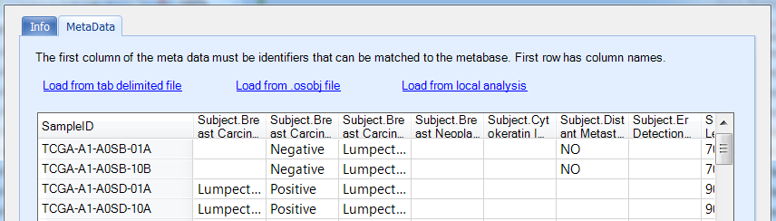
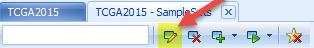
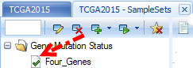
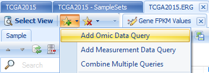
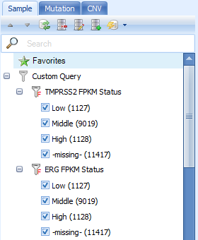

# Advanced Analytics

## Sample Set

Like Gene Set, user can also create a sample set, a collection of Samples. Sample sets can contain additional sample meta data, which are supplementary to the meta data shipped with Land.

Unlike meta data and clinical data, which are normally controlled by administrators, sample sets can be created and managed by all users. Users can share the sample sets they created with other users and can also subscribe/unsubscribe sample sets.

User can create a sample set based on imported sample design table, selection in land or query analytics.

### Create A Sample Set by Importing

To create sample set, go to **Land | Manage | Samples | Manage Sample Set**:

Same as gene set, sample sets are organized by tags, user can add a new sample set by clicking **Add** and the following window will show up:

In the MetaData tab, user can upload sample set from file, local analysis or an omicsoft data object (.osobj) file:

### Create A Sample Set by selection

User can create sample set directly by selection/filter using the following four options in **Sample Set**:

Create sample set will only create a set of samples selected (marked as red in views) or visible after filter:

Group sample set will include all samples but mark them as Yes/No as meta data:

In the Info tab, user will name sampleset (such as *NUSAP1 upregulated samples* ), tag the sampleset (such as *PRAD, NUSAP1* ) and set Readers and Editors access.

### Create A Sample Set by Land Analytics

ArrayLand also provides a list of powerful analytic functions to query the whole land database and create sample set, based on mutation, copy number status:

Taking generating **Generate Site Mutation Status Sample Set** as one example, it will open a query window:

Site mutation query allows user to input mutation ID (in the format of *chr.position.alteration* ) or mutation amino acid change, such as *BRAF.V600E*. In the example above, we query four types of mutations together, including IDH1.R132* (IDH1 mutations change 132th amino acid position from R to anything).

Once click **Send to Queue**, the analytic job will send to ArrayServer job queue:

Once job finishes, the sample set, *Test BRAF IDH RNASeq Mutation SampleSet*, will show in **Land | Manage | Samples | Manage Sample Sets**. Mutation status, MUT or WT, is marked for each mutation site in the sample set.

User can modify the permission, sample set tags by clicking Edit/Update after a sample set is created.

Once a sample set is created, users can subscribe the sample set.

Once a sample set is subscribed, a check mark will appear in front of the sample set name.

Once you subscribe to a sample set, you will see it in **all future** land queries, as a filter column in Sample tab under "Sample Set", and also a profile column to trellis and split samples in the visualization.

Below is the *IDH1* expression boxplot, categorized by Tumor Type (filter to SKCM only), Sample Type and *BRAF* mutation status:

## Custom Query

**Custom query** provides another approach to query genes/features quickly.

Custom queries are created by dynamic land database query. Custom queries can be combined and they can be viewed by OmicPrint. But unlike sample sets, custom queries cannot be shared, nor can they be used to limit samples used in **Analytics**.

### Add Omic Data Query

To add a custom query, click the icon besides **Select View** and choose from the list:

We provide custom queries of a gene on expression, CNV, mutation, fusion and RPPA.

The following example shows how to query the expression level of *ERG* and *TMPRSS2* in RNA-Seq dataset, separated by ',':

We can also query the *TMPRSS2->ERG* fusion in RNA-Seq dataset:

Three query results are immediately available to do customizations for the current view.

In the view above for ERG **Gene FPKM**, we filter **Tumor Type** to PRAD, **specify multiple profile columns** to Tumor Type and Fusion Status

And **Change Symbol Properties** to color by *ERG* expression status:

The color legend is shown on the Legend tab, where you can change color for each category:

Numeric data (Like Expression Ratio, RPPA, FPKM etc) can also be categorized by user-defined breakpoints. Say we want the samples with FPKM less than 10% as "Low", larger than 90% as "High" and Others as "Middle", the breakpoints can be set as this

Then the custom query will show as

The categorization is based on the overall samples. If users want the categorization based on each group, then check **Discretization for each group**.

The custom query can also be performed using summarized numeric data in multiple genes by checking **Summarize multiple genes by** and choosing a summarization method.

### Add Measurement Data Query

In addition to Omic Data Query, measurement data query can also be added if measurement data has been imported. Detailed information about measurement data will be described in the next chapter.

### Combine Multiple Queries

After creating multiple Custom Queries in Land Sample tab, users can use AND/OR logic to combine multiple custom queries.

From the left panel, users can select multiple levels in different queries to combine. The default logic is **OR**.

If users want to use **AND** logic to combine queries, please check **Match all** option.

### Other

Users can also add SampleSet query (for the sample sets, regardless of whether they are subscribed or not) and MetaData query.

Sample Sets can also be created from custom queries:

Moreover, ArrayLand provides an overview of all custom query results as an **OmicPrint** view:

OmicPrint view is a tree, categorized by tumor type, then gene names and queries. The same sample is aligned vertically. It will show the sample ID when users mouse over the block. Sample blocks are colored by alteration types, such as mutation (MUT), amplified, deleted, etc.

From the view above, we can see clear the correlation between *ERG* up-regulation and presence of *TMPRSS2->ERG* fusion.

## Report Top Gene List

In Land analytics, we also provide tools to scan all or a subset of samples for top mutated, amplified or deleted genes, top fusion and top transcripts:

Below is one example of scanning COAD samples for top mutated genes (only select important mutation types shown in at least 10% of samples). The COAD sample set can be created by "Create Sample Set From Selection", described in the sample set chapter. By clicking **Send to Queue**, the job will run on ArrayServer. Depending on the number of samples in the chosen sample set (or maybe all samples), it may take more than 30 min to traverse all genes in all samples to generate the report.

Generated top-gene reports are stored in **Land | Analytics | Open Result Set**:

