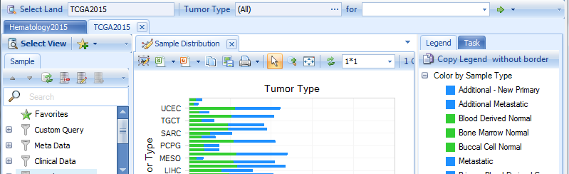

# Introduction

## OncoLand

OmicSoft uses OmicLand framework to deliver large data service results. OncoLand is an important part of the OmicLand collection, specifically focused on oncology data. Land files are built up based on OmicSoft File System (OFS), which stores genomics data in database files and different layers of indexes for gene/markers and samples. The goal of OncoLand is to provide fast data access in both sample and gene directions for biomarker-focused queries.

Once users configured Land data on OmicSoft internally, OmicSoft Studio/OmicLand users can search all types of genomics profiles of a single gene or a set of genes instantly with rich visualizations.

This tutorial is mainly based on TCGA Land and CCLE Land, but there are many other oncology-focused databases to explore. Please refer to the OncoLand Whitepaper, available through the Help menu item, for descriptions of all available lands within OncoLand.

## TCGALand

The Cancer Genome Atlas (TCGA) is a project, begun in 2006, to collect cancer samples and generate genomic profiling dataset for bioinformatics and biomedical researchers. There are a number of different techniques/platforms used to generate genomics datasets, including expression microarray, copy number variation profiling, SNP genotyping, methylation profiling, microRNA sequencing, transcriptome and exon sequencing.

Once you connect to the server, you can find the TCGA land data by clicking **Select Land**:

The default view is **Samples** view showing the number of samples in each tumor type. Other views are also available for users to query the sample data at a general level:

One useful view is **Clinical Significance - Group Association**. It is a dynamic view showing the association of all clinical variables with the selected grouping (sample variable).

**Survival Data** view is a plot of percent survival across time (Kaplan-Meier Survival Curve) using a specific grouping (e.g. Tumor Type)

## CCLELand

The Cancer Cell Line Encylopedia (CCLE) project is an effort to conduct a detailed genetic and pharmacologic characterization of a large panel of human cancer cell lines. The CCLE provides public access to genomic data, analysis and visualization of DNA copy number, mRNA expression, mutation data and more, for about 1000 cell lines.

