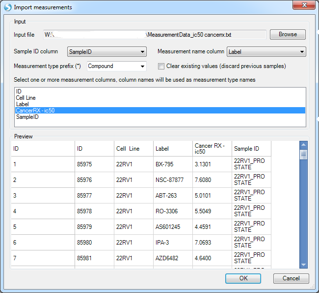

# Measurement Data

Measurement data is orthogonal data associated with Land Omics Data, such as compound/drug screening and RNAi data.
User can add measurement data to create views and query the land omics data.

## Import Measurement Data

In this tutorial, we are using a cell line land data as one example since it has drug screening data.
User can add measurement data in **Manage | Measurement | Add Measurement Data**:

The measurement data source file should have columns for Sample ID matching Land samples, measurement label column containing compound/screening names, and one or more measurement columns. Example of IC50 table below:

User can browse the measurement data using **Manage | Measurement | Manage Measurement Data**:

User can also add measurement meta data in **Manage | Measurement | Add Measurement Meta Data**

These meta data will be attached to each compound when browsing them in **Manage Measurement Data** window.

## Search/Visualize Measurement Data

Once measurement data is imported, the measurement labels (such as compound names) are searchable in the search box:

There are boxplot and heatmap views for this compound:

## Measurement Data Query

Measurement data can also be used to query Land Omic Data in **custom query** in any **Sample** tab:

User can categorize the measurement data into categories, such as sensitive and resistant, using numeric break points or directly labeling. Here we categorize the drug IC50 values for Nutlin-3a by:

*   <3: sensitive
*   Between 3 and 6: middle
*   >6 Resistant

The custom query results can be used as a filter and profile column in views for Omics data.

