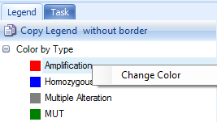
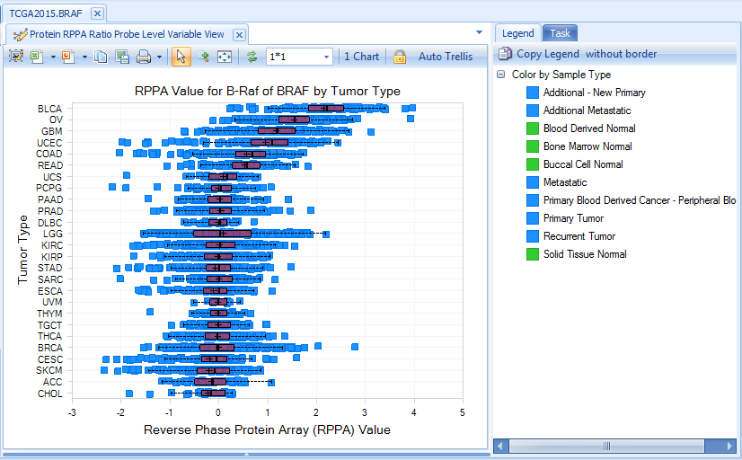
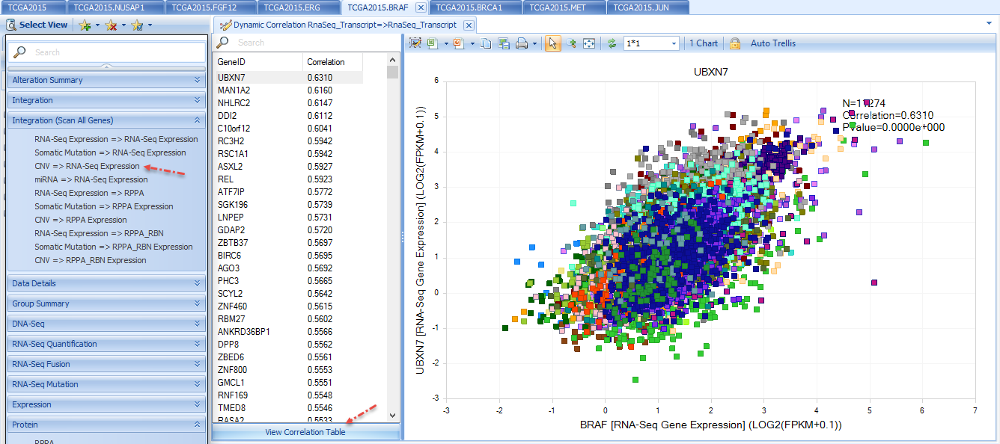
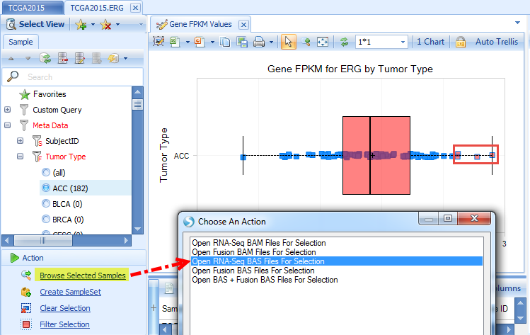
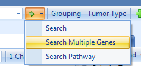
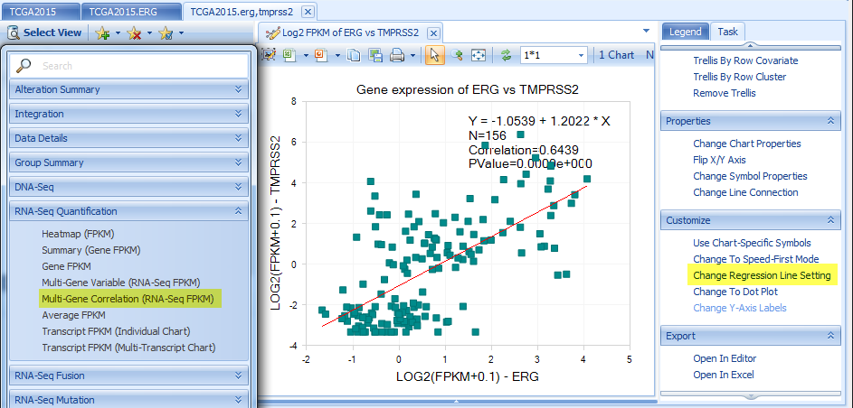
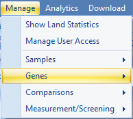
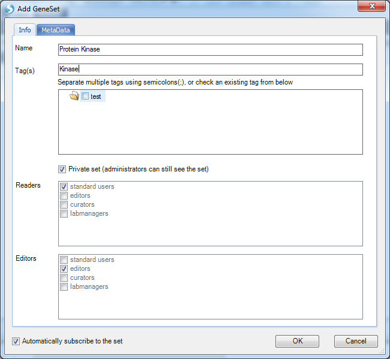
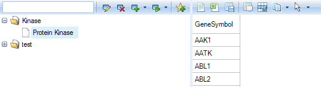

# Search Basics

## Search a single gene

Open TCGALand, then type a gene name, such as *nusap1*, in the search box. Notice that the auto fill box will assist you to complete the full gene name. Click the green arrow then select "Search",  or press "Enter" to search gene *NUSAP1* in TCGA land.

A figure showing DNA Alteration Distribution for gene *NUSAP1* is returned. This shows the number of different Alteration types, organized by primary group type (in *TCGA*, the primary group type is Tumor Type.)  

On the left panel, **Sample**, **Mutation** and **CNV** tabs are used to filter samples depending on different filter criteria. Under **Mutation**, clicking "View Filtered Table" will show detailed mutation information matching with the selected filter criteria.

On the right panel, **Legend** tab shows legend by color. The color can be changed by right-clicking each level.

**Task** tab can be used to change data shown in the view, change profile columns, specify data summarization method, change chart properties, etc. The data used in the view can be exported to txt or excel files.

OncoLand provides bunches of data views which can be accessed in **Select View**. Data are organized into sections based on platform types as well as an **Integration** section. In each customized view, there will be a tooltip, describing the view when moused over:

By clicking a different view, the default setting is to replace the current view with the newly selected view. If users prefer to keep all views, there is an option:

### DNA-Seq

Somatic Mutation is based on MAF (Mutation Annotation Format) files downloaded from TCGA. By definition, somatic is present in tumor but not control.

**Somatic Mutation Distribution** view shows the percentage of mutant samples in each grouping (e.g. Tumor Type).

Somatic mutations can be visualized in built-in ArrayLand genome browser. Visualizations will be automatically refreshed in response to the filters on mutation features and sample meta data.

### RNA-Seq Quantification

#### RNA-Seq gene and transcript FPKM

**Gene FPKM** Charts return visualizations based on FPKM (Fragments Per Kilobase of transcript per Million mapped fragments).
All FPKM data calculated at the transcript level, using an EM algorithm based on RSEM [^link^](http://deweylab.biostat.wisc.edu/rsem/ ). Data are further normalized for each sample by firstly adding 0.1 to FPKM and then taking log 2. This makes FPKM values comparable across all samples in the Land. Data are summarized at the gene level, by taking the sum of all transcript FPKM values.

Visualization is further configurable in the task tab, including chart/symbol properties (shape, color and size).

**Summary (gene FPKM)** view shows percentage of tumor samples whose RNA-Seq log2(FPKM+0.1) expression is 2x up-regulated or 2x down-regulated, compared to normal samples in each group (e.g. Tumor Type).

The default fold change cutoff 2x can be changed under **Expression** tab in the left panel.

#### RNA-Seq Exon Details

RNA-Seq details on exon and exon junction level are visualized in the built-in genome browser. It can help the user answer questions such as “*Are there FGF12 transcript expression differences between PRAD tumor samples?*

Search *FGF12* and open **RNA-Seq Quantification| Genome Browser (Exon Details)**.
In Sample tab, filter to PRAD:

User can change **the grouping to Sample Type** (In this case, Normal, Primary Tumor, Metastatic) since we have filtered to show one tumor type (PRAD) only:

The coverage is at exon level and colored by grouping (Sample Type), as illustrated in **Legend**. The genome browser **transcripts are painted as stack bars**
representing the relative expression ratios between two sample types. From this view, normal tissue clearly expresses the first transcript; while tumor tissue expresses the second transcript, with more obvious expression of the second transcript in metastatic tumor tissue.

### RNA-Seq Fusion

Gene fusion events in tumor samples can be identified using Omicsoft’s FusionMap [^link^](http://www.arrayserver.com/wiki/index.php?title=FusionMap ) algorithm.

There are two main algorithms:

1. Read spanning algorithm - using a cutting-edge technique, a read must map partially to one gene and partially to the second gene. At least 1 read must be fusion-spanning for it to be returned in ArrayLand views;

2. Discordant pair algorithm – if one read is mapped to one gene, and another read is mapped to a second gene, this is considered a potential fusion.

Here is the Fusion (RPKM) view by searching gene *erg* in the search box:

For the TCGA land version in this tutorial, to be sensitive, we report all fusions with at least one junction-spanning read support. But by default, we apply some filters to show the more interesting fusions. We provide varied options to filter false positives? in the **Fusion** tab, such as

**Canonical splice junctions** (GT-AG, GC-AG and AT-AC) are considered to be more likely than other splice junction patterns.

**In-frame** fusions are more likely to be real than frame shift fusions.

**On Exon Boundary** indicates whether one or both breakpoints are on an exon boundary (more likely for real fusions).

**In Control** means in normal samples. By default it is checked and any fusions shown in normal samples are filtered out. You can relax this option if you want to explore more.
Loading of fusion results might be slow in this version since there are too many fusion candidates with relaxed (require only one junction spanning read) parameters.

For more details about fusion detection and filters on fusion features, please read the following wiki page:
[^link^](http://www.arrayserver.com/wiki/index.php?title=Fusion_gene_detection_in_RNA-Seq )

In the fusion views at fusion junction level (**Fusion Site Frequency**), user can get more fusion details by clicking the link on the upper right:

Fusion data of this particular form will be added to the Analysis solution tab:

User gets the expression pattern views of gene A, gene B and fusion gene A->B, such as the variable view:

### RNA-Seq Mutation

Views in this section are based on results using Omicsoft’s mutation detection algorithm, summarized by frequency of the mutation. TCGA Land only stores mutations with at least 10 total hits, 5 mutation hits, and mutation read frequency >0.20. There are summary views as well as a built-in ArrayLand genome browser view:

### RNA-Seq Somatic Mutation

If there are both tumor and normal RNA-Seq samples for a patient, Omicsoft’s **Summarize Matched Pair Variation** method is used to call mutations as somatic. For more details, please read the following wiki article:
[^link^](http://www.arrayserver.com/wiki/index.php?title=Ngs_SummarizeMatchedPairVariation.pdf )

Same as RNA-Seq Mutation, there are summary views as well as built-in ArrayLand genome browser view.

### RNA-Seq (Survival View)

Survival View is a quick way to check if a gene's expression status affects the survival of individuals. For example, when searching for the gene tgif1 and filtering for LGG tumor types and primary tumors, we see that high levels of tgif1 appear to correlate with poor survival. (Try removing these filters and looking at all tumor types - you will notice that there is no longer a nice separation of these groups):

### Expression

Expression Ratio is from Agilent data, comparing Tumor or normal sample to universal human reference.

Summary (Expression Ratio) view shows a plot of percentage of tumor samples showing 2x up-regulation and 2x down-regulation, organized by group (e.g. Tumor Type). The default fold change cutoff 2x can be changed to other fold of cutoff under Expression tab.

### Protein

Protein data, reverse phase protein array (RPPA), is only available for a subset of genes (like BRAF). Normalized RPPA (RPPA_RBN) is the Replicates Based Normalized RPPA. For more information about RPPA technology, please read the following webpage in MD Anderson Cancer Center:
[^link^](http://www.mdanderson.org/education-and-research/resources-for-professionals/scientific-resources/core-facilities-and-services/functional-proteomics-rppa-core/index.html )

### Copy Number

Copy number data is based on Affymetrix SNP 6.0 data, in Log2 Ratio values.

In built-in ArrayLand genome browser, copy number data is shown as segments. Genome browser tracks can be filtered by sample or CNV features. Samples in tumor group are sortable by log2Ratio values.

### Methylation

Methylation data is from the Illumina Methylation 450 platform, summarized at the probe level.
Future improvements may summarize at promoter regions or transcript regions.

### Integration

Integration section includes integrative visualization of expression correlation of CNV-expression, expression in array VS RNA-Seq.
Here is an example:

copy number VS expression (from RNA-Seq) for *MET*

### Integration (Scan All Genes)

Integration section includes integrative visualization of a selected gene's RNA-seq expression, somatic expression, cnv etc in comparison with all other genes' RNA-seq expression, RPPA etc.

For example, below shows RNA-Seq expression of other genes vs copy number of BRAF. By default, the gene with the highest correlation will show in the plot. The left window shows the correlation coefficients for all other genes. By clicking one of them, the plot will dynamically change to the selected gene. More details can be seen by clicking "View Correlation Table".

## Action

When samples are selected on a plot or summary tables, detailed sample meta data for selected samples will be displayed in a window below.

After clicking the small '+' symbol on the left side of the detail window, multiple options for Selection Details will appear. For example, clicking **Copy Number Details** will return copy number details.

The user can also select one or more samples in an RNA-Seq related charts, such as **Gene FPKM**, then click **Browse Selected Samples | Open RNA-Seq BAS Files for selection**. BAS (BAM summary) files contains coverage at base pair resolution, exon junction and mutation information. On average, it is 64x smaller than BAM file and does not contain sequence information.

Click **OK** after selecting the grouping. It will open a genome browser in the **Browser** tab:

User can further remove the grouping and split the genome browser track to samples from the option in right click menu. For more information about genome browser, please read **Genome Browser Tutorial**.

Select any samples in **RNA-Seq  Fusion| Fusion (RPKM)**, and click **Browse Selected Samples |Open Fusion BAS Files for selection**. It will open genome browser views for fusion alignments based on fusion junction spanning reads and inter-transcript fusion reads:

If user gets TCGA approval with level 1 data access, they can further link their BAM files in ArrayLand. Two more options will show in the Selection by specifying *EnableBam=TRUE* in land configuration:

## Search Two or More Genes

User can search two or more genes by typing **geneA,geneB,geneC** (separated by commas) in the search box:

Or input the gene list in **Search Multiple Genes**

Searching for multiple genes enables different views compared to single gene search. There are new charts, such as **Co-Mutation Frequency** views:

**Multi-Gene Correlation** views in Expression, CNV, and RNA-Seq  Quantification sections. The regression line mode can be changed under **Task** tab.

The example below shows RNA-Seq FPKM correlation between ERG and TMPRSS2 for TGCT tumor samples.

**Heatmap** Views in Expression, CNV, RNA-Seq Quantification, DNA-Seq and RNA-Seq Mutation sections:

**Fusion (Genepair Frequency)** Charts will only show fusions between these multiple genes. **Browse Selected Samples | Open fusion BAM/BAS Files** for selected samples will remain  but **Browse Selected Samples |Open BAM/BAS Files** for select samples will not be allowed since there are multiple gene regions.

**Fusion Genome Browser** will show the fusion information between the searched genes.

**Fusion Negative Exon Coverage** shows the exon coverage for samples without fusion. **Fusion Positive Exon Coverage** shows the exon coverage for samples with fusion. The genome browser clearly shows the first few exons of ERG have less coverage in fusion positive samples in comparison with those in fusion negative samples, due to fusion with TMPRSS2.

Each circle represents each fusion ID. By clicking one circle, the corresponding fusion in the other gene panel will also be highlighted. Fusion details will show in the detail window.

## Gene Set

In ArrayLand, each user can create a set of genes they are interested in, such as a set of genes in one pathway.
To create a gene set, go to **Land | Manage | Genes | Manage Gene Sets**.

User can add a new Gene Set by clicking **Add**

User can specify the GeneSet name, tags, and read/editor permissions.

In the MetaData, user can load a list of genes from a file or ArrayStudio analysis with certain meta data:

Created Gene Sets are organized in the Land by tags

The whole set of genes is searchable in Land by typing the gene set name in the search box:

All multiple-gene views will be based on the whole set of genes, such as the expression (FPKM) heatmap:

