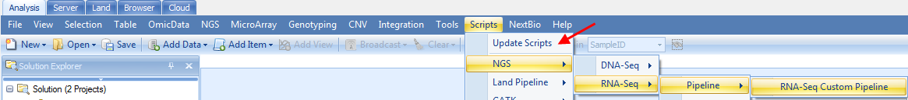

# Pipeline Script

A pipeline script (Pscript) is created and managed by ArrayServer administrators. Once a pscript is installed in Array Server, it becomes a pipeline tool. Users can submit large amount of samples to the pipelines to process the samples and analyze data. The input and output for the pipeline can also be pre-configured and exposed to GUI.

A Pscript includes three blocks: **Info**, **Input** and **Script**.

**Info** block allows the administrator to specify a label for the script, a description of the script, as well as a category (separated by \\ for multiple levels) for the pscript, as in the example below:

	 <Info>
	 Label=Illumina RNA-Seq Alignment
	 Description=Import Illumina reads with B37/R62
	 Category=NGS\RNA-Seq\Illumina

**Input** block allows the user to specify variables (also defined as Parameters) that will be used by the script. Variables are named by using the @VariableName@ pattern. These variables can be substituted at appropriate places within the script. Each variable should follow this pattern:

	 @VariableName@=DefaultOption
	 ~@VariableName@=Variable description
	 ~@VariableName@Levels=Level1, Level
	 ~@VariableName@ExclusiveLevels=True

**Script** block contains the Ocript procs that perform data analysis in the pipeline. User may refer to Oscript that was introduced in the previous chapter in this tutorial.

Below is an example of a pscript (RnaSeq Alignment Pscript Pipeline) that align RnaSeq reads and save the output bam files to a specified folder:

	 <Info>
	 Label=RnaSeq Alignment Pscript Pipeline
	 Description= Align RnaSeq reads and export Bam to a folder
	 Category=NGS\RNA-Seq\Illumina

	 <Input>
	 @JobNumber@=4
	 ~@JobNumber@=Number of threads to run for each of the steps.
	 ~@JobNumber@Levels=1,2,3,4,5,6,7,8
	 ~@JobNumber@ExclusiveLevels=True

	 @ThreadNumber@=4
	 ~@ThreadNumber@=Number of threads to run for each of the steps.
	 ~@ThreadNumer@Levels=1,2,3,4,5,6,7,8
	 ~@ThreadNumber@ExclusiveLevels=True

	 @ProjectFolder@=
	 ~@ProjectFolder@Type=FilePath
	 ~@ProjectFolder@=Output folder for ALV and BAM files
	 ~@ProjectFolder@Type=FilePath

	 <Script>
	 Begin OpenProject;
	 ServerProject @ProjectName@;
	 End;

	 Begin MapRnaSeqReadsToGenome /Namespace=NgsLib /RunOnServer=True;
	 Files
	 "@FileNames@";
	 Reference Human.B38;
	 GeneModel Ensembl.R82;
	 Trimming /Mode=TrimByQuality /ReadTrimQuality=2;
	 Options
	 /PairedEnd=True /FileFormat=FASTQ /AutoPenalty=True
	 /FixedPenalty=2 /Greedy=false /IndelPenalty=2
	 /DetectIndels=False /MaxMiddleInsertionSize=10
	 /MaxMiddleDeletionSize=10 /MaxEndInsertionSize=10
	 /MaxEndDeletionSize=10 /MinDistalEndSize=3
	 /ExcludeNonUniqueMapping=False /ReportCutoff=10
	 /WriteReadsInSeparateFiles=True
	 /OutputFolder="@ProjectFolder@/@ProjectName@/BAM"
	 /GenerateSamFiles=False /ParallelJobNumber=@JobNumber@
	 /ThreadNumber=@ThreadNumber@ /InsertSizeStandardDeviation=40
	 /ExpectedInsertSize=300 /MatePair=False
	 /InsertOnSameStrand=False /InsertOnDifferentStrand=True
	 /QualityEncoding=Automatic /CompressionMethod=Gzip
	 /Gzip=True /SearchNovelExonJunction=True
	 /ExcludeUnmappedInBam=False /KeepFullRead=False
	 /Replace=False /Platform=ILLUMINA /CompressBam=False;
	 Output RNASeqAlignment;
	 End;

	 Begin SaveProject;
	 End;

	 Begin CloseProject;
	 Project @ProjectName@;
	 End;

The Pscript may be saved as RnaSeqAlignmentPipeline.pscript, and installed in Array Server in **Manage | Manage Scripts** as shown in the next section.

## Manage Pscript in Array Server

ArrayServer administrators can manage (add, edit and remove) PScripts in Array Server. The pscript management is in **Manage | Manage Scripts**:

Administrators may install new pscript as a pipeline in Array Server by clicking on **Add | Download script from Omicsoft | Load From File**, and select the .pscript file (for example RnaSeqAlignmentPipeline.pscript).

Administrators may install pre-configured pscript pipelines prepared by Omicsoft by clicking on **Add | Download script from Omicsoft**.

Choose one script, for example **IlluminaDNASeqBAMFullPipeline**, and click **OK** to show the details of the script, including description, required input, oscript for each analysis module. Click on **OK** to install this script on Array Server.

## Submit Samples To Pscript Pipeline to Run Jobs on Array Server

Users may submit samples to Pscript pipeline to perform large scale data analysis on array server.

The most typical way for users run samples in a pipeline is to upload a sample registration file (file extension .osreg) to the user's Instruction folder in Array Server.

Array Server automatically scans the Instruction folder, picks up any sample registration files (osreg files) in the folder, and submits the samples in the osreg file to the pscript pipeline that is specified in the osreg file. The pscript pipeline will process samples in Array Server.

Here is an **osreg** file example that provides input sample and parameters for the RnaSeq Alignment Pscript Pipeline shown in the begining of this chapter:

	 [Samples]
	 SampleID	FilePath	SampleName
	 SRR521462	FASTQ1=/path1/test1.fastq|FASTQ2=/path1/test1.fastq	Sample1

	 [SampleSet]
	 ID=Alignment_test
	 Title=Alignment_test
	 Reader=standard users
	 Editor=standard users
	 ExperimentSource=Test
	 ExperimentTitle=Test Experiment1
	 ExperimentDescription=Test Pscript for a customer
	 ExperimentDesignDate=07/24/2017
	 PrincipalInvestigator=Test
	 Project=test 1

	 [Pipeline]
	 Project.Readers=standard users
	 Project.ID=AlignmentTest
	 UserID=omicsoft
	 ScriptID=RnaSeqAlignmentPipeline.pscript
	 Project.Editors=omicsoft
	 Parameters.JobNumber=2
	 Parameters.ThreadNumber=4
	 Parameters.ProjectFolder=/Users/omicsoft/20170724_pscript_user_v1

Users may refer to the Sample Registration Chapter in Sample Management tutorial for more details on the osreg file.

Users may also submit samples to pscript pipeline by browsing server samples and right click on any SampleSet to **Run Server Pipeline**. Users may then choose one of the installed scripts to process their samples.

## Customize Pscript and Expose it to Array Studio GUI

Server administrators have the capability to make a Pscript available in the Analysis tab of Array Studio. This option would allow users to automate analyses without registering the samples on the server, similar to our built-in analysis pipelines under the **Add Data | Add NGS Data** menu option. To expose a Pscript to GUI, the Pscript author needs to include the following in <Input> section.

	 <Input>
	 ExternalScriptInputType=Files
	 ExternalScriptMenuText=Customized Function Name
	 ExternalScriptMenuStructure=NGS\RNA-Seq\Alignment
	 ExternalScriptFileFilter=FASTQ files|*.fastq|.gz|*.gz

Example of the full script allowing GUI input:

	 <Info>
	 Label=RNA-Seq Custom Pipeline (with save after each step)
	 Description=Raw data QC, Align to B37.3 with RefGene, Post Alignment QC with Ensembl
	 Category=NGS\RNA-Seq\Illumina

	 <Input>
	 ExternalScriptInputType=Files
	 ExternalScriptMenuText= RNA-Seq Custom Pipeline
	 ExternalScriptMenuStructure=NGS\RNA-Seq\Pipeline
	 ExternalScriptFileFilter=FASTQ files|*.fastq|.gz|*.gz

	 @PairedSamples@=True
	 ~@PairedSamples@=Data is paired. Options are True or False (True by default)
	 ~@PairedSamples@Levels=True,False
	 ~@PairedSamples@ExclusiveLevels=True

	 @ThreadNumberPerJob@=4
	 ~@ThreadNumberPerJob@=Number of threads to run for each of the steps.
	 ~@ThreadNumerPerJob@Levels=1,2,3,4,5,6,7,8
	 ~@ThreadNumberPerJob@ExclusiveLevels=False

	 @ParallelJobNumber@=8
	 ~@ParallelJobNumber@=Number of parallel jobs to run for each of the steps

	 @PreviewMode@=True
	 ~@PreviewMode@=Set to true to run raw data QC in preview mode
	 ~@PreviewMode@Levels=True,False
	 ~@PreviewMode@ExclusiveLevels=True

	 @Gzip@=Gzip
	 ~@Gzip@=Set to Gzip if input files are gzipped or None
	 ~@Gzip@Levels=Gzip,None
	 ~@Gzip@ExclusiveLevels=True

	 @OutputFolderName@=
	 ~@OutputFolderName@Type=FilePath
	 ~@OutputFolderName@=Output folder for results and BAM files

	 <Script>
	 //Raw data QC section
	 Begin NgsQCWizard /Namespace=NgsLib;
	 Files
	 "@FileNames@";
	 Options /FileFormat=AUTO /QualityEncoding=Automatic /CompressionMethod=@Gzip@
	 /PreviewMode=@PreviewMode@ /ParallelJobNumber=@ParallelJobNumber@
	 /BasicStatistics=True  /BaseDistribution=True /QualityBoxPlot=True
	 /KMerAnalysis=True  /SequenceDuplication=True /IgnoreFF=True
	 /OutputFolder="@OutputFolderName@";
	 Output ;
	 End;

	 Begin SaveProject;
	 End;

	 //Mapping Section
	 Begin MapRnaSeqReadsToGenome /Namespace=NgsLib;
	 Files
	 "@FileNames@";
	 Reference Human.B37.3;
	 GeneModel RefGene;
	 Trimming /Mode=TrimByQuality /ReadTrimQuality=2;
	 Options /ParallelJobNumber=@ParallelJobNumber@ /PairedEnd=@PairedSamples@
	 /FileFormat=AUTO  /AutoPenalty=True /FixedPenalty=2 /Greedy=false /IndelPenalty=2
	 /DetectIndels=False  /MaxMiddleInsertionSize=10 /MaxMiddleDeletionSize=10
	 /MaxEndInsertionSize=10 /MaxEndDeletionSize=10  /MinDistalEndSize=3
	 /ExcludeNonUniqueMapping=False /ReportCutoff=10 /WriteReadsInSeparateFiles=True
	 /OutputFolder="@OutputFolderName@" /GenerateSamFiles=False
	 /ThreadNumberPerJob=@ThreadNumberPerJob@  /InsertSizeStandardDeviation=40
	 /ExpectedInsertSize=300 /InsertOnSameStrand=False
	 /InsertOnDifferentStrand=True /QualityEncoding=Automatic /CompressionMethod=@Gzip@
	 /SearchNovelExonJunction=True /ExcludeUnmappedInBam=False;
	 Output ;
	 End;

	 Begin SaveProject;
	 End;

After installing the PScript on Array Server, any Array Server user can open a server project and open this PScript in **Scripts** (click on **Update Scripts** first). **RNA-Seq Custom Pipeline PScript** example with full script.

Users can simply input their files and parameters and perform their analyses using the customized PScript.
