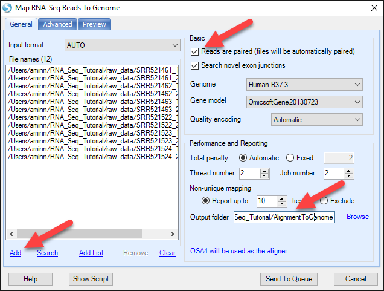

# Alignment to the Genome

The second step in the analysis of most RNA-Seq data is the alignment of the reads to the genome. Alternatively, if the data has already been aligned, the alignment files (BAM/SAM) can be imported using **Add NGS Data | Add RNA-Seq Data | Add Genome Mapped Reads**.

For this experiment, we will align the data using Array Studio.
Please go to the **Add Data** dropdown menu on the toolbar, then choose **Add NGS Data | Add RNA-Seq Data | Map Reads to Genome (Illumina)**.

At this point, the Map RNA-Seq Reads to Genome module appears. The first step is to click the **Add** button to specify the location of the files. Choose the 12 files that were downloaded from SRA or the subset of the dataset downloaded from the OmicSoft website.

Note that these files are in the .gz format. The alignment process takes this into account and supporting .gz format is an effective way to save some space when importing files, as there is no need to extract all files.

Since this is a paired experiment, click the **Reads are paired** checkbox.
This will ensure that the pairing information is used in the alignment and counting process.

Choose the **Genome** for the experiment. In this analysis, we used **Human.B37.3**.
Omicsoft supplies standard genome builds for common organisms, but the user can always choose to build and use their own genome. Similarly, choose the **Gene Model** to be used for alignment. Here we use an Omicsoft gene model built on 07/23/2013, but the user can also choose from various Ensembl, UCSC or RefGene builds, or build their own gene model. Options to build genome and gene models can be found in the menu under **NGS | Build | Build Reference Library** and **NGS | Build | Build Gene Model**.  

Leave the **quality encoding** set to automatic. The files used in this tutorial were encoded using the Sanger quality scoring system.
**Total penalty** should be left as automatic - alignment parameters are described completely in Omicsoft's white paper on alignment [^link^](http://omicsoft.com/downloads/whitepaper/OmicsoftAligner.pdf).

**Thread number** indicates the number of threads to use per alignment, and usually this number should be less than 6. Job number refers to the number of parallel jobs (independent processes).

**Non-unique mapping** indicates how many "ties" for non-unique reads should be reported, or whether they should be excluded all together.

Only BAM files will be output. If users also want SAM files, there is a tool (**NGS | Tools | Convert Files**) in ArrayStudio to generate SAM files from BAM files.

**Output folder** is the place if one wants to explicitly specify a location to store the alignment BAM files. Otherwise the bam files will be saved in a default location (a random number/letter folder in the project folder). In this tutorial, it is recommended to specify a folder so that BAM files can be found easily in next step (for fusion detection).

There are a few options in the **Advanced** Tab (e.g. Indel detection). In general the default values have been tuned and should work well in most cases.

Leave the **Exclude unmapped reads** *unchecked*, so that the generated BAM file will contain the information for all the reads (i.e. mapped and unmapped). The generated BAM files (which contain unmapped reads, possible fusion reads) can be directly used as input for the single-end fusion detection algorithm (see the fusion chapter in this tutorial).

Click **Send to Queue** to submit the analysis.

This analysis could take hours to complete, depending on the number of threads, type of computer (64-bit/32-bit), etc. As an additional option, in the parameters for mapping the reads, there is an additional **Preview** tab, which allows the user to specify a percentage of the reads to sample for alignment and QC. This option may be attractive to a user who wishes to test the quality of the data before performing a large-scale analysis on new RNA-seq datasets.

After the alignment, you will see a NgsData object and an alignment report table in the solution explorer, and BAM files as well as alignment report summary files in the specified output folder:

Add the design table, "Design.txt", which can be found in the .zip folder containing the subset of RNA-Seq data downloaded in Chapter 1 of this tutorial. Right click on **Design**. Select **Import | Tab delimited file**

There will be two options to specify:

**Append to the existing covariate table**: checking this option will append the selected design file contents to the existing design table.

**Use the name order in the new covariate table**: checking this option will use the name orders in the selected design file, instead of using the name orders in the existing design table.

These two options should be left unchecked for this tutorial (as this is a new design table to import).

The study includes 3 K562 cellline samples and 3 MCF7 cellline samples.

