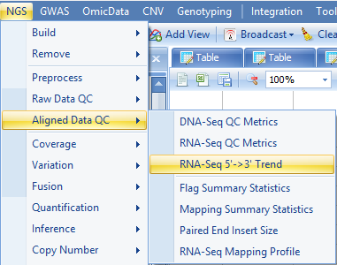

# QC of Aligned Data

## Alignment Report

By default, an alignment report is generated anytime an alignment is done in Array Studio.
If it is not already open, go to your Solution Explorer and double click on Report from the **AlignmentReport** table.

This will show, for each pair (or single file if the user did not do a paired alignment), some statistics regarding mapping. One of the key statistics is the uniquely paired reads (uniquely mapped and properly paired). *Note:* Omicsoft is constantly updating algorithms and data to make sure that users have the most accurate results. You may have slightly different results when you compare your results with the tutorial.

## RNA-Seq Aligned QC

This module can be used to generate a table of metrics, along with visualization for each metric by scanning the alignment BAM files. These metrics can be used to provide an overview of different statistics on alignment, coverage, Flag, mapping location, insert size strandness, and more, in a single table. It also generates a **ProfileView** showing a chart for each metric.

Here we assume that the alignment data (NGS data) exist in a project. If not, one can add bam files into a project by going to **Add Data | Add NGS Data | Add RNA-Seq Data | Add Genome-Mapped Reads**. To run the RNA-Seq QC module, go to **NGS | Aligned Data QC | RNA-Seq QC Metrics** now.

You will see the following menu item:

Choose the NGS data and leave all other settings as their defaults and click **Send to Queue** to run the module. **Source** metric is based on the provided gene model. It provides the most information with gene models like Ensembl that have detailed information for the source of each transcript. Here, we specify to use gene model OmicsoftGene20130723.

The analysis returns **Table** and **Profile** Views of QC metrics in the **Aligned Data QC** folder:

In the **Table** view, as you scroll from top to bottom on the table, you will find the following sections:

### Alignment Metrics

These metrics can be used to give an overall idea of the quality of the alignment for your samples.

### Coverage Metrics

The coverage metrics give you an overall idea of the mean coverage of your experiment. For RNA-Seq, it looks at the (total length of aligned reads/total exon length of your gene model). It also gives metrics on the number and percentage of genes with coverage. Finally, it gives a metric on the number of genes with at least 1 RPKM of coverage, as well as 10 RPKM of coverage.

### Duplication Metrics

The duplication metrics can give you an idea of the total level of duplication for an experiment (after alignment). This is based on coordinates (start position), rather than the raw data QC which was based on sequence. It is expected that an RNA-Seq experiment will have a large amount of duplication, so do not be alarmed if these metrics show high values.

### Feature Metrics

Feature metrics measure the rate of CDS/Exon/Gene/Transcript coverage by RNA-Seq data.

### Flag Metrics

Flag metrics are generally only useful for paired end reads when data has been aligned with OSA. It provides metrics using the SAM Flags.

### Insert Size Metrics

Insert size metrics provide some basic metrics on the insert sizes for paired end experiments. Use these metrics to ensure that the paired end experiment is performing as expected, and to look for any outlier values.

### Profile Metrics

Profile Metrics provide important overall statistics based on the provided gene model. Metrics include the rate of reads mapped to an exon, exon junction, intron, anywhere in a known gene, in a known gene with an insertion or deletion, an inter-gene region, inter-gene region with insertion, inter-gene region with deletion, or a deep inter-gene region (>5kb outside the known gene model). Use these metrics to determine the overall success of the profiling.

### Source Metrics

These metrics can be used to get a sense of the overall types of transcripts that are being aligned. For instance, in this experiment shown below, most reads are mapped to hg19 known genes and a small fraction is mapped to mitochondria.

### Strand Metrics

The strand metrics give you the percentage of reads that are aligned to the sense or anti-sense strands. For most Illumina RNA-Seq experiments (in which the reads are unstranded, it is expected that reads would align in equal portion (50/50). However, for some stranded protocols, this might not be the case.

## Sequencing (Positional) Trend

This module is specifically designed to investigate the sequencing positional biases by summarizing the overall coverage along the transcripts. In practice, we find that the module is particularly useful to assess the quality of RNA-Seq data from low input protocols , where we observed severe positional bias due to library preparation steps.
You can find the function in **NGS | Aligned Data QC | RNA-Seq 5->3 Trend**.

Choose the NGS data and leave all other settings as their defaults and click **Send to Queue** to run the module.

The analysis returns a QC table in the **Aligned Data QC** folder with name **Trend53**:

Double click the **Profile** View if it is not opened:

By Default, all transcripts are classified into seven length groups (0-499bp, 500-999bp, 1000-1999bp, 2000-2999bp, 3000-3999bp, 4000-4999bp, 5000+bp). Coverage values in each length group are linearly scaled to have the maximum to be 1, so that they are comparable among different length groups. Bins 1-100 are from transcript 5' to 3'. The view above shows very minor positional bias toward 5' (little higher coverage on 5' end).

## Other Aligned Data QC

**RNA-Seq QC Metrics** provides comprehensive assessment of the alignment data. We also provide metrics such as **Flag Summary Statistics**, **Mapping Summary Statistics**, **Paired End Insert Size**, **RNA-Seq Mapping Profile** as separate functions, where users can specify more analysis options.

