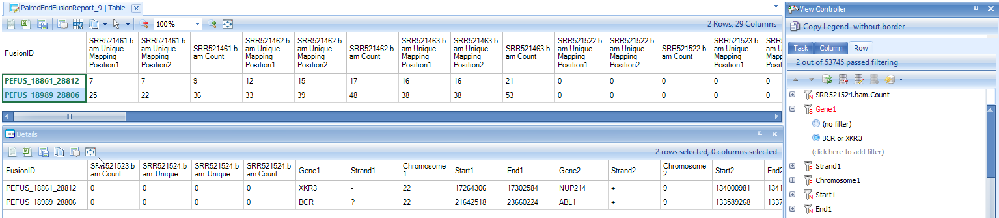
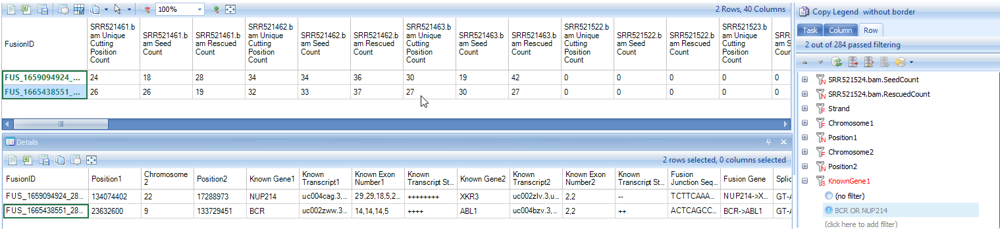

# RNA-Seq Fusion Gene Detection

In RNA-Seq datasets, fusion genes can be detected based on both paired- and single-end reads. In a paired-end NGS dataset, a discordant read pair is one that is not aligned to the reference genome with the expected distance or orientation. If a set of discordant read pairs are mapped to two different genes, a fusion gene is suggested. On the other hand, single-end reads that span the fusion junctions provide base-pair evidence for the fusion events.
In paired-end datasets, two fusion reports from junction-spanning reads and discordant read pairs can be combined to eliminate false positives and provide accurate base pair resolution detection of fusion.

Three fusion detection functions can be found in **NGS | Fusion** menu:

## Report Paired-End Fusion Genes

**Report Fusion Genes (Paired End)** module will detect fusion genes from inter-transcript paired-end reads based on RNA-Seq alignment (**NgsData**).

Choose the NGS data and Gene model; specify the fusion report cutoff and alignment tie cutoff. Check **Output fusion reads** option and specify the directory path, supporting fusion reads will be saved as BAM files which can be used for visual checking in the genome browser. Leave all other settings as their defaults and click **Submit** to run the module. The output is a paired fusion report table listed under **Table** in **Solution Explorer**:

In the report table, there are three columns for each sample.
The first column shows the number of *Unique mapping positions* from reads in *Gene1*, the second column shows the number of *Unique mapping positions* from reads in *Gene2*, while the third column shows the total *Count* of read pairs mapped to that fusion. If reads map to only a small number of unique positions, this could indicate a false positive (potentially PCR duplicates). There are 3*6=18 columns of data, as well as additional annotation columns: gene name, strand and genomic locations. The start and end positions in the table describe the genomic coordinate of the gene, not the breakpoints of fusion gene. The exact breakpoint cannot be determined by fusion detection based on discordant read pairs. The information in **Filter** column in the report table comes from a fusion black list.
For more information about the blacklist, please read the following wiki article:
[^link^](http://www.arrayserver.com/wiki/index.php?title=Fusion_gene_detection_in_RNA-Seq#Blacklist_filter )

**View Controller** can be used to set row filters to list only genes of interest. Simply navigate to the **View Controller**, and under the *Row* tab, input genes of interest into the Gene1 and Gene2 filters. Below are rows for identified known *BCR-ABL1* and *NUP214-XKR3* fusion events in K562 samples:

When fusion ID is right-clicked, there will be an option to open a new Genome Browser to view selected fusion.

In the genome browser view, this feature can be customized to look at individual samples, or to combine tracks within a group. For this example, all samples are examined individually. Use the zoom features (arrows below) or the click wheel of the mouse to zoom in and out of regions of interest. In the example below, notice that the three samples (SRR521461-521463) have a different read coverage of BCR (left) and ABL1 (right) at the 3' and 5' ends, respectively.

**Report Fusion Genes (Paired End)** module reports fusion events by grouping gene pairs by rows in one table.
It provides an easy way to detecting recurrent fusion events when the analysis was run on multiple samples.

## Map Fusion Reads

**Map Fusion Reads** module will detect fusion genes from fusion junction-spanning reads which can characterize fusion genes at base pair resolution. It is a preferred approach to detect fusion events, using OmicSoft s fusion alignment method (*FusionMap, Ge,H, et al. Bioinformatics (2011): 1922-1928*). The fusion detection can use raw sequence files (Fastq, fasta, or qseq format) or alignment NGS data (BAM/SAM). If user is using the original **FASTQ** files, the first step is to filter out normal reads and get a pool of potential fusion reads. Make sure to click **Reads are paired** option so that a pair of files will be considered as one sample during fusion detection. The module will automatically pair two files based on file names. If it is unchecked, one file will be treated as one sample.

If user is using **BAM** files, potential fusion reads (such as reads spanning on two nearby genes) in alignment and unmapped reads will be extracted for fusion detection.
It is a preferred approach which saves running time of the filtering step when starting with **FASTQ** data.

**Minimal cut size** is the minimal seed length for fusion detection, which requires the minimal length of a fusion read mapped in two fusion partners, see wiki page:
[^link^](http://www.arrayserver.com/wiki/index.php?title=Seed_Read )

The default **Cut size** is to use value min(25, max(18, readLength/3). For this tutorial dataset, read length is 76, so we use the default.

There are more fusion alignment options in the **Advanced** tab. Leave all settings as their defaults and click **Submit** to run the module. The output is a fusion report table listed under **Table** in *Solution Explorer*:

In the report table, there are three columns for each sample. The first column shows the number of unique mapping positions from fusion junction spanning reads, the second columns shows the number of fusion *seed* reads, while the third column shows number of fusion *rescued* reads.
There are 3*6=18 columns of data, and 21 **annotation columns** for fusion strand, fusion breakpoint, known gene/transcript names of two genes, fusion junction sequence, splice pattern, predicted fusion gene and open reading frame status, and a "Filter" column containing black list information.
The annotations characterize fusion events at base pair resolution. We also create rollup columns, such as **SplicePatternClass** (Canonical or NonCanonical), **FrameShiftClass** (Frame shift or inFrame), **Distance** (displayed as "gap size" between two breakpoints or "-1" if located on two different chromosomes) and **OnExonBoundary** (Both, Single or None), for users to further filter false positives.

Below are two rows for known *BCR-ABL1* and *NUP214-XKR3* fusion events identified in K562 samples:

Like paired end fusions, users can also view fusions detected by "Map Fusion Reads" in genome browser by right-clicking the "Fusion ID".

**Map Fusion Reads** module reports fusion events by grouping fusion junctions by rows in one table.
It provides an easy way to detecting recurrent fusion events when the analysis was run on multiple samples.

## Combined Fusion Analysis

**Combined Fusion Analysis** will run fusion junction spanning + inter-transcript fusion read pairs detection at the same time. Combined fusion analysis can only be run on Paired end NgsData (Add or generate BAM files in ArrayStudio). It detects fusion junction spanning reads from unmapped reads in BAM files and detects inter-transcript fusion read pairs from singletons from BAM alignment entries. It will return a report showing potential fusion genes and counts for each fusion junction with columns showing the number of supporting junction spanning reads and inter-transcript fusion read pairs.

For more information about fusion gene detection, please read our "best practice" article in wiki:
[^link^](http://www.arrayserver.com/wiki/index.php?title=Fusion_gene_detection_in_RNA-Seq )
