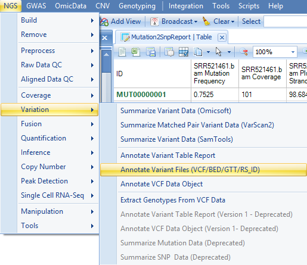

# RNA-Seq Mutation Detection

Mutation data can be generated for the RNA-Seq data.
This allows the user to compare frequencies of mutation, for individual sites, between groups of samples.
All mutation functions can be found in **NGS | Variation**.

In this tutorial, we will only cover **Summarize Variant Data (Omicsoft)** and **Annotate Variant Table Report** functions and **Annotate Variant Files (VCF/BED/GTT/RS_ID)**. User can find the documentation for other functions by click the **Help** button in each function menu.

## Summarize Variant Data

Variants are reported based on the pileup data from alignment data (**NgsData**).

Choose the NGS data. In the reference section, all references are selected by default. User can select a list of regions to summarize mutations. Selections can be on "Gene list" (a list of gene symbols from project lists), "Customized regions" (load a bed file), or a "Filtered by region" (i.e. chr9:133710831-133763062, or more regions separated by |). We will leave these selections as default in this tutorial.

Specify the base and mapping quality cutoff and choose the minimal coverage and mutation options. By default, the module only counts a mutation if the coverage >= 20, # reads supporting the minor allele >= 5 and the minor allele read frequency >= 5%.

!!! note
    You should lower the coverage cutoff if you are using the subset (5%) tutorial dataset.

In the **Advanced** tab, users can specify whether to adjust quality based on neighbour base pairs at each position, can check more output options and ask the module to add dbSNP information (dbSNP annotation can also be added in the mutation annotation step). Maximal frequency specifies the mutation read frequency needed in at least one sample to keep a mutation (i.e if none of the samples has a frequency over 0.10 at one position, then that mutation will not be kept). In addition to summarized reports, it is also helpful to choose **Generate merged VCF report for all samples** and specify an output folder. That will generate a streamed VCF report for all samples in the output folder.

Leave all settings as their defaults and click **Submit** to run the module. The output is a Mutation2Snp report table listed under **Table** in solution explorer:

In the mutation report table, there are four columns for each sample:

*   Minor allele **MutationFrequency**.
*   **Coverage** at this genomic location.
*   Percentage of mutation detected on the **plus strand** (MutationReadOnPlus/TotalMutationRead). Ideally, mutation should be detected evenly in both plus and minus strand. A percentage near 0 or 100 may imply a strand bias, which introduces false positive mutation calls.
*	Genotype.

If there are multiple minor alleles at the same location with frequency >= cutoff, they will be reported as different rows.
The report comes complete with annotation for each site, including chromosome, position, reference nucleotide and mutation (either a change in sequence or insertion/deletion). The whole table is a merged report from multiple samples grouping by mutation site (location + type) in rows. The mutation will be reported if at least one sample contains it with read frequency >= cutoff. The mutation read frequency, even 0%, and coverage in other samples will be also reported. Dot in the table are missing values, indicating that the coverage at this position in that sample is less than cutoff.

## Annotate Variant

The variants are then annotated with gene coding information, known SNPs and functional prediction databases.

Open **NGS | Variation | Annotate Variant Table Report** module; choose the mutation2snp report in **Data**, Omicsoft gene model in **Gene model**. Leave all settings as their defaults in this tab.

In the **Annotation Sources** tab, user can specify more annotation sources, for example 1000Genome and ClinVar as shown below. User also has the option to write the annotated mutation result directly to a text file. Users also have the option to build custom mutation annotators in the **Additional Sources** tab, using **NGS | Build - Build Mutation Annotator**.

Leave all the other settings as their defaults and click **Submit** to run the module. The output is a report table listed under **Table** in solution explorer:

The number of rows in annotated report table is more than that in mutation report table, because the annotation was done on each transcript. In the **Advanced** tab, there is one option: **Annotate by the longest transcript only**. If this option is checked, only the longest transcript of each gene will be used to perform the annotation.

Besides the columns for each sample (mutation frequency, coverage, PlusStrand%, and Genotype) in the mutation annotation table, there are a number of annotation columns: Dbsnp ID, Dbsnp Category, Gene name/Transcript ID, Type, Location, Consequence, mutation position in the open reading frame (Position On Cds), AAMutation and RS ID. In addition, there are columns that correspond to the annotations chosen in the **Annotation Sources** prior to running the analysis. Using the **View Controller**, choose filters to focus on items of interest. For example, in this module, we have filtered the results for the gene SERPINB:

## Annotate Variant Files (VCF/BED/GTT/RS_ID)

Here, users need to specify the VCF file location, note that only merged VCF file is supported. Users need to specify the Reference and Gene model in the General Tab. And in the Annotation Source Tab, users can choose annotators to further annotate VCF file.

In the **Annotation Source** tab, users can choose from the following sources:

|new_annotators_png|

* **1000GenomesSimple** - Output allele frequency, population allele frequency in 1000 Genomes data

* **CADD** - Combined Annotation Dependent Depletion (CADD); scoring the deleteriousness of variants in the human genome.

* **ClinVar** - Output health related information based on ClinVar database

* **Conservation** - Output conservation scores including GERP++, PhyloP, PhastCons, etc

* **ESP6500** - Output allele frequency in ESP6500 (NHLBI Exome Sequencing Project) data

* **ExAC** - Output allele frequency, population allele frequency in ExAC (The Exome Aggregation Consortium) data

* **FunctionalMutation** - Output functional mutation information based on dbNSFP (database for nonsynonymous SNPs' functional predictions)

* **GRASP2** - Genome-Wide Repository of Associations between SNPs and Phenotypes

* **GTExEqtl** - Output eQTL information based on GTEx project

* **GWASCatalog** - Genome-wide Association data from NHGRI-EBI

* **GWAVA** - Genome Wide Annotation of VAriants

* **Haploreg** - Output annotation on non-coding variants from HaploReg

* **Interpro** - Output protein domain based on InterPro database

* **RegulomeDB** - Output annotations for SNPs with known and predicted regulatory elements based on RegulomeDB

* **UK10K** - Frequency data from the UK10K project

* **Wellderly** - applies frequency data from STSI to identify variants present (and absent) in individuals who have reached 80 years of age without chronic disease

* **HGMD** - gene lesions in the Human Gene Mutation Database

In addition, it is now possible to use alternate annotators, including Cancer-, Gene-, and Region-based versions.

After submitting, an annotation file for vcf will be generated. Please note that this is a stream server file, instead of a local file to save searching and storing memory usage.
