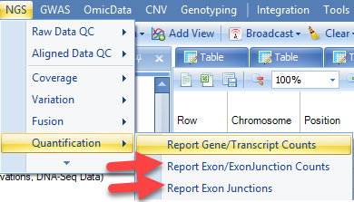

# RNA-Seq Quantification

ArrayStudio provides a number of modules and options for RNA-Seq quantification at gene, transcript, exon and exon junction levels.

## Report Gene/Transcript Counts

Given the alignment, one can summarize the gene expression at both gene and transcript levels, using the Quantification module in **NGS | Quantification | Report Gene/Transcript Counts**.

Both RPKM and Count tables can be generated. In this tutorial we summarize the gene level expression values with both the RPKM and Counts in one step. User can also choose to quantify at transcript level by selecting it in the **Summary Level** option. By default, option **Count fragments instead of reads** is selected to use paired reads only (thus FPKM is calculated). Options to count reads based on strands are designed for datasets from strand-specific protocols. In this tutorial, the six samples are not strand-specific as shown in the strand metrics from aligned QC table. Both stranded counting options are checked, and ArrayStudio will quantify expression values based on all mapping data.

Choose the NGS data and leave all other settings as their defaults and click **Submit** to run the module.
The output includes two Omic datasets, Counts and FPKM.

Both Omic datasets have gene and transcript annotation attached which were pre-built when building gene model. The design table attached to Ngsdata previously is automatically attached to these new data. They are treated as **OmicData Data** and all microarray data analysis functions, such as **OmicData | Pattern | Hierarchical Clustering**, **OmicData | QC | Principal Component Analysis**, **OmicData | Inference | General Linear Model** and other modules can be used for downstream data analyses.
Please read the Microarray tutorial to get detailed analysis information.

Counts can be used to look for changes between groups of samples through DESeq analysis in **NGS | Inference | DESeq (V2) One Way Test** or **DESeq (V2) General Linear Model**.

Below shows an example of DESeq One Way Test. DESeq One Way Test offers a statistical method to test whether a gene/transcript is differentially expressed between two or more groups of samples. Choose the newly generated Count table from the Quantification step and specify the analyses you would like performed. Here, we use the default parameters of DESeq, in which we compare the two tissue types (Bone marrow and breast, as specified in our design table). Output options can be customized to include separate lists for enrichment in one sample versus another, and to obtain additional analyses. This step can also be performed locally or on the server (check box if this is preferred). Click **Submit** to perform the analysis.

The results include an Inference Report table with estimates and pvalues, similar to ANOVA test results, and a Dispersion table in "Summary" folder.

For the volcano plot, users can specify in **View Controller** which columns to show using **Specify Columns**, and also add cutoff lines by **Specify Cutoff Lines**.

The volcano plot view is fully customizable and includes the ability to change symbol size/color, add labels, change titles, and export into local programs (as an image or powerpoint slide). Please refer to the microarray tutorial documentation to see some of these features.

## Report Exon/Exon-Junction Counts

Exon/exon junction level counting can be used for detection of alternative splicing.

There are two modules for exon level counting:

### Report known Exons/Exon Junctions

**Summarize Exon/Exon Junction Count** module will do quantification based on known gene models, i.e. exon junctions already annotated by gene model. Choose the NGS data and leave all other settings as their defaults and click **Submit** to run the module.

By default, **Perform RPKM normalization** option is checked. Normalized counts in RPKM fashion are reported for known exons and exon junctions based on the specified gene model. In the output report, each row is one *known* exon or exon junction annotated by genome coordinates, gene and transcript name.

|exon_exon_output_png|

### Report All Exon Junctions

**Report Exon Junctions** module quantifies *all* exon junctions detected by the alignment step.
Choose the NGS data and leave all other settings as their defaults and click **Submit** to run the module.

In the output report, each row is one exon junction annotated by genome coordinates, intron size, and gene/transcript name.
The types of exon junctions include known (annotated by the gene model), novel (not contained in the gene model, or one side of the exon junction lies on a known exon boundary, while the other side of the exon junction is unknown).

