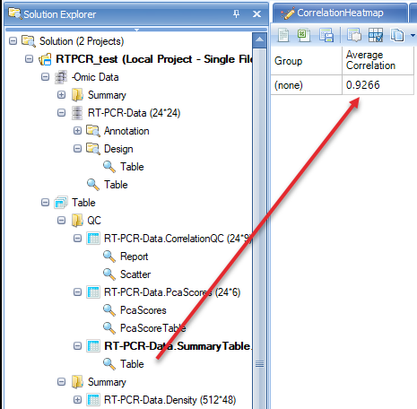
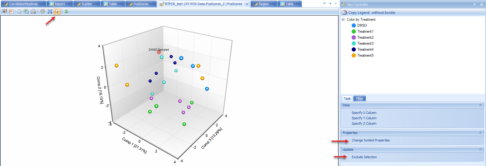
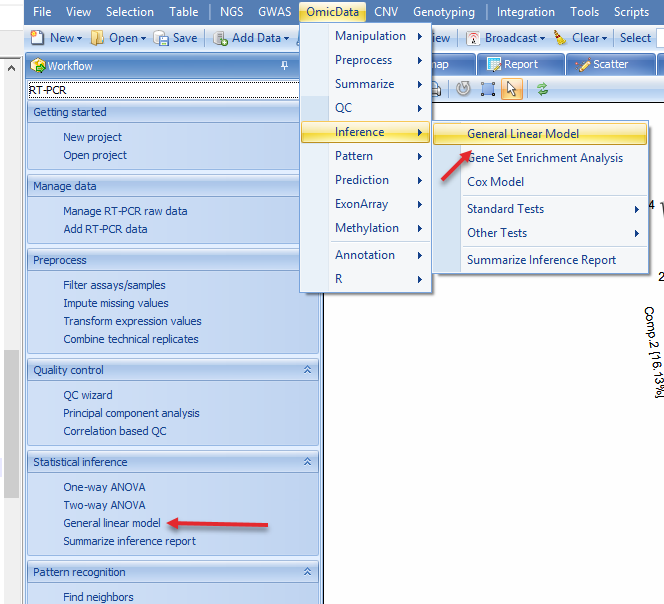
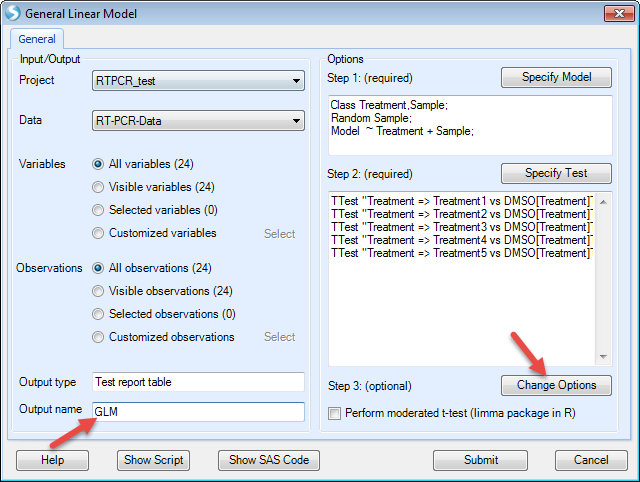
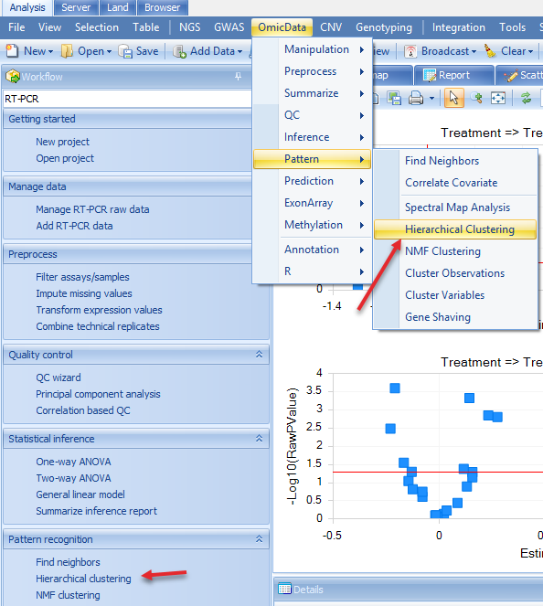

# Downstream Analysis of RT-PCR data

Based on this **RT-PCR** data, downstream analysis can be applied in the same way as **Microarray** data.

Here we will introduce QC wizard, principal component analysis, general linear model, and hierarchical clustering. For more details on other downstream statistical methods, please refer to Microarray tutorial.

To better annotate the samples to do the downstream analysis, please first follow the below steps to parse the ID in design table to Treatment and Sample.

First choose **Parse Column** in **Analysis | Table**, then select the design table

As treatment and sample are combined with "-" sign. We use "-" to split the columns

Then design table will add two more columns. Double click the column name of the last column, then change it to "Sample"

## QC wizard

QC wizard is a quick and easy way to run multiple QC commands simultaneously. Available options are Pairwise correlation, Correlation based QC, Principal component analysis and Kernel density. From the **Workflow** tab, select QC Wizard. This menu item can also be found under **Omicdata | QC | QCWizard**

Check "Kernel density" and keep all other options as default then click "Submit".

The results will show in Table and Summary folder.

A Density plot will show in the window. It shows the RT-PCR value distribution for each sample.

Correlation based QC calculates Median Absolute Deviation (MAD) scores for each group. By default, the cutoff for MAD score is -5.

From the scatter plot, we see that there are two blue (FAIL) points that can be considered outliers. Users have the option to remove these outlier points and under **View Controller**, select "Exclude Selection" under the **Task** tab. To keep the analysis simple for this tutorial we will leave these potential outliers alone, but users are encouraged to explore the results of selecting the "Exclude Selectin" option after the completion of this tutorial to see how it affects these analyses.

---
!!! note
    *When user does choose "Exclude Selection" option in this module, QC Analysis will be repeated on remaining samples, which can lead to additional samples failing MADScore filter.*
---

PcaScores will show a 2-D plot on the first and the second principal components. A Hotelling T2 ellipse with alpha level of 0.05 is also shown. From this plot, there is no outlier sample.

There is also a summary table that shows the average correlation in each group. As group was not selected in QC wizard, the correlation will be based on all samples. **Note**: *As outliers are excluded based on failing MADScore or PCA analyses, this correlation value will creep closer to 1 (100%)*.

If user-defined options instead of default options are needed for QC analysis, users can perform each QC step, rather than QC wizard.

## Principal Component Analysis

As mentioned previously, QC wizard is used to perform QC analysis with default parameters.

Here principal component analysis has more options to change. For example, we want a 3-D plot for PCA.

Then a 3-D plot for the first three principal components will be shown. Users can drag the plot and rotate the plot to get a better view.

Users can change the symbol properties to make the points color by Treatment, and make it show label ID when selected.

The plot shows samples do not cluster with Treatment in this data. But in some other cases the data will be clustered in some specific groups.

If there are obvious outlier samples, users can select the samples and choose "Exclude Selection". From the PCA plot, there is no outlier sample, so keep all of them.

## General Linear Model

General linear model is an important command to run statistical analysis on data. It allows the user to model the data on a variable-by-variable vasis. The user can specify a fixed, mixed or random model. Estimates, fold change, p-value, significant lists can be generated using this model. Using general linear model can generate more complicated statistical models than one-way ANOVA or two-way ANOVA.

In the next example, a general linear model on Treatment with Sample as random factor will be generated. The purpose is to find out the differentially expressed genes in treatment samples compared with DMSO control samples.

Go to **OmicData | Inference | General Linear Model** or in the Workflow tab, select **Statistical inference | General linear model**:

The first step in this process will be to "Specify Model":

Choose Treatment and Sample on the left (these two columns are in categorical types, so "Class" is checked). Then Click "Add" to add in the model. Check "Random" before Sample as we want sample as a random factor. Then click "OK" to finish setting up the model.

Now the model has been set. The next step is to "Specify Test" (T-test and/or F-test):

We want to compare each treatment with DMSO. So check "For each" (Treatment), then compare to "DMSO". Then we check all the options to generate estimates, fold changes, P-values, and significant lists. Then click "Add"

For this example, F-test is not needed so we leave it as blank. In future studies, users can use "FTest (ANOVA)" tab to specify F-test options.

Then click "OK". Now the model has been generated.

The next step is to change the options for the model, for example changing the cutoff of alpha-value or generating LSMean data. For this example, we just leave it as it is.

Then click "Submit" to run the model.

The results include a report and volcano plots in "Inference" folder, and significant gene lists in "List" folder of the **Solution Explorer**.

We can change the number of plots shown in one window, and also unify the scale.

When a point is selected in one plot, the corresponding point will also highlight in other plots. Details about the selected point will be in "Detail" window.

Additional view options are available in the **View Controller** on the right side of the user interface. For example, users can specify the X and Y-axes columns by "Specify Columns". Users can also specify p-value and estimate/fold change cutoff lines to better visualize and select the significant genes.

## Hierarchical Clustering

The Hierarchical Clustering command performs hierarchical clustering on data object observations and/or variables.

For example, we would like to see how the significant genes in the general linear model step (expressed differently in other treatments compared to DMSO) and how the samples cluster. Then in the Hierarchical clustering, we choose the significant gene list and all samples, and compute both observation and variable trees. Users can access this option by choosing in the **Workflow** tab **Pattern Recognition | Hierarchical Clustering** or the menu option **OmicData | Pattern | Hierarchical Clustering**:

We choose the significant gene lists by selecting the "GLM LinearModel Sig10" under the "Customized" Variables option. Choose the "Compute variable tree" and assign an Output name that will allow you recognize this customized clustering report:

After clicking "Submit", the dendrogram will appear in the main view. Users can change the clustering normalization method by "Specify Normalization" in the **View Controller | Task | Data**.

There are additional customization options under the **Task** tab in the **View Controller** window. For example, we see that X-axis labels are not showing in full. We can rotate the labels for better visualization by choosing **View Controller | Task | Properties | Change Chart Properties**:

We can also add color bars for observations and variables to better see the clustering feature by selecting **View Controller | Task | Customize | Change X-axis or Change Y-axis ColorBars**:

Our view has chanegd to reflect these changes. The *Color Legend* is in the top view of **View Controller**. Colors can be changed by simply right-clicking within this legend.

From the dendrogram, we can see how the observations and variables cluster. However, there is not a specific pattern in this example dataset. In some other cases, you may find the samples cluster by specific factors such as gender, age, treatment, etc.

Users also have the option of choosing specific branches within the dendrogram to see which genes or samples cluster. Simply click on the dendrogram in the dendrogram view and only those selected branches will appear in the heat map. Additional annotations (i.e. color bars) can also be added as described above.

|

Congratulations! You are done with the analysis. Feel free to browse other options in the workflow to examine other features of this module. As mentioned above, users are encouraged to examine the consequences of filtering out samples (i.e. ones that did not pass MADScore filters) on subsequent steps (QC, GLM, and hierarchical clustering). Click "Save" to save this project. You can reopen this project later on to get back to the same state as you saved.
This includes all views, filters, analyses, etc.

This tutorial represents just a piece of what Array Studio is capable of, with reference to RT-PCR preprocessing and analysis. Feel free to try different options along the **Import RT-PCR Wizard** to get a feel for what Array Studio can do. For additional information, don t hesitate to contact Omicsoft s support team (support@omicsoft.com).

**Thank you for using Array Studio.**

**Please contact Omicsoft Support (** support@omicsoft.com **) or Omicsoft Sales (** sales@omicsoft.com **) for sales-related questions.**
