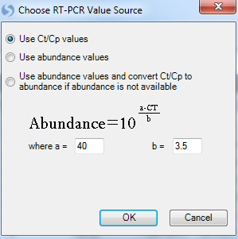
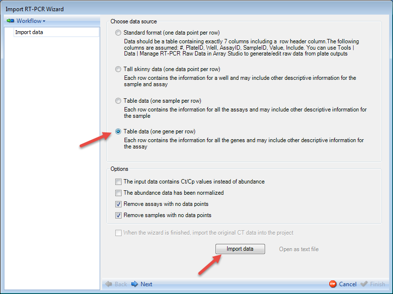
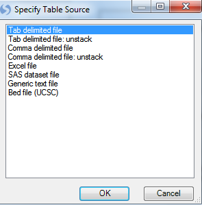
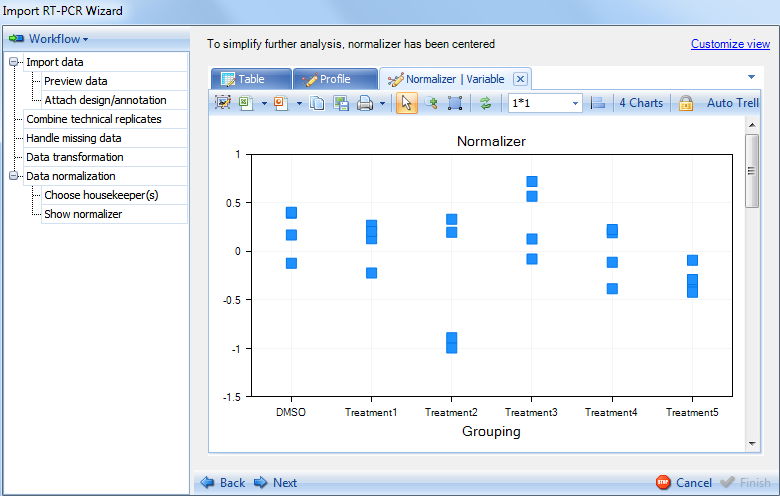
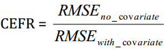

# Import RT-PCR Wizard

The **Import RT-PCR Wizard** can be used to walk the user through the process of importing and normalizing data. It can be opened via the **Add RT-PCR Data** menu item, or through the **Manage RT-PCR Raw Data** menu (after adding plate files).

Click the **File | Import RT-PCR Wizard** to continue:

At this point, the user is asked to choose an RT-PCR Value source. Options include
using the **Ct/Cp values**, using the **abundance values**, or using **any available abundance values and converting Ct/Cp to abundance where abundance is not available**. In this tutorial, since the imported plate file did not contain abundances, choose the first option and click **OK** now:

The **Import RT-PCR Wizard** is now displayed and contains two main sections. On the left is the workflow section. The Workflow section shows the user on which step of the **Import RT-PCR Wizard** the user is working. Initially, this will be the **Import data** step, as shown below but will be updated throughout the completion of the wizard. Also, clicking the *Workflow* button will allow the user to save the workflow to return at another time.

Array Studio supports importing data from the following formats:

* Standard format (one data point per row)-For this format, Data should be a table containing exactly 7 columns, including a row header column. This table should include the following columns #, PlateID, Well, AssayID, SampleID, Value, and Include. This is the format used in Tools | Data | Manage Taqman Raw Data.

* Tall skinny data (one data point per row)- For this format, data should be in a table where each row contains the information for a well, and may also include other descriptive information for the sample and assay.

* Table data (one sample per row)- For this format, data should be in a table where each row contains the information for all the assays and may include other descriptive information for the sample.

* Table data (one gene per row) - For this format, data should be in a table where each row contains the information for all the genes and may include other descriptive information for the assay.

Because the data was imported using the **Manage RT-PCR Raw Data** module, most of the options on this screen will be filled in by detecting the file automatically.

The only option that could possibly be in need of changing at this stage is the **Remove assays with no data points** and **Remove samples with no data points** options.

The user also has the option to import the original CT data into the project. This is unselected by default.

Uses can also import QuantStudio RT-PCR data.

Below is an example QuantStudio file

As one row is for one data point, the data can be imported as Tall Skinny Data format.

Then specify each column

Uses can also import TaqMan hPSC Scorecard data, formatted as below:

The data can be imported as Table format

Select the **Next** button at the bottom of the window

## Preview Data

The
**Workflow** frame of the **Import RT-PCR Wizard** window now shows that we have advanced to the **Preview data** step.

The right side frame contains statistics for the data being imported, as well as visualizations (Heatmap Table tab) of the data. Samples can be removed in this screen by clicking on sample IDs on the column header and clicking on **Remove selected samples** option. Notice that number of sample selected will be updated to reflect how many you have selected.

Individual genes can also be deleted by first clicking on the gene ID (header of the row) and clicking on **Remove selected assays**.

Click the **HeatmapTable** tab to see the heatmap view of the data.

This shows a Heatmap view of the gene abundance in different samples. Any missing data points will be a yellow color. The table and heatmap views are fully customizable by selecting the **Customize View** option.

This will return the **Customize View** window which contains multiple tabs (**Task**, **Variable**, and **Observation**) for customization - these are similar to the options available under **View Controller** in the Microarray tutorial. These can be used to format the display options of the table and heatmap views, as well as filter for specific samples or assays.

Through the preview step, now we have made sure that the imported data is correct. Click the **Next** button to advance to the next step.

## Attach Design and Annotation

This brings up the **Attach design/annotation** step as indicated in the **Workflow** section. Your design table will have been created in advance, and should contain each sample in your dataset in a row with the different design annotations in each column. For this particular dataset, a file has already been created that contains the name of each sample, and a treatment column containing the treatment each sample belongs to.

Click the **Import** button to open the already saved design table:

Design tables can be imported using a number of different formats. Choose **tab delimited file** now and click **OK**.

The design table was saved as *sds21.design.txt* in the same directory as the data file. Select this file now:

Once the design file is imported, the design information will be automatically extracted into the biological grouping box.

The user should select the column that represents the biological grouping of their design. For the purpose of this tutorial, select **Treatment**.

Click on the **Next** button to advance to the next step.

## Combine Technical Replicates

The **Combine technical replicates** is the next step in the **Workflow** frame.

On the right side frame, the user can visualize the technical replicates, auto-filter out "bad" replicates as well as manually filter the replicates. Finally, the user can specify the combination method for the replicates (Mean, Geometric Mean, or Median).

Click the **Auto filter** option at the top of the frame. This will return the **Auto filter** window:

The **Auto Filter** allows the user to automatically filter the technical replicates based on these
criteria:

*   Exclude data point if value is greater than the specified value.

*   Exclude data points if value is less than the specified value.

*   Exclude the entire cell if the range of the cell is greater than the specified value. For abundance data, range is defined as log2(max/min). For Ct/Cp data, range is defined as max-min.

*   Exclude outlier data points based on Grubb's test - Can be used for filtering based on technical replicates (minimum of 3 replicates required). See
    [^link^](http://en.wikipedia.org/wiki/Grubbs'_test_for_outliers )
    for more details.

*   Exclude the whole cell if mean is greater than the specified value. For abundance data, mean is defined as mean(log2(value). For Ct/Cp data, range is defined as mean(value).

*   Exclude the whole cell if SEM (Standard error of the mean) is greater than the specified value.

Keep the default settings and click on **OK**. This will generate a new tab Replicate.Summary Table, which summarizes the 2 technical replicates for each variable (AssayID) by range, mean, SEM (Standard error of the mean). Individual points can be selected for exclusion in this table as well.

The scatter view will highlight data points that are set as missing by the auto filter. Switch to the **Scatter** tab now. Each chart shows the 24 points (24 observations) for one variable. There are 24 variables (genes) in total, so there are 24 charts. Users can scroll up and down to visualize each chart. Additional charts can be displayed in the same window by choosing the window size option on the toolbar. Each data point on the chart is the average of the 2 replicates of this gene in each observation.

Replicates that have either been selected by the **Auto Filter** or manually selected will be highlighted (red). Notice that one particular gene (Control Ribosomal 18s) appears to have a large number of data points that are highlighted. This is due to the **Auto Filter** attempting to exclude data points with a Ct value less than 10.

To see which 45 points were selected in the text file, click the option labeled **45 selected and set as missing**. This will open up a text file showing the 45 excluded data points:

The last step in combining technical replicates is choosing the combination method (bottom of window). The available methods include taking the **Mean**, **Geometric mean** or **Median** of the technical replicates. For the purpose of this demonstration, we will use the mean which is the default option.

Click on **Next** will advance to the next step: **Handle missing data**.

## Handle Missing Data

The **Handle missing Data** step provides the user with two views to visualize the missing data. In addition, selected missing data points can be replaced with a value of the user's choosing (35 by default).

Proceed to the next step by clicking on **Next**.

## Data Transformation

The **Data transformation** provides user several options for the data transformation.

If the data imported contains CT values, these values must be converted to abundance values. An editable formula is given for the conversion of these values as indicated above. The user has the options (enabled by default) to perform a log2 transformation on the data and to calculate relative abundance or relative quantification (RQ). For this demonstration, please choose the first option.

Click on Next to proceed to the next step **Data Normalization**.

## Data Normalization

There are multiple methods available for normalizing theRT-PCR data:

*   By using **Analysis of Covariance (the default option)**, you
    can use one or more housekeeping genes to compute a robust score and use this score as a covariate to adjust other genes. This method is statistically sound and the user has the best control on the process.

*   By using
    **Simple housekeeper normalization**, you can compute a robust score for all of the housekeepers as the normalizer. Missing data will be excluded from the calculation
    if simple summarization (e.g. mean) is used.

*   By using
    **Global normalization**, you can compute
    the median of all the assays as the normalizer. Missing data will be excluded from the median calculation.

Options to calculate the normalizer:

*   Choose the Summarization method for normalizer calculation.

    *   PCA
        -First, a PCA analysis is done based on the housekeeper matrix (housekeepers were centered and scaled). Then the first component is extracted and used to approximate the data matrix. Next, for each sample, the fitted values were averaged to get a single value (normalizer) for each sample.

    *   Mean

    *   Median

*   Choose **I prefer to use the full model** if you just need the software to calculate the
    normalizer for you (not normalizing the data). This option, when selected, will not normalize the data. It provides the normalizer value for the user but does not go through the normalization process.

*   Choose **I would like to perform a separate normalization for each group (e.g. tissue type)**
    if you want to specify a group by which to perform separate normalizations. For example, if the user had an experiment with different tissues types, they may want to normalize
    within each tissue type separately. If this box is selected, the user would have to
    choose the **Sample group column** from the columns in design table and perform the remaining normalization steps on each group.

For this demonstration, please choose the first option.

Clicking on **Next** will proceed to the **Choose Housekeepers** section of the **Data Normalization** step. If you choose **Global normalization** method, the **Choose Housekeepers** step will be skipped.

## Housekeeping Gene Selection

The **Choose housekeeper(s)** step allows the user to specifically select the housekeeping genes that will be used for normalization:

Clicking on the **Select housekeepers** button will present the **Select Rows** window:

This brings up a list of available genes. The user can scroll to their specific housekeeper genes and use Ctrl + click to select multiple genes. Finally use the arrow button, move them to the right panel.

For this tutorial, select *Control-ACTB*, *Control-GAPDH* and *Control-PPIA*. Once the housekeepers are selected and moved to the right **Listed rows** panel, click on **OK** button to proceed.

Array Studio creates a number of different views. The first view is a summary table containing information for each of the housekeepers, including *Missing samples, mean, range of values, standard deviation of values, FtestPvalue (based on biological group), Min, Max and Max/Min*.

Notice that the Control-GAPDH row is colored red to warn the user that the one-way ANOVA test Pvalue falls below 0.1 (housekeeper gene has significant different intensity in the 24 treatment groups. The user could choose to remove this housekeeper and recalculate but for the purpose of this tutorial, leave this as is.

Switch to the **Variable** tab.

The **VariableView** allows the user to see a Scatter View of each housekeeper gene for each of the biological groups (from **Attach design** step). There are actually 4 data points for each biological group, but they have similar abundance and group close to one other. Click on **Customize View**, choose **Change Symbol Properties** and use the **Jitter** option to get a better visualization of the 4 points. This can be used to manually eliminate "suspect" data points from the normalization calculations, by clicking directly on the blue data points and checking the **Mark selected points as missing** option on top right.

Switch to **Data** tab, the next view for visualization of the housekeepers. This table lists values for all the data points in **Variable** view.

Switch to **Profile** tab now to see the **Profile view**, which show the values from **Data** table.

With the visualization and selection of housekeepers complete, click **Next** now to continue. This will bring up the **Show Normalizer** step.

## Show Normalizer

The **Show Normalizer** includes several views of the normalizer, the first being a table, listing the 24 normalizers calculated for each of the 24 observations.

Click the **Profile** tab now to see the profile view for the normalizers  values in 24 observations. The Normalizer is shown in blue at the bottom, while the 3 housekeepers are shown in different colors at the top. User can check the legend by clicking on **Customize view** on top right and clicking on **Legend** tab.

Click the **Variable** tab now to see the variable view. Like the **Variable** view in previous step, data points are organized by biological group. On every chart there are 4 data points for each group, and using **Jitter** can separate them on the chart.

Click on **Next** to continue to the next section of the **Data normalization** step.

## Analysis of Covariance

In **Analysis of Covariance** step the user needs to set the model to be used for the normalization. By default, the previously calculated normalizer is included in the model:

Click the option **Specify full model** now to specify the model. This opens up the **Specify Linear Model** window. This is the same window used in the **General Linear Model** analysis module. More details on how to use this window can be found in the *Microarray Tutorial*.
For the purpose of this tutorial, our model will consist of the normalizer and treatment. Select **Treatment** from the left side of the window and then click **Add** to add it as one of the terms in the model. Notice that for categorical factors, user should make sure that its **Class** box is checked.

Click **OK** button to finish specifying model and return to the **Analysis of Covariance** window.

At this point, the model is ready and we just need to run it. Notice that the model now shows **Normalizer + Treatment**. Advanced options for this section include a special outlier filtering option that is enabled by default. Click **Run Model** now to run the model.

Results are returned in the window above, which is empty before running the model.
The summary note indicates that there are 20 out of 21 assays (21 genes without counting the 3 housekeepers) that have improved *CEFR* (Covariate Efficiency Factor Residual). These 20 genes showed smaller RMSE (Root mean square error) in model with normalizer than that without normalizer. The CEFR is calculated by the following formula:

The summary note also indicates that there are 3 outliers detected and marked as missing. This summary table shows the number of outliers removed (outlier filtration can be
specified in the advanced options), as well as a coefficient for each gene and PValue indicating whether the gene was improved due to normalization. This is used in conjunction with the calculated *CEFR* value to give the user an idea of how well the normalization went. This table can be opened in Excel or as a text file and saved for later use if interested. After looking at the results of the normalization, click the **Next** button to continue to the next section of **Data normalization**.

## Show Residuals

The **Show Residuals** section provides more detailed statistical views of the results of the normalization.

For each assay (gene), there are **Observed vs. Fitted** plot, **Observed** plot, **Fitted** plot, **Studentized** plot, **Jackknife** plot. The first 3 views plot observed and fitted values and the last 2 plot Studentized residuals and Jackknife residuals.

**Observed vs. Fitted** plot:

Switch the tab to see **Observed** plot:

Switch to the **Fitted** plot:

Switch to the **Studentized** plot:

Switch to the **Jackknife** plot:

Click on **Next** to go to the **Preview data** step.

## Preview Data

The **Preview Data** displays a preview of the data to be imported.
Missing values are indicated by dots

.

.

Click **Next** to go to the final section of the **Import RT-PCR Wizard**.

## Finish

Click on **Finish** at the bottom right of the window. This will complete the Import RT-PCR Wizard and will import the data shown in **Preview Data** step into Array Studio.

The data has now been completely imported into Array Studio as **RT-PCR** data listed under **Omic Data** folder of the **Solution Explorer**.

Like the **Microarray** data in Microarray tutorial, this data has design table and annotation table.
The 24 normalizer values are listed in the design table for each of the 24 observations.
