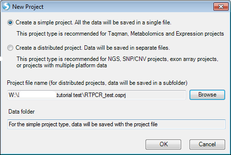

# Introduction

*Array Studio*
provides an integrated environment for analyzing and visualizing high dimensional data.
It is convenient in organizing and visualizing data with its *Solution Explorer*, which organizes each project into *Data, QC, Table, List, Cluster, Text, Attachments* and other categories. Multiple projects can be opened simultaneously in the *Solution Explorer*, and data can be shared among projects.
Each view is controlled by a *View Controller*, which performs view customization, applies filtering, and displays legends. Furthermore, its interactive visualization technique provides the details of data with the *Details Window* and *Web Details On-Demand*.

It is highly recommended that users complete the prerequisite for this tutorial: **MicroArray Tutorial**, which is a good introduction to
installation, basic usage, data structure and standard visualization in Array Studio.

## Downloading the SDS21 dataset

For this tutorial, the following materials will be required:

*   The SDS21 text file containing the RT-PCR data

*   The SDS21.design.txt file containing the RT-PCR data design information

In this dataset, there are 24 observations (6 treatments * 4 samples) and 24 variables. Each variable (AssayID) has 2 technical replicates in each observation. These files are available in a zipped resource file located on the Omicsoft web srver at the following URL:
[^link^](http://omicsoft.com/downloads/data/tutorial/RTPCR_sds21.zip )

After downloading the single .zip file, unzip the file to a folder to be used for this tutorial.

With the downloaded sample data, this tutorial will cover the steps involved in:

*   Importing data directly from **ABI** result text files

*   Normalizing data using a number of statistical methods

*   Viewing results using the same visualization tools employed elsewhere in Array Studio

## The Workflow Window/ The Solution Explorer

When Array Studio is first installed, it will look similar to what is displayed below.

If you have previously opened projects in Array Studio, you will see the **Last Opened Projects** window. If so, just click cancel so that Array Studio looks similar to below.

The "Workflow" window should be visible on the left side of the screen. If the window is not visible, go to the **View** Menu and select **Show Workflow**. Click the **Workflow** tab (next to **Solution Explorer**) and the **Workflow** window should appear similar to the screenshot below.

This window provides users, especially new users, with a  guide  to running different types of analysis. Click the Workflow dropdown box now and select **RT-PCR**.

Notice that the RT-PCR Workflow is separated into different categories, including *Getting started*, *Manage data*, *Preprocess*, *Quality control*, *Statistical inference*, and
*Pattern recognition*. While it is possible to access all of these functions via the menu commands in Array Studio, the workflows are designed to make it easier for the new users to work through their data.

The first section of the RT-PCR Workflow is the *Getting Started* section. In this section, it is suggested that the user either create a new project or open a previously created project.

To create a new project, click the **New Project** button in the Workflow, or the **New** button on the toolbar, or go to the **File** Menu, then click **New Local Project**. This opens the *New Project* window. *Note*: For the purposes of this tutorial, we will do the analysis under *Local Project*. However, this module can also be performed under *Server* mode, by simply clicking **File | New Server Project** or **New | New Server Project**

*Array Studio* allows the user to create two different project types:

*   A simple project, in which all the project is saved in a single file (recommended for microarray and
    RT-PCR projects).

*   A distributed project, where data is saved in separate files (recommended for exon array, CNV,
    or genotyping projects).

Since this project involves an RT-PCR project, choose **Create a simple project** now. Then, click the **Browse** button to select a location and name for the project. Once this is complete, click **OK** to continue.

Switch to the **Solution Explorer** by clicking on the *Solution Explorer* tab, which should be found at the bottom of the *Workflow Window*. If the *Solution Explorer* tab is not visible, open it by going to the *View Menu | Show Solution Explorer*.

The Solution Explorer will be empty except for data containers for List, Cluster, and Text files. You can right-click on List, Cluster, and Text for their additional options. For instance, right-clicking on List will bring up options to add a new List, add list from file, etc. A List can be used to filter the data, by either Variables (e.g. probesets), or Observations (e.g. chips or samples).
