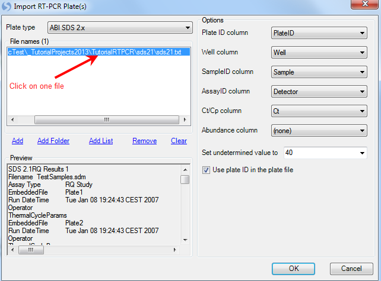
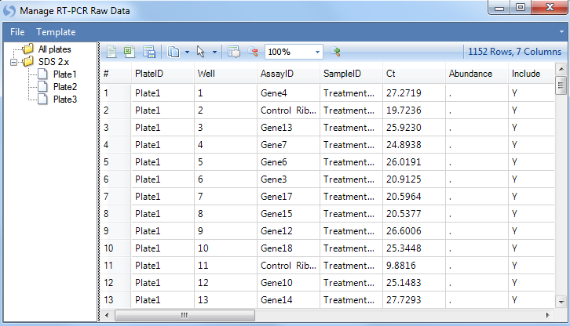

# Manage RT-PCR Raw Data

At this point, we are ready to add RT-PCR data to the *Solution Explorer*. This can be done in a variety of ways, but the easiest way is to first switch back to the **Workflow** *Window*, by selecting the *Workflow* tab at the bottom of the *Solution Explorer*. Alternatively, go to **View Menu | Show Workflow** to show the *Workflow Window*.

RT-PCR data can be imported directly from "ABI SDS 2.x", "Roche LC480" and  BioMark  exported text files. The module **Manage RT-PCR raw data** can take any number of these text files and convert them to a format suitable for the **Import RT-PCR Wizard** (for normalizing and importing RT-PCR data into Array Studio).

When selected, this opens the Manage RT-PCR Raw Data window, as shown below:

Initially, this will show a blank main window, as well as a section for organizing the plates (initially will just show an "All plates" folder with nothing in it). Go to the **File** menu and select **Add Plate File(s)** to begin the process of importing RT-PCR data.

This will open the **Import RT-PCR Plates** window

The first priority for this screen is to add plate files. This can be accomplished by selecting the **Plate type** to **ABI SDS 2x** and clicking the **Add** button.

This opens a window to select your plate file. Choose the "sds21.txt" file you downloaded earlier in this tutorial.

Once the files have been added to the **File name(s)** section, information in the files is automatically extracted. Clicking on an individual plate file shows a preview of that file in the **Preview** box. This allows the user to see if the correct plate files were imported, and also helps to set the **Options** section.

In general, you should pay particular attention to the options on the right, including **PlateID column**, **Well column**, **SampleID column**, **AssayID column**, **Ct/Cp column** and **Abundance column**.
Since there is no abundance information in this file, the abundance column indicates *(none)*, while other information is extracted automatically from the file. By default, undetermined values are set to 40, but users can **Set undetermined value to** 35, 40 or missing. When finished, click the **OK** button to return to the **Manage RT-PCR Raw Data** window to proceed to the next step.

Once plates have been added to the **Manage RT-PCR Raw Data** window, they will be organized in the left-most box. Notice in the example below that there are three plate files.

If data needs to be edited at this point (i.e. editing Sample Names, AssayID, etc.) this can be done at this step. To exclude a particular data point, change the **Include** column from **Y** to **N**. Once finished, select from the menu **File | Save Raw Data** to save the data.

The imported raw data will be saved as an Omicsoft RT-PCR raw data (.taqman) file, which can be uploaded anytime in the future through **Import RT-PCR Wizard**.

Now that the raw data has been successfully saved, we can proceed to the **Import RT-PCR Wizard** to finish the normalization and importing of the data as a regular Array Studio dataset.

