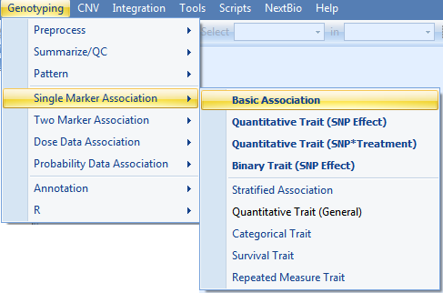
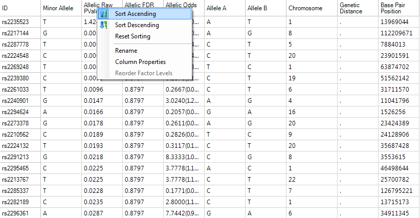
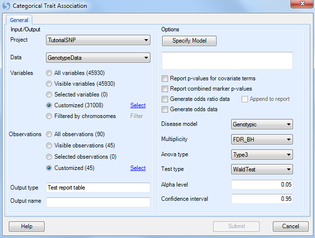
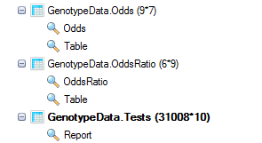
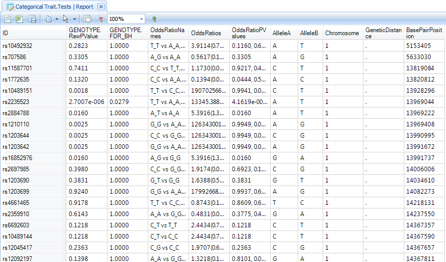
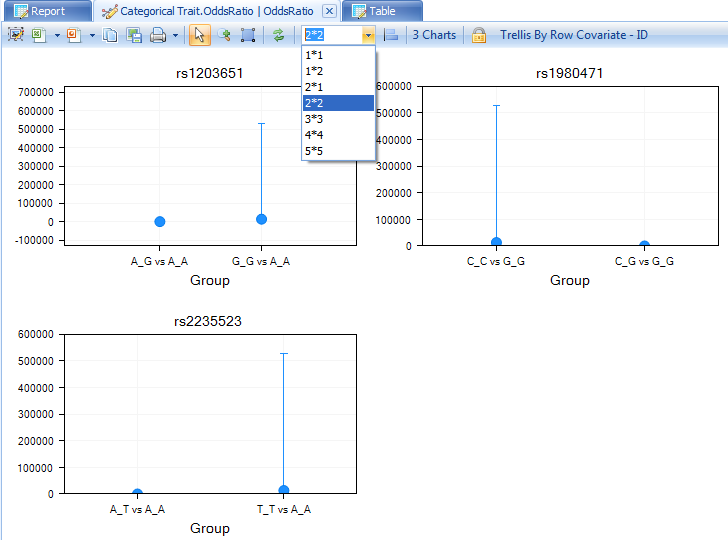
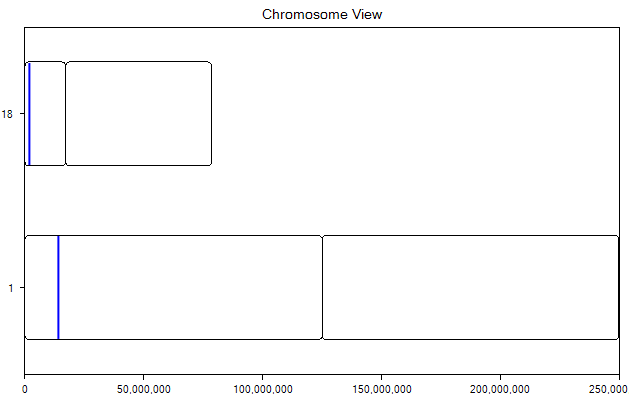
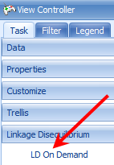
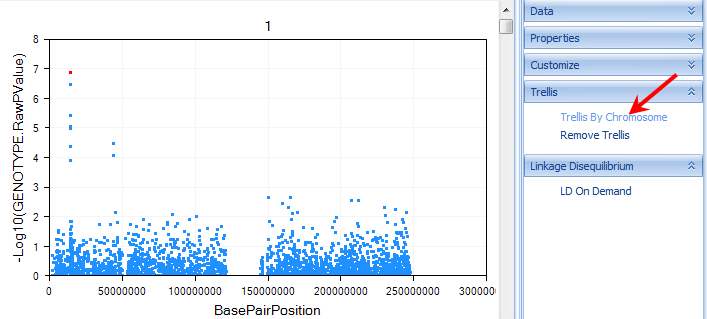
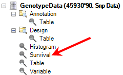

# Association Analysis

Besides visualization, summarization, and QC data, *Array Studio* contains a powerful set of tools for SNP association analysis. Users can analyze data using *Single-Marker Association* tests or *Two-Marker Association* tests. Available tests include *Basic Association*, **Stratified Association** (single marker only),  **Quantitative Trait**, **Categorical Trait**, **Survival Trait**, **Repeated Measure Trait**, as well as **Dose Data** and **Probability Data Association** tests (also CNV analysis modules are available).

In this tutorial, we will cover basic association, categorical trait, quantitative trait, and survival trait analysis.

## Basic Association Single Marker

Single marker-basic association analysis is based on Fisher s Exact test to test the allele frequency difference between Case/Control traits. To start a single marker-basic association analysis, go to *Genotyping Menu | Single Marker Association | Basic Association* to open the *Basic Association* window.

As usual, ensure that the *Project* is *Tutorial* and *Data* is *GenotypeData* and the *Variables* are set to customized variables using the list **GenotypeData.Variable31008**. For all of our association analyses, we only have design information for the *JPT* group, so use the *Observation* list **GenotypeData.Observation45** that was created in the last chapter during the *Filter* step (use customized observation list).

Under *Options*,

*   We need to set the design column containing the **Trait** we wish to analyze, in this case **Phenotype** (Note: By default, *Array Studio* should have chosen this as the *Trait*, due to the selection of *Group* as the *Phenotype* column when importing the *Design Table*).

*   Next, we need to set the **Case** level. As the levels of *Group* are named case and control, we should choose **Case** as our *Case* level.

User can use following options to decide which statistics to include in the result:

*   Generate the *Minor allele* (make sure it s checked)

*   *Minor allele count*

*   *Allelic test p-value and odds ratio* (make sure it s checked)

*   *Genotypic test p-value* (uncheck this box)

*   *Dominant test p-value*

*   *Recessive test p-value*

*   *Additive test p-value*

*   *Exact test*
---
!!! note
    While it is possible to run this analysis and test for a genotypic p-value, dominant test p-value, recessive test p-value, additive test p-value, and use Fisher Exact test instead of Chi-square test, for the purposes of this tutorial we will only investigate the allelic test Chi-square p-value and asymptotic odds ratio (Fisher Exact test will give exact odds ratio).
---

We can set the Multiplicity adjustment for the test (leave as is with *FDR_BH*, an Alpha level of *0.05*, and a Confidence interval of *0.95*).

Finally, change the **Output name** to *Basic Association* and click **Submit** to run the basic association test.

A new *Table* will be created in the *Solution Explorer* under the *Inference* section. All association analyses in *Array Studio* will generate **Inference Reports**. Notice the name of the report, *Basic Association.Tests* (as this is the name we specified above), and the type the report *InferenceReport Data*.

A *TableView* called *Report* will be generated by default and immediately visible in the main view window (make sure filters are cleared to see all variables). All of the requested information is now available for each marker, including the MinorAllele, Allelic.RawPvalue, Allelic.AdjustedPValue, and Allelic.OddsRatio. The Odds Ratio also includes the confidence interval. The last 5 columns are the appended annotation table.

Right click in the header of the *Allelic.RawPvalue* column and select **Sort Ascending**.

The *TableView* is sorted, showing the most significant markers based on this analysis.

We can also choose to filter this view, and we can do so using any of the generated columns (p-value, adjusted p-value etc.) or any of the annotation columns. As we are going to run three more similar analyses (categorical, quantitative and survival traits), we will do some filtering by p-value in later chapters.

## Categorical Trait Single Marker

To run a single marker-categorical trait analysis, go to the **Genotyping Menu | Single Marker Analysis | Categorical Trait**.

As always, ensure that *Tutorial* is chosen for *Project, GenotypeData* is chosen for *Data*, **GenotypeData.Variable31008** is chosen for *Customized Variables*. As we only have categorical trait information on the JPT subjects, make sure that our subject list, **GenotypeData.Observation45**, is chosen for *Customized Observations*.

Click the **Specify Model** button to open the *Specify Model* window:

Set the **Trait** to *Group2*.
Notice that the type of trait is now recognized as a *Categorical Trait*, and lists the three categories. Note: for categorical traits, the user can specify whether the data is ordered. If it is ordered, it should be analyzed differently (using cumulative odds logistic regression instead of generalized logistic regression), and the *Levels are ordered* checkbox should be checked when running the model for this dataset. Check the **Levels are ordered** checkbox now (Array Studio has the ability to deal with nominal traits or ordinal traits).

Additional covariates could be added to the model at this point, including potential principal component analysis components. However, for this tutorial, leave the model as is (*Categorical Trait* is *Group2*, *ordered*, model only includes *Genotype*).

Click *OK* to return to the *Categorical Trait* window.

At this point, the updated model should be reflected in the window.

Ensure that **Generate odds ratio data** and **Generate odds data** is selected. Ensure that **Genotypic** is chosen for the **Disease model**. Other available diseases models include *Additive*, *Dominant*, and *Recessive*.

**Multiplicity** should be set to **FDR_BH**, with an **Alpha level** of 0.05 and a **Confidence interval** of 0.95.

Set the *Anova type* to Type3, and set the *Test type* to *WaldTest* (the other option is *LikelihoodRatio* test).

Finally, set *Output name* to **Categorical Trait**.

If the user is interested, the equivalent SAS code can be generated after all options are set, by clicking the **Show SAS code** button.

Click *Submit* to run the Categorical Trait association analysis.

Three new *Tables* will be generated under the *Inference* section of the *Solution Explorer*: the standard *Tests* table, as well as the requested Odds and OddsRatio *Tables*.

Double click on the **Categorical Trait.Tests Report** to display the *TableView* in the main view window. If this data is filtered, reset all filters to see all variables.

Notice that the *Categorical Trait.OddsRatio* table contains two views: an *OddsRatio* view and a *Table* view. Switch to the *OddsRatio* view now by double-clicking it.

The *OddsRatio* table will only be generated for significant genotypes. Remove any filters on this view, and notice that there are 3 charts that were generated. To view all 3 charts in the same time, change to **2*2** in the drop down list.

The user can also see the **TableView** information for the *OddsRatio* by double-clicking the generated table view.

In this *TableView*, each row contains the marker ID, the group that is being compared, and the p-value, as well as the odds ratio and confidence intervals. Annotation information is also included.

Finally, a Table has been created for viewing the Odds. This includes a visualization of the *Odds*, as well as a *TableView*. Double-click on the **Odds** view now to open it in the main view window.

Double-click on the **TableView** of **Odds** now to see the generated Odds for each group.

## Quantitative Trait Single Marker(General)

To run a single marker-quantitative trait, go to **Genotyping | Single Marker Analysis | Quantitative Trait (General)**, which opens the *Quantitative Trait* window.

As always, ensure that *Tutorial* is chosen for *Project*, *GenotypeData* is chosen for *Data*, and **GenotypeData.Variable31008** is chosen for *Customized Variables*. As we only have categorical trait information on the JPT subjects, make sure that our subject list, **GenotypeData.Observation45**, is chosen for*Customized Observations.*

Click the **Specify Model** button to open the *Specify Model* window:

The first step in this window is to select the quantitative trait to be used for analysis. For **Trait**, choose the column **Qtrait**, as this contains our quantitative trait information. If the correct column is selected, the box to the right will indicate that the type of trait is indeed a quantitative trait.

Next, we can add any covariates to our model. Normally, this may include generated components from a principal component analysis.

For this tutorial, we will just add the columns labeled **Covariate 1** and **Covariate 2**. They can be added by selecting both of these columns (under *Columns*), and clicking the **Add** button to add them to the model.
Notice that **Qtrait**, **Covariate 1** and **Covariate 2** are set to **Class**, uncheck the box for them.

Click **OK** to return to the *Quantitative Trait* window. At this point, the updated model should be reflected in the window.

Under *Options*, ensure that **Generate LSMeans data** is selected, as well as **Generate contrast data**, and that **Genotypic** is chosen for the **Disease model**. Other available diseases models include *Additive*, *Dominant*, and *Recessive*.

**Multiplicity** should be set to **FDR_BH**, with an **Alpha level** of 0.05 and a **Confidence interval** of 0.95.

Set the *Anova type* to Type3, and set the *Test type* to *WaldTest* (the other option is *LikelihoodRatio* test).

Finally, set *Output name* to **Categorical Trait**.

Click **Submit** to run the Quantitative Trait association analysis.

Three new *Tables* will be generated under the *Inference* tab of the *Solution Explorer*: an *LSMeans* (least square mean) *Table,* a *Contrasts Table* and a *Tests* table. The *Tests* table is similar to the *Table* encountered with the *Basic Association* analysis and with the categorical association analysis.

Ensure that the *Report TableView* for **Quantitative Trait.Tests** is showing in the main view window. Reset any filters if need.

Next, let s filter the table, to only show us markers where the **GENOTYPE.FDR_BH** (adjusted p-value) is less than **0.05** (enter "<0.05" into the *GENOTYPE.FDR_BH* filter).

This should show a *TableView* containing 12 rows. Let s further sort these rows by the adjusted p-value column, so that the most significant markers are shown first, as shown below.

Select the top three markers now, by clicking on the header row names in the ID column.

Now, let s generate a *ChromosomeView* for this data. To add a *ChromosomeView*, right click *Quantitative Trait.Tests*, click on **Add View** and then choose **ChromosomeView**. When added, it should look similar to the following screenshot.

Only two chromosomes are shown, because the data was previously filtered. We will un-filter this data in one minute, but first, let s check to see whether the three selected markers (with the same p-values) are in linkage disequilibrium.

To generate Linkage Disequilibrium results on demand, click the **LD On Demand** button in the *Task* tab of the *View Controller*.

This generates a correlation heatmap of our selected rows, with a red color indicating higher correlation. The coloring scheme can be changed by clicking the *Customize View* window in this window

If the Correlation Heatmap does not look similar to the screen shot above, click the **Customize View** button and remove any *Variable* filters.

It is clear from the perfect correlation values (=1), that these three markers are in complete linkage disequilibrium.

Close the window and return to the *ChromosomeView*.

Now, remove the previously set p-value filter. Your *ChromosomeView* should now look similar to below. In this view, you can see all of the Chromosomes in your experiment, and then each chromosome has lines colored, based on a certain criteria.

Click the **Specify Data Source** option in the *Task* tab of the *View Controller*. Note that the **Genotype.RawPValue** option is chosen. This means that the color is based on this column. Click *OK* to return to the view.

Now click the **Change Color Properties** option in the *Task* tab of the *View Controller*. This dialog box shows you how the chart is colored. In this case, high p-values are colored as a clear color, while low p-values are colored as blue. The user can also specify what counts as a high and low p-value.

Feel free to change the colors, and/or the high and low p-values, and reflect the changes on the chart.

The user also has the option of looking at each individual chromosome in its own chart. This can be accomplished by clicking the **Trellis by Chromosome** option in the *Task* tab of the *View Controller*. Click this option now and the view should reflect the screenshot below.

Scroll through the charts, to see all of the chromosomes. Notice that the Y-axis of the chart represents the  log10 (p-value). This is a fully interactive view as well, so individual data points can be selected and viewed in the *Details Window*. When selected, points turn a red color.

*Array Studio* also generated *LSMeans* table and charts for the quantitative data.

Switch to the *LSMeans* view for the Table **Quantitative Trait.LSMeans**. By default, LSMeans data was generated for each significant marker (as we noted earlier, there are 12 significant markers, with an adjusted p-value<0.05). Scroll through the charts and take a look at the data (unfilter the data if necessary). It is clear that for each significant marker, the different genotypes have different least square mean values for the quantitative trait.

A Table view of the *LSMeans* data was also generated and can be opened and viewed at any time.

Finally, a *Contrasts Table* was generated, with a *Contrasts* view, as well as a Table view. Double-click the **Contrasts** view now.

On the X-axis is each contrast (i.e. A_T vs. A_A, T_T vs. A_A), with the Y-axis the value of the estimate.

A Table view was created for the *Contrasts* dataset. This can be opened and viewed at any time.

## Survival Trait Single Marker

Survival Trait analysis could be an important component of any SNP study from clinical trials. As we noted earlier, it is possible to generate a *SurvivalView* in *Array Studio*. However, we can also perform single-marker and two-marker survival trait association analysis.

Single-Marker Survival Trait analysis will be demonstrated in this tutorial. To perform this analysis, go to the menu **Genotyping | Single Marker Association | Survival Trait**.

As always, ensure that *Tutorial* is chosen for *Project*, *GenotypeData* is chosen for *Data*, **GenotypeData.Variable31008** is chosen for *Customized Variables*. As we only have categorical trait information on the JPT subjects, make sure that our subject list, **GenotypeData.Observation45**, is chosen for *Customized Observations.*

Click the **Specify Model** button to open the *Specify Model* window:

For Survival Analysis, the user needs to have design columns containing at least three pieces of information. First, the **Time** column must be set (in this case, use the **SurvivalTime** column). Second, the **Status** column must be set (in this case, use the column **Status**). Finally, the **Event** must be set (using **Death** from the *Status* column).

**Strata** and other covariate factors can also be added to the model at this stage as well. However, for this tutorial, just leave **Genotype** in the model.

Click **OK** to return to the *Quantitative Trait* window. At this point, the updated model should be reflected in the window.

Under *Options*, ensure that the **Generate hazard ratio data** is selected, and that **Genotypic** is chosen for the **Disease model**. Other available diseases models include *Additive*, *Dominant*, and *Recessive*.

**Multiplicity** should be set to **FDR_BH**, with an **Alpha level** of 0.05 and a **Confidence interval** of 0.95.

Set the *Anova type* to Type3, and set the *Test type* to *WaldTest* (the other option is *LikelihoodRatio* test).

Finally, set *Output name* to **Survival Trait**.

Click **Submit** to run the Quantitative Trait association analysis.

Two tables will be generated in the *Inference* section of the *Solution Explorer*, *Survival Trait.HazrdRatios* and *Survival Trait.Tests data*.

Finally, notice in the *Lists* section of the *Solution Explorer*, that each of our analyses has generated lists of significant genes, based on our criteria of an FDR-BH adjusted p-value of 0.05.

Let s use our survival analysis *List* with the previously generated *SurvivalView* in the GenotypeData dataset to see what these markers look like.

First, reopen the **SurvivalView** of the *GenotypeData* dataset by double-clicking it in the *Solution Explorer*.

Next, once the *SurvivalView* is opened, go to the **Variables** filter in the *View Controller*.

Select the *ID* column of the filter, and expand it.

!!! note
    If the main view window shows an error message, stating that there is missing or negative information in Y, you will need to re-filter the *Observations* to ONLY include the **JPT** subjects as the remaining subjects do not include survival time information, and this filter had been previously removed.

To add a filter based on a list, right click on ID and choose **Add List Filter**. Select the *Survival Trait.Association.Sig6* which contains the six significant markers in the survival trait analysis, and then click *OK*.

The main view window is updated to only show the 6 charts from the significant markers.

Congratulations! You have completed four different association analyses in *Array Studio*. Save your project file, in case you want to go back to it in the future. In the next chapter, we will look at further visualizations that can be used on the analysis results.
