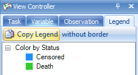
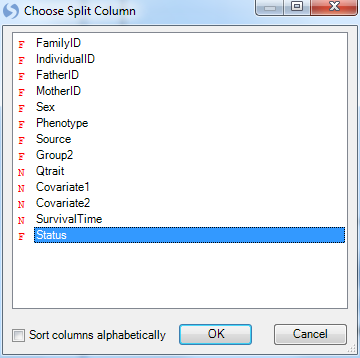
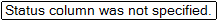
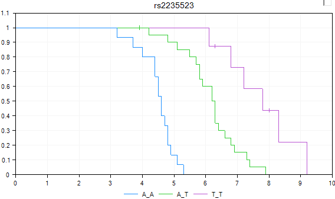
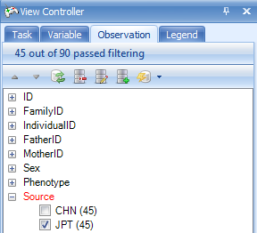

# Visualization of Data

## The TableView

Upon import, Array Studio will automatically generate a *TableView* for the genotyping or SNP data.

The *TableView* in Array Studio can easily display millions of rows or columns. In this view, each observation is in a column, while each marker is a row. Genotype information is shown in each cell (in this case, A_A, C_C, C_T, etc.).

Scroll through the data now to see the speed that Array Studio can display data.

Please refer to Microarray Tutorial for different options and filters for table view.

## The Details Window and Web Details

*Array Studio* includes a feature called *Details on Demand*. In most views, selecting objects in the view will show details about that object (i.e. row, column, data point), in the **Details** *Window* (at the bottom of the screen).

Click on a marker in the row header of the *TableView*, and notice that the marker name changes to green. This indicates that this row has been selected, and information is available in the **Details** *Window*.

If the *Details Window* is not currently visible at the bottom of the screen, switch to it by selecting **View Menu | Show Details Window**. Note that all of the annotation information for the selected row or rows is shown in the *Details Window*.

The *Details Window* can also be used to show information about a particular observation (subject in this tutorial). Click the header row of one of the subjects now.

*Array Studio* also includes a feature called **Web Details on Demand**, supported by default for Illumina and Affymetrix chips. This allows the user to find out detailed information on particular marker from a few public databases/websites (available websites depend on the user s choice and the chip type).

To access **Web Details**, right click on any marker row header column, in either the *TableView* or *Details Window*. Available *Web Details* for this particular marker and chip are Hapmap, NCBI, and UCSC. Select any one of the three options. This will open a new Internet Explorer browser window.

An example Hapmap *Web Details* window is shown below (if the link does not work, open HapMap homepage first and then try again).

Now clear all row and column selections for next step: visualization in *HistogramView* and *AlleleSignalView*.

## HistogramView and AlleleSignalView

While the speed and flexibility of the *TableView* are nice, it is the other views in *Array Studio* that really allow it to stand out over other programs when it comes to visualizations. The *HistogramView*, along with the *AlleleSignalView* (only available for Illumina imported and Affymetrix imported data), will allow the user to further investigate individual markers in the dataset.

To add a *HistogramView*, right-click on *GenotypeData*, and click *Add View*.

This brings up the now familiar *Add View* window. Choose **HistogramView** and click *OK*.

*Array Studio* should now display a *HistogramView*. This view shows one chart for each marker, split by the three genotypes. Scroll through the charts, and notice that you are scrolling through almost 46,000 charts.

At this point, let s filter by the marker **rs2235523**. The view should now look similar to below.

Notice that all three genotypes are represented in the data. We can use any of our covariate design information to make this view more informative.

For most of the rest of the tutorial, we are going to work with only the JPT population from this study. The reason for this is that we only have simulated covariate information for the JPT population. So, to filter to only see the JPT population, switch to the **Observation** tab in the *View Controller* and expand the *Source* filter and choose JPT. The chart will update to show only the JPT population.

Go back to the **Task** tab in the *View Controller* and click **Specify Split Column**. This allows the user to split each genotype, by a specified column in the *Design Table*.

Choose *Phenotype* from the *Choose Split Column* window and click OK.

The view is updated so that each genotype is now split by *Status* (Death and Censored). It is clear from looking at the chart that there is a difference between the two groups for some of the genotypes.

Change to the **Legend** tab of the *View Controller* to see the Legend for the chart.

!!! note
    The colors of the Legend can be changed by right-clicking on the different options in the Legend (alternatively, the colors can be changed using the options in the Task tab of the *View Controller*. The user can also change the Column properties for the selected field which links back to the design table.

*Array Studio* can show on-the-fly p-value information (using a Fisher Exact test) for any marker in the *Histogram View*. Click the **Show Summary Information** button in the *Customize* section of the *Task* tab in the *View Controller*.

Another view, called the **AlleleSignalView** , is available for data that include allele signal file (this view is not available for this tutorial as the allele signal information is not contained in the data imported via *PED/MAP* files). An example *AlleleSignalView* is shown below, along with the Silhouette values (in practice, the closer to 1 each silhouette value is, the better the genotype call. If you would like to get some recommendations for the empirical cutoff  values, contact the Omicsoft support team). This view is not available for data imported via *PED/MAP* files, as the allele signal information is not contained in those files.

## The VariableView

The **VariableView** is another useful view, as it can show numeric values for each marker. If the user has a quantitative trait (i.e., cholesterol level, systolic blood pressure, etc.), they can visualize individual markers for each genotype based on that trait.

Add a *VariableView* now by right-clicking the -Omic data object and choosing *Add View*. When complete, the new view should look similar to below.

By default, *Array Studio* has chosen a column to the response variable (using a numeric column). To verify that the response column is set as we want it to be (to the column Qtrait), go to the *Task* tab of the *View Controller*, and click the *Specify Response Column* button now.

As we have a quantitative trait in our design table under the column Qtrait, ensure that it is chosen in the *Choose Response Column* window and click **OK**.

Since the correct column was already chosen, the view is not changed. As we have the view filtered for the one specific marker, there is only one chart available. However, if we removed the filter, we\'d be able to scroll through all 46000+ markers in the dataset, and look at the response by genotype.

The *VariableView* can be further customized, using the **Specify Split Column** button in the *Task* tab of the *View Controller*. The split column will split each genotype by whatever categorical design column we choose, and automatically distinguish different groups by color.

Click **Specify Split Column** now.

For demonstration purposes, choose *Phenotype* from the *Choose Split Column* window now.

The view is once again updated, with the two statuses now colored differently. Again, these views can be opened in PowerPoint, or the legend can be viewed by going to the **Legend** tab of the *View Controller*.

The next customization is to  jitter  the data points so that they don t overlap to each other by using the **Change Symbol Properties** button in the *Task* tab of the *View Controller* (found in the *Properties* section). Choose this now.

The **Symbol Properties** window allows the user to configure a number of different options. Notice that the **Color By** section has already been set to *Status*. Other options include changing the size of the symbols, rotation, shape, labels, and opacity.

For demonstration purposes, let s increase the *Jitter* about 1/5 of the way to max. Then close this window to see the updated view.

The view is updated, with each group now  jittered so that the user can now see all the data points.

## The SurvivalView

In SNP-related experiments from clinical trials, usually there is survival information available. *Array Studio* includes a special **SurvivalView**, for visualizing the time to event data. Let s add that now, in the usual way. When completed, it should look similar to the following.

*Array Studio* is informing the user that the time column has not yet been specified. Click **OK** to continue and then specify the *Time* column in *Task* tab of *View Controller*.

In the *Task* tab of the *View Controller*, click the **Specify Time Column** button.

Choose **SurvivalTime** in the *Choose Time Column* window. The *SurvivalTime* column in our design table contains the information on time, needed for this view.

*Array Studio* now informs the user that the **Status** column has not yet been specified.

Click the **Specify Status Column** button in the *Task* tab of the *View Controller*, and then choose Status in the *Choose Status Column* window.

*Array Studio* now informs the user to specify an **Event**.

Click the **Specify Event** button in the *Task* tab of the *View Controller*.

*Array Studio* now lists all the levels of events in the status column. For this study, available choices include **Death** or **Censored**. Choose **Death** and click *OK*.

The **SurvivalView** is finally configured. Censored events are marked with a vertical line. The user can use this view to investigate different markers, based on survival time. It is clear in this case that there is a difference between the three genotypes, when it comes to survival time.

Note: If you see the following message: **Missing/negative data found in Y**.

Assure that that under the Observation tab in the View Controller has the source selected as below:

At this point, it is recommended that the user save the project (*File Menu | Save)*. If interested, the user can stop at this time. All filters, views, tables, etc., that have been generated in *Array Studio* are saved with the project, so the user could conceivably close the project, then reopen it, and continue right where they left off.

Congratulations! You\'ve now used many of the important views in *Array Studio* for analyzing SNP data. In the next chapter, we will investigate Marker Statistics, Data Filtering, and Population Structure.
