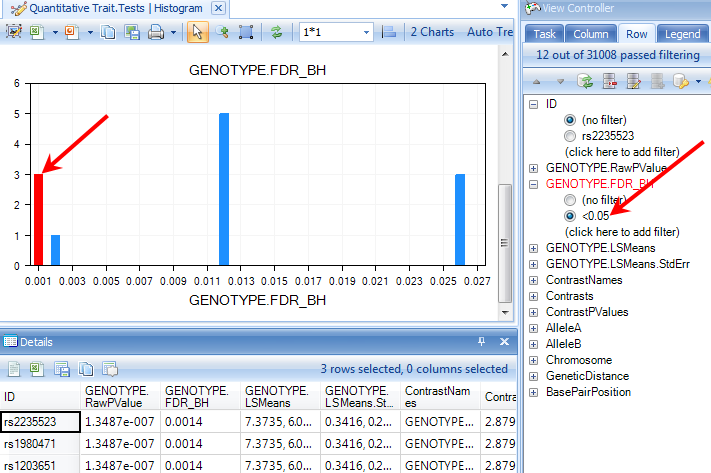
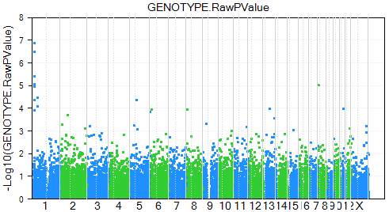

# Visualization of P-Values

*Array Studio* also includes a number of other views, specifically for visualizing p-values after running an analysis. For this tutorial, we will investigate the p-values generated by the quantitative trait analysis in the previous chapter. Specifically, this includes *ChromosomeView*, *HistogramView*, *PvaluePlotView*, *GenomeView*, and *RegionView*. As we already discussed the *ChromosomeView* in the previous chapter, it will not be discussed again here. But, feel free to investigate the *ChromosomeView* again on your own.

## HistogramView

Add a **HistogramView** to the **Quantitative Trait.Tests** table in the *Inference* section of the *Solution Explorer*. Right click on **Quantitative Trait.Tests**, and choose **Add View**. Choose **HistogramView** from the list.

Once the view is open, it will look similar to the following.

On the x-axis is the p-value, while the y-axis is the count of each p-value.

To change the column used for the p-value, use the **Specify Histogram Columns** option in the *Task* tab of the *View Controller*.

This opens the *Choose Columns* window. Add **GENOTYPE.FDR_BH** to the *Listed columns* and click *OK* to return to the view.

Notice now that there are 2 charts in the view. Scroll to the chart to see the initial *HistogramView* for the adjusted p-values.

Filtering on p-values can reveal more significant ones in this view. Try this now, by filtering the **GENOTYPE.FDR_BH** to those markers less than 0.05 (enter "<0.05" into the **GENOTYPE.FDR_BH** filter).

Click on any bar in the **HistogramView** to see the details of variables in that bar. Selected bars are highlighted in red. Notice that the **Details** window is updated to show the selected variables.

## PValuePlotView (PValueQQPlot now)

Besides the *HistogramView*, *Array Studio* provides a **PValuePlotView** for looking at analyzed data. Add this view to the **Quantitative Trait.Tests** table by adding it in the usual manner. Once added, it should look similar to the screenshot below. If you have an active filter (e.g. raw-pvalue < 0.05), reset the filter now.

The **PvaluePlotView** plot the expected p-value versus the observed p-value and can be used for examining the distribution of the p-value results.

In this view, the x-axis shows the  Log10 of the expected PValue, while the y-axis shows the  Log10 of the observed PValue.

The expected p-value line can be drawn by clicking the **Show Line** option in the *Customize* section of the *Task* tab of the *Solution Explorer*.

The view is updated with the expected p-value line in red and the 95% confidence interval values in green. It appears from this graph the observed p-values do deviate from the expected distribution.

Other options in the *Task* tab of the *View Controller* include removing the  Log10 transformation from the graph, and specifying which columns to be used as p-value columns. Like all the other views in Array Studio, PValuePlot view is also fully interactive.

## GenomeView

Another view that can be added is the **GenomeView**. In this view, the x-axis represents the whole genome, while the y-axis represents the p-value. The user can set a specific p-value cutoff for visualization (by default 0.01).

Add a new **GenomeView** to the **Quantitative Trait.Tests** table now. When added, it should look similar to the screenshot below. Points shown by default have p-value < 0.01.

To change the P-value cutoff, click the **Specify PValue Cutoff** in the *Task* tab of the *View Controller*.

This opens the *Specify PValue Cutoff* window. The user can either choose one of the preset p-values, or enter the value in the box. Change the *PValue cutoff* to *1* in order to display all data points. Click **OK** to continue.

The graph is updated. Note that by default the symbols are colored by chromosome. This works well, as the user can easily distinguish between the data points on each chromosome.

Finally, the user can also trellis the chart by chromosome, so that each chart represents one chromosome. Do this by selecting the **Trellis By Row Covariate** option in the *Task* tab of the *Solution Explorer*.

This opens the *Choose Columns* window. Add **Chromosome** to the *Listed Columns* and click *OK* to trellis the chart by chromosome.

The view is updated so that there is one chart per chromosome. In total, there are 32 charts.

The chart of chromosome 16 is shown below.

## Region View

Another view that can be added is the **RegionView**. In this view, the user can use the latest Ensembl build to visualize their results across the chromosomes. In addition, they can easily find particular genes of interest and automatically zoom to that region.

Clear all filters on the *Quantitative Trait.Tests* report now.

Add a new **RegionView** to the **Quantitative Trait.Tests** table now. When added, it should look similar to the screenshot below.

*Note:*
The first time a RegionView is added, it may take a few minutes to download the Ensembl and Hapmap information.

The *RegionView* contains multiple parts. Each part is fully interactive, and contains options that can be accessed by right-clicking.

The first section is the Overview of the chromosome. The chromosome in view can be set, either by manually setting the Start and End points or by using the zoom in and zoom out.

For the Overview section, the user can right-click to switch between panning and zoom modes. Selecting particular sections of the chromosome will zoom in the main view.

The next section contains the cytoband for that chromosome.

The next visible section is the transcript view. This will show the names of the transcripts for the currently visible region. It becomes very useful as you zoom in. Again, right-clicking allows a number of options.

Right click on that region and choose **Find Gene** from the dropdown box.

This opens the *Autofill* window where the user can search for their gene of interest. Type *Prdm2* and move it over to the right-hand side, and then choose the region. Click **OK** to continue.

The transcript view is now zoomed to the region of PRDM2, where the user can visualize all the p-values associated with this region. The current chromosome region we are viewing is highlighted in red on the cytoband.

Again, all of these sections can be further customized by using right-click, and switching between modes.

By default, the main view will contain 1 chart of p-values. The x-axis is the position of the chromosome, while the y-axis shows the  Log10 Pvalue. Use the **Specify Value Columns** from the *Task* tab of *View Controller* to display more numerical columns.

Add *GENOTYPE.FDR_BH* from the left panel to the right *Listed columns* panel. The main view is updated to have 2 parallel plots.

Congratulations! You have now explored your results of your analysis, using a number of different visualizations.
