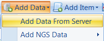
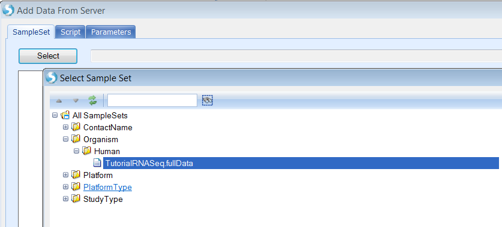
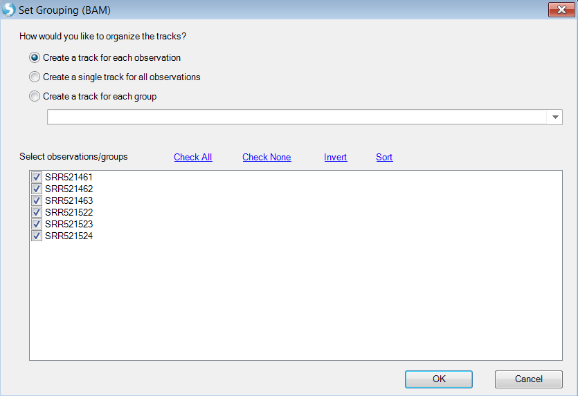

# Integration

## Pipeline Integration

### Pipeline Scripts

User can run a pre-configured pipeline on a sample set. Pipeline can be as simple as raw data QC, alignment and then do quantification analysis on NGS data. Pipeline scripts are managed by ArrayServer administrators in **Server | Manage | Manage Scripts**:

### Run Pipeline Script in Analysis

To run a pipeline on a SampleSet, open or create a server project in the **Analysis** tab. Then go to **Add Data | Add Data From Server**:

Select a SampleSet

Select a pipeline script:

Fill required parameter values and click **OK** to run:

### Run Pipeline Script during Sample Registration

User can run pipeline script during sample registration process by adding **[Pipeline]** section in sample registration file.

By using the sample registration file above, a server job will be submitted at the end of sample registration to create a server project with ID *TutorialRNASeq1*, using pipeline script *Tutorial.RNASeq.v1.pscript* and specified parameter values.

## Genome Browser Integration

As we mentioned above, sample registration supports multiple file formats, including BAM (NGS alignment) files. User can modify the old registration file, adding a file path to BAM files:

Registering this file (**Server Sample | Register Samples**) will update samples with BAM path.

Now, the alignment files (BAM files) of samples can be loaded in the Genome Browser tab directly through **Add Track | Add Track From Server Samples**:

User can add individual samples or the whole sample set. Here we choose the *TutorialRNASeq.fullData* sampleset:

User has the option to add one sample as one genome browser track:

Or create tracks for groups defined by sample registration meta data:

Choose *Cellline* as group which will create two genome browser tracks: K562 and MCF7.

User can split the combined tracks to individual samples by right click and select **Split Into Multiple Tracks**:

For more information and features available in the genome browser, please read the **Genome Browser Tutorial**.
