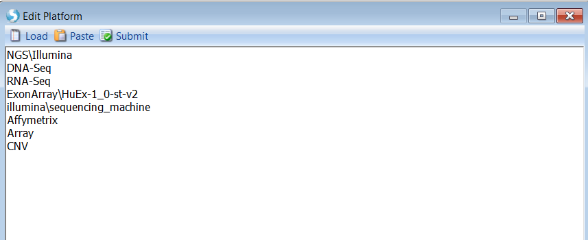

# Sample Management

## Sample Registration

Array Server provides a simple way to allow users to register, annotate and manage the samples through one one-click submission of a text file. Sample registration is limited to the LabManager user group or higher.

Below is a sample input file for sample registration:

User can get this text file from downloaded tutorial data.

The input file has one required section and one optional section:

**Samples**: this required section lists samples, associated file path, and meta data for the samples. Fields are tab delimited. First row must be column headers, and the first two columns must be SampleID and FilePath. SampleID must be unique across the full database, and FilePath must be a relative path that s exposed by the Array Server FTP server (usually it points to a mapped folder). Multiple files, separated by "|", can be specified for each sample. The user can contain as many additional columns (e.g. LIMS fields, treatments and other grouping information, etc.) as needed, but it is recommended to control the vocabulary for both the column name and column value.

Depending on server configurations, certain columns in your input file are set to *MANDATORY*. These settings can be viewed by the server administrator under **Manage | Server Information | Show Sample Template**. This will open a Table where users can see which columns are needed in the **Samples** section. Please check this setting and, if necessary, add mandatory columns to the table provided with this tutorial.

ArraySuite supports multiple file types in FilePath, including CEL, FASTQ, BAM and etc. For more details, please read the following wiki page:
[^link^](http://www.arrayserver.com/wiki/index.php?title=FilePath )

**SampleSet**: this section is optional and lists the meta data for the sample set that will be automatically generated based on the listed samples in the **Samples** section. The user can set *Editor* and *Reader* for the sample set but these two fields are not required.

To register the sample, go to **Server | Server Sample | Register Samples**:

Users can choose to register samples using a file located in server or local:

Choose the sample registration file prepared as shown above and click **OK**. Once finished, you will get

Some users might encounter an error like this:

The error hints users that information including Organism, Platform, and Platform type has not been defined ahead by the server admin. In this situation, users should contact the server admin.

To define these fields, the server admin can go to **Manage => Manage Predefined list**:

Next, add corresponding information from lists of Organism, Platform, and Platform type. Be sure to add one item per line in the lists.

Another error that may be encountered appears like this:

Depending on server configurations, certain columns in your input file are set to *MANDATORY*. These settings can be viewed by the server administrator under **Manage | Server Information | Show Sample Template**. This **Sample Template** is discussed further below in the **Browse Samples** section. This will open a Table where users can see which columns are needed in the **Samples** section. Please check this setting and, if necessary, add mandatory columns to the table provided with this tutorial.  

## Browse Samples

To browse samples, go to **Server Sample | Browse Samples**

Categories used in the tree for **SampleSets** are ones defined as Organizable=TRUE in the server configuration file: *default.template*. Here is the wiki page for more details about **default.template**:
[^link^](http://www.arrayserver.com/wiki/index.php?title=Default.template )

Categories used in the tree for **Samples** are ones defined as Organizable=TRUE in the server configuration file: *sample.template*. Here is the wiki page for more details about **sample.template**:
[^link^](http://www.arrayserver.com/wiki/index.php?title=Sample.template )

Users can always check the predefined sample and sampleset columns in **Server | Manage | Show Sample** or **SampleSet Template**:

## Create New SampleSets

New sample sets can be created from registered samples that are belong to existing sample Sets. User can select samples of interest and right-click to **Create SampleSet**.

User can also create sampleset using sample registration file with Sample ID only:

Register this sample using **Add SampleSet** function:

## Search Samples

To search sample or sample set, go to **Server Sample | Search Samples**. The search function has the power of full text search.

Type  Bone  and select  tissue bone marrow  in the autofill. Click **OK** and then **Add** to the search criteria field:

User can narrow down the search space by adding more search criteria. Click **OK** to search samples.

A new sample tab will appear with a table of identified samples:

