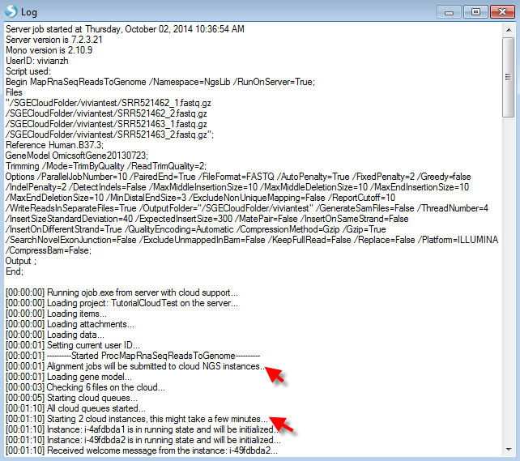
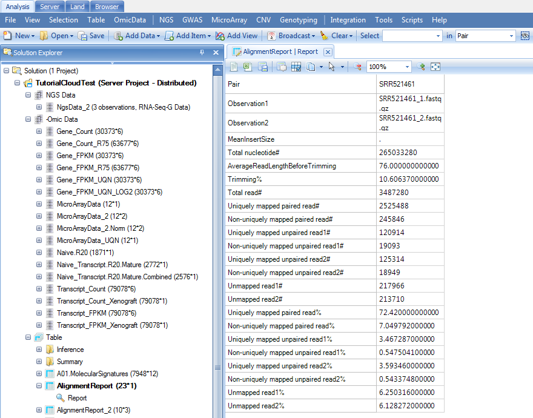

# Array Server on Cloud

Array Server can also run jobs on the cloud.
It only requires the ArrayServer administrator to perform a simple one-time set up. To other users, it is a transparent process. They do not need to do any extra setup, nor will they find any differences with other non-cloud jobs.

This tutorial is drafted for standard users. To configure Server with Cloud, please contact Omicsoft Support to get the manual for Server on Cloud admin.
After ArrayServer admin has configured the Server with Cloud, standard users do not need to set up Cloud Preferences but only need to connect to the server with cloud integration through the *Server* tab:

When connected, the window looks the same as the server window.

Notice that the *Cloud* tab will not appear.

## Uploading Files to Server cloud

Before running server jobs on cloud, the users should upload the data files on the specific cloud folder they have been assigned. Go to **Server File | Browse Files** window:

Then go to the **cloud folder** configured in advance.
Please contact the admin if the user does not know where their cloud folder can be found.
In the folder, users can create their own folder and upload the data the same way as running a server project:

## Run Server Project on Cloud

Once files are uploaded to the cloud folder, users can not run a server project on the cloud.
Please create a server project in the **Analysis** tab first.
The analysis window and analysis steps are the same as running a server project. When adding data to a project, remember to browse the right cloud folder for your files:

After sending the data to queue, the job progress could be monitored the same way as server project:

## Run Multiple Jobs on Cloud

When running multiple jobs (For example, multiple samples sequencing data alignment), multiple cloud instances will be allocated.
This makes it much faster to perform the analyses.

To test this, users can use the RNA-seq data downloaded in the previous chapter. For illustration purpose, we will only use two samples to reduce the process time. Again, remember to go to load the data to the correct cloud folder prior to starting the project:

The demo dataset is paired-end sequencing data; please check the **Reads are paired** check box. For Server project to run on cloud, the users must specify output folder. The directory has to be under the cloud folder (not necessary to be the same cloud folder as the raw data). The principle is that all data, including raw and analyzed data, are on the cloud, while users' local machines and company server only store small data objects linking to the files on cloud. Upon job submission, again, the job could be monitored:

The users can right click on the job and select **View Full Log**:

In the *Log* window, as you can see, the jobs are being submitted to cloud NGS instances, 2 cloud instances will be started as we have two samples to align:

As a general user, you cannot monitor the Cloud Instances for Server Cloud.

The users can go back to the *Analysis* tab and continue any downstream analyses and visualization:

Congratulations! Now you can successfully run server projects on cloud!
