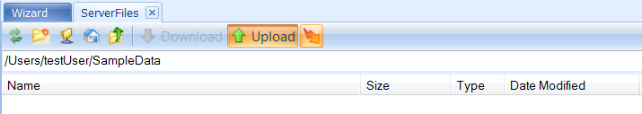

# Connecting to a Server and Uploading Files

## Connecting to a Server

Before creating a server project, first connect to a server by clicking the **Server** tab on the top of Array Studio.

Fill in the server information (where **Server name** can be anything given by the user to help remember the server) and log-in credentials. Select the **Connect** button. Depending on the server setup, another window may appear prompting the user to choose which analytical server to connect to.

Upon successful login, the default **Wizard** window will appear in the Server window:

## Uploading Files

One requirement for performing server-bases analysis is that the raw data (*e.g.* cel, fastq or bam files) has to be located on the server. One can use Array Studio to transfer local files to the server easily.

In the **Server** tab, go to **Server File | Browse Files**:

The **ServerFiles** tab will appear with a listing of the current folders in the /Users/username directory:

In the example above, we are in the user folder (*/Users/admin*) and with the user id as *admin*. The User folder is one place to hold your personal data files. New folders can be created by right-clicking the mouse and selecting **Create New Folder** from the dropdown menu.

Create a new folder and name it **SampleData**.

Enter the **SampleData** folder and click **Upload** to transfer files from local computer to the server.

Select the *ServerTest.bam* file and click **Open**. As the files load, the progress is monitored in the lower portion of the **ServerFiles** window:

Once the uploading has finished and the ftp transfer is complete, the files will appear in the **SampleData** folder.
