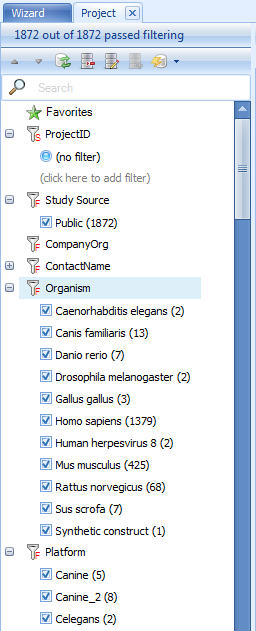
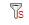
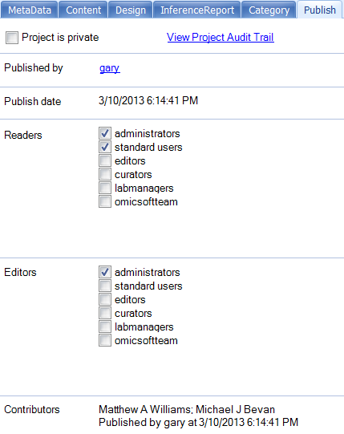
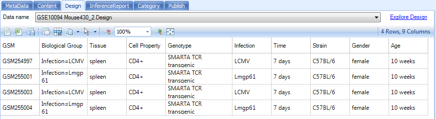

# Getting Started

Server explorer contains functions to search and display data stored in Array Server. Both Array Studio and Array Viewer contain the Server tab. Array Viewer is a separate product to view data shared in Array Server, having the same functionalities as ones in **Server/Land/Browser** tabs in ArrayStudio.

In this tutorial, we focus on modules in the Server tab in Array Viewer. They are the same in Array Studio Server tab. The tutorial is based on published projects in Array Server.

## Installation and Setup

To start Array Viewer for the first time, click on the following link: [^link^](http://omicsoft.com/software/ArrayViewer/publish.htm )

Make sure to use **Internet Explorer** for this process.
Array Viewer in Internet Explorer requires the installation of the .NET 3.5 framework. For users with the .NET framework already installed, clicking Install will proceed to login and launch of Array Viewer, as shown below.

Click the Edit button to edit the Omicsoft server of your choice and enter username and password information, or for internal servers, click the Add button to add a new server to the list.

This opens the Server Information window. The user has the ability to edit the name of the server, server address, as well as User ID and Password. At this point, the user should enter the User ID and Password provided to them by their Array Server Administrator. Some internal servers may not require **user authorization**, and this should also be indicated by the Administrator. Click OK to save the Server Information.

After editing the server, click the **Connect** button to connect to the server of your choice. After a successful login to the server, Array Viewer should look similar to the following screenshot:

Click on the Server tab where the default view will be the Wizard.

## Wizard

When the user initially opens the Server tab in Array Viewer, a wizard is shown, that allows the user to quickly get started. All search functionality can be done from the wizard.

At this point, the user can click the **Search Server** button and should see a window similar to the following (note: the number of projects and name of tabs may not match exactly).

## Project Browser, Tagging, and Meta Data

The left hand side of the screen provides the user a way to manually browse projects, either by Category, or using the advanced Filter option for projects.

ArrayStudio makes filtering projects very easy. Users can use the check box to filter projects.

Besides using the check box, users can click on the icons

and

located besides each filtering column. In the popup window, users can search for projects and make single or multiple selections.

Single clicking on a project in the **Project Browser** will show the meta data related to this project in the main view window. Click on any project. The Project tab of the main view window is updated with the published information for this project. The Project tab contains a number of meta data tabs, including General, Platform, Contact, Custom, Content, Design, Inference Report, Category, and Publish. Click on each of these tabs now to see the different meta data that can be seen for each project.

Notice the **Category** tab, which contains meta data on the category to which the project belongs. This is the tab that is used to populate the Category browser. When uploading a project (only if the user has write access to a project), this information can be edited.

Notice that the **Publish** tab shows information about how the project was published, including Published by, Publish date, Readers, Editors, and Contributors. Readers and Editors show the user groups that have read and write access to this particular project. In addition, for users connected to internal servers, there is the option to upload private projects, which cannot be viewed by other users (other than administrators). There is also an option to **View Project Audit Trail**, which will show the Audit Trail, in OmicScript form, of every major action taken by the analyst when analyzing the project (or the steps performed by Omicsoft to analyze the public projects).

Notice that the **Content** tab contains a list of all data that was uploaded with the project, as well as the index status of the data. If a dataset or table is **Indexed**, it can be searched within Array Viewer. This would mean that the testing results contain rows that are indexed (probesets) that can be searched, while the summary Table does not, and thus it cannot be searched.

The **Design** tab shows the design table information (sample information) for each project. For projects with multiple datasets, there will be multiple dataset names available in the Data name dropdown box. This is useful in getting information about the samples contained in each project, without having to download data for that project. Note that any of these tables can be easily exported to Excel or saved as text using the toolbar above the table.

The **InferenceReport** tab contains information on any inference reports created. For each tests table in the Data name dropdown box, each comparison is shown, with information as to whether Raw p-value, Adjusted p-value, Estimate, Fold change, and Max(LSMean) (to be used as an intensity filter ) are available. Contrasts can be categorized into a Test type, and this can be shown here as well (and used for filtering with the Search Inference Report module). A description of each contrast (or test) can also be entered by the user upon uploading a project (or edited by a user with write access to that project). For users not familiar with the concept of a  contrast  or  test , think of it as a  ratio , complete with p-value and fold change information, as well as the maximum intensity for each group in the test.

