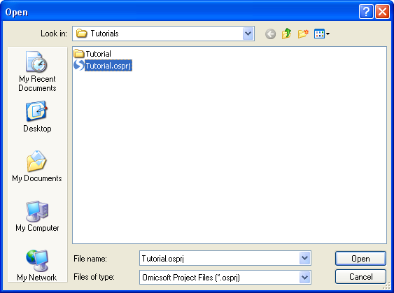

# Publishing Data

Any Array Studio user has the ability to publish data to the server.

This can also be done through Array Viewer, and only requires the user to have access to a project file.
If the user of this tutorial does not have access to a project file, and to an internal server, this section can be skipped.

Click **Publish Project** from the Publish dropdown box.

Choose the **project** *.osprj* file that you have saved and are ready to publish. The project cannot be opened while being published in Server Explorer.

This opens the Publish Project window. In this window, you must first choose the data/items to publish. Any number of data, tables, and lists can be published.

Next, you must choose which of these published data and tables will be enabled for full-text search. This is an extremely important step, as only those selected data and tables will be searchable (those not chosen will be uploaded, and available for download, but not searchable).

Next, the Meta Data needs to be entered. If you are replacing an existing project, you can use the Load Meta Data From Existing Project button to choose an existing project s meta data.

Meta data tabs include General, Platform, Contact, Custom, Category, and Publish (Note: For internal servers, the administrator has the ability to completely customize meta data, so this may look different).

The ProjectID field can be used to replace a project. If a project with a particular ProjectID already exists on the server, the user will receive a warning message asking if they want to replace that project. Leaving the ProjectID field blank will generate an automatic ProjectID for that project.

Click the Publish tab, as this tab contains important information. This allows the user to select which User Groups will have Read and Editor Access to a project. A Project is Private checkbox allows the user to upload a project for private use only.

Clicking the Publish button will upload your Array Studio project to the server, where it will be fully searchable and available to the selected User Groups.

Note: Certain fields may be required in order to publish a project (when it is not private). These fields may differ depending on the administrator.

More information on options for publishing can be found in the individual help module.
