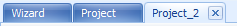
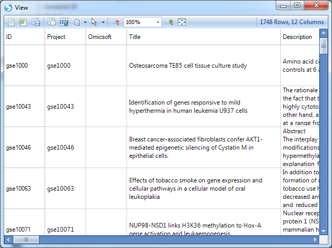
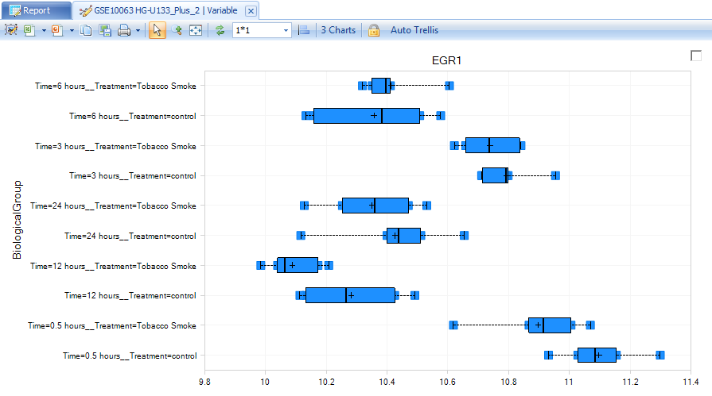
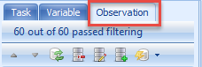

# Searching Projects

Array Viewer/Server Explorer offers the ability to quickly search meta data for particular terms.
For instance, if the user wants to search all projects for the term  cancer , this can easily be done.
All searches in Array Viewer can be done using the **Search** dropdown box at the top of the screen and choosing **Wizard**.

In Array Viewer/Server Explorer, it s possible to search the Project, the Variable, and the Observation (sample information).
First, we will demonstrate searching just the project meta data, but you will soon see that both projects and variables can be searched.

!!! note
    In Array Viewer, searching variables is equivalent to searching genes, SNPs, CNVs, etc.

## Searching Project Meta Data

To search project meta data, use the Filter Project tab.
Options for this tab include searching by full text search, or sub setting the data via the Disease, Organism, Platform, or Custom tabs.

Type **neoplasms** into the search field for Project (full text search).

Notice that Array Viewer has an auto-fill feature, that attempts to fill in known meta data information as you type (This is a good indicator of terms contained on the server, and can be helpful when searching).

This is extremely helpful for finding projects of interest. For instance, in the example below, typing "cancer" into the search box will either search all project meta data fields for cancer, or search particular columns or levels for the term. The user can choose to return, for instance, any project where the column DiseaseState, contains "cancer". Another common search would be searching for projects that contain Age, Ethnicity, Gender, etc.

The best way to search for projects related to cancer would be to use the disease classifications built into the GEO data in Array Server, and to search for a term like neoplasms. Choose  Category neoplasms , as shown below, pertaining to any project that belongs to the category of neoplasms. Click OK to save the pattern (Array Server uses its own pattern system to tell the server how to search, although this never has to be learned by the user).

Click **Search Server** to begin the search.

The server will search for all projects with the disease classification of *neoplasms*.

### The Report Tab

After every search in Array Viewer, a new tab is opened, containing all the search information and results for each search. These are named incrementally, from Project, Project_2, Project_3, etc. Notice that after performing the search for cancer, a new tab is created, called Project_2.

Selecting **All Tasks | Show Project Report** will return the report of all projects returned from that search. Click this now.

This opens a floating window with a table of the projects that matched the results of the search.

This table contains the list of projects that have meta data that match the results of the search, as well as a link to Download the data (demonstrated later), Organism, Study Type, Sample #, Platform, PublishDate, Category information, PublishedBy information, Title of project, and the number of rows that match the symbol searched. As we did not search a symbol, the Matched column should return the total number of rows (or variables/markers/probesets) in each project.

The floating report can be sorted by right-clicking on any header in the table. In addition, it can be exported to Excel or saved as a text file by using the toolbar above the report (this is standard in any table view in Array Viewer).

### Project tab meta data

Now, let s take a look at which projects were returned by our search. If the floating report window is still open, close it now.

Scroll to and click on gse10063, to see the meta data for this particular project.

Switching to the **Category** tab will show that this project belongs to the Neoplasm disease classification, specifically Leukoplakia, Oral.

## Downloading Project for Analysis in Array Studio

For users with internal servers and licensed copies of Array Studio, projects can be downloaded to be further analyzed and refined by the user.

This can be done by clicking on any of the returned projects in the Project Browser and clicking the **All Tasks** dropdown menu at the top of the Project Browser. Then, choose **Download Filtered Project To Local** from this menu.

This opens a dialog box for saving the project, which will be downloaded in its entirety to the user s local machine in the specified folder. For the purposes of this tutorial, this is not necessary, but it should be noted that the project is downloaded in the exact state that it was originally uploaded, including any views, analyses, etc.

Alternatively, users can double-click the selected project. Multiple options are provided for downloading the project:

## Filtering Variables

One of the real powers of Array Viewer lies in its ability to visualize analysis results and views that were uploaded by the original analyst, as well as the ability to add new views for projects. While it is possible to view all the rows in a project in the server, this is not always recommended. Sometimes the recommended option is to do a search for a particular Variable (Gene names or Probe/ProbeSet names). The result will be a list of projects in the Project Browser containing the number of rows matching the Variable we have searched.

Let s do a search again, but this time, we will look for projects containing category neoplasms, and the gene symbol *egr1*.

Click **Search Server** to begin the search. Matching projects are returned in the Results window.

Now, let s take a look at one of these projects. Scroll to and click on gse10063. By taking a look at the meta data, we can see that this is a project looking at the effects of tobacco smoke on gene expression and cellular pathways in a cellular model of oral leukoplakia.

To take a closer look at the data for this project, we have four options. Double-click on **gse10063** now. The user will be prompted with multiple options for downloading the project:

Select the second option and click **OK**.

(The first time an annotation-type is downloaded as cache to your machine, the binary annotation will be downloaded as well. Each subsequent time will be faster as the annotation will not need to be re-downloaded).

This returns all of the data related to the ID **egr1** for this project. In the Project Browser, notice that there is now a tree, containing a number of datasets and results tables. These are the exact datasets and results tables that were uploaded by the original analyst, containing all of the observations (60 chips) and 3 of the rows (expand the nodes of the explorer to see similar to below).

Open up the *.Tests* table, containing the results of any statistical tests performed on this project, and double-click on the Report view.

Before we delve too far into this project, note the Gene Symbol column. We ve returned only symbols that are EGR1, as we might have expected.

## Views and Customizations

### Customizing a view

Now expand the dataset GSE10063 HG-U133_Plus_2 and double-click on the view **Variable** to see the view created by the user that uploaded the data.

This view shows all of the 60 chips from this experiment and their expression. For many projects, this will be automatically grouped using BiologicalGroup, which is the group that was used for the creation of any analysis and inference report. There are 3 charts, one for each variable representing *egr1*.
The important point to take home from this is that this view was created by the analyst.
Any and all views created by the analyst are visible in Array Viewer.

Notice the Task tab on the right-hand side of the screen. This is the exact same Task tab that is contained in Array Studio, and allows the user of Array Viewer to further customize a view. In addition, the user has the option to further filter the view using the Observation and Variable tabs as well. The screenshot above is after **flip X/Y**. Click on **Change Profile Gallery** in the Task tab (under Customize) now.

Change the gallery type to **Boxplot** and click **OK**.

Notice that the view has been updated to show a boxplot plot representation of this particular probeset s expression across all of its chips in each group. This view can be further customized, if needed in **change symbol properties** for dot color, shape, jitter and etc.

### Filtering a View

Besides using the Task tab, the user has the option of customizing a view, by using the **Variable** and
**Observation** tabs in view **controller** to further filter the data.

Click on the **Observation** tab to see the available filters for this dataset.

Expand the filter Treatment to see the treatments that can be filtered. Click on Tobacco smoke to see only those samples that were treated with tobacco smoke.

Notice that the main view window is updated to now only show those chips associated with tobacco smoke treatment. The available filters in the **Observation** tab are from the **Design** table of this project, and are dependent on what the analyst uploaded when uploading the project.

Right-clicking on a filter column will usually allow the user to change the type of filter, from a **Radio filter** (allowing selection of one group or all groups), a **Checkbox filter** (allowing the selection of multiple groups, all, or none), and a **String filter** (allowing the entering of a string for filtering). Sometimes not all of these options are available, as it is dependent on the column type for that column (i.e. numeric, factor, character, etc.). Change the filter back to (all) before continuing.

Note that all the views can be saved as pictures/texts, or opened in Excel or PowerPoint by using the toolbar contained over the views.

### Creating A New View

Besides the ability to look at views that were created by the original analyst, the user has the ability to add new views for their own purposes. These views are not saved back to the server with the project (unless the user shares the view in which case a static representation of the view is saved to the server), but can be opened and saved as pictures, in Excel, or in PowerPoint.

To add a new view, click the **View** menu and then **Add View**.

Then, choose the dataset or table to which you want to add the view (in this case GSE10063 HG-U133_Plus_2). Array Viewer and Array Studio always give the user the choice as to which dataset or table to add a view.

Alternatively, you can right-click on the dataset of which you want to add a view, and click Add View.

This opens the **Add View** dialog box. Click **HeatmapView** and click OK to add a **HeatmapView** to the dataset. This window is context-sensitive and contains all the views available for that type of data or table. Inference tables have different views available than MicroArray data, which has different views available than copy number data, etc.

The **HeatmapView** is created and can be further customized, filtered, etc., and then be saved by the user in Excel, PowerPoint, or as a picture.

### Data Menu

When using Array Viewer, you cannot perform additional analysis on the data. Analysis can only be performed by using Array Studio. However, Array Viewer does offer the user the option to perform some manipulation features on datasets and tables. These manipulations are not permanent, and are not uploaded to the server. However, they can be used for temporary purposes. For  OMIC datasets, the Data menu is available for manipulations. Also, for manipulation of table data, the Table menu can be used.

Click the **OmicData** menu now to see the list of manipulation options available for microarray data. Options include subsetting data, splitting data, merging data, concatenating data, deleting data, sort variables, sort observations, generating contrast data, exporting data, and uploading the results of an inference report to GeneGo.

Choose Split now to split the dataset into multiple parts, using the design table.

This opens the Select Data window. Choose the dataset we have been working with, and click OK. Note, it is possible to have multiple projects data downloaded at the same time, and thus you may be given the option of which project and dataset upon which to perform the split. In this case, there was only one  dataset  downloaded (although there were other tables and inference reports).

This opens the **Split Data** window. Choose Split observations, and choose Treatment from the drop-down menu. Click **Check All** to split the data into all 3 of the Groups. Click **OK** to continue.

Notice that after splitting, 2 new datasets have been created and views are now accessible in the project browser. Note: These changes are not permanent, and are not stored on the server, but are for temporary purposes only.

### Sharing a View

One of the key features of Array Viewer is the ability to share any customized view with another user. This view is saved statically (like a snapshot of the data), so even if the original data changes, this view is still the same.

Let s share the view we just created (the HeatmapView). If this view is not the current view, switch to it now. You can switch the open view using the list of views at the top of the main section of the window, or by finding it again and double-clicking in the Project Browser. To share a view, click the **Share** dropdown box and choose **Share View**.

This opens the Share View window. The user has the ability to create a Title and Description for the view, as well as to set the User groups and/or individual Users that can see the view.

Enter a **Title** and a **Description** now, and then click OK to continue.

Array Viewer will inform you that the view has been shared, and assign it a view ID.

Click OK.

In addition, Array Viewer will automatically open up your default email program, containing a link to the shared view, which you can use to send to a colleague, similar to the screenshot below.

Other options regarding **Shared Views** include opening a previously shared view, re-sharing a view (to once again create an email link), and un-sharing a previously shared view, all available from the Share dropdown menu.

## Batch Searching Projects

Besides being able to search for a project using a single project search term and single symbol term, Array Studio offers the ability to do a batch search.

This time, instead of filtering projects by full-text search, we will use the tabs for Organism, Platform, and Custom. These tabs allow the user to filter by predefined fields, specified by the administrator. Click on the **Custom** tab to see the options for filtering by multiple projects in a customized manner.

**Add Criterion** can be used to add a filter for a specific field to the batch search. Alternatively, **Add List** can be used to filter by a general criterion, or a project list.

Click **Add List** to add a filter criterion to the batch search.

This opens the **Input Project List** window. Change Input list is to (anything) and enter hypoxia, heart failure, and cholesterol in the search box. Click **OK** to continue.

The Custom tab is updated to reflect the added filters.

Here, we specify the field to be anything. We can explicitly specify the field to be ProjectID and other metadata design columns.

