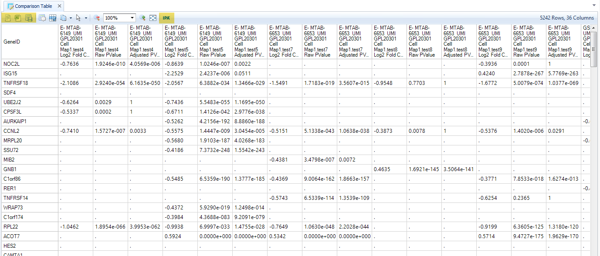
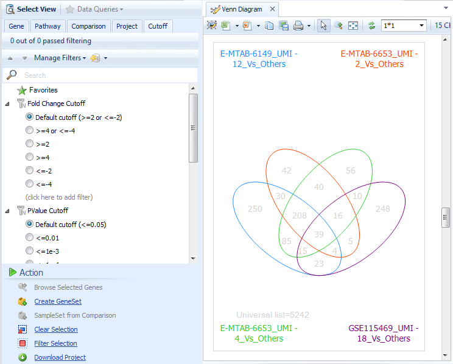
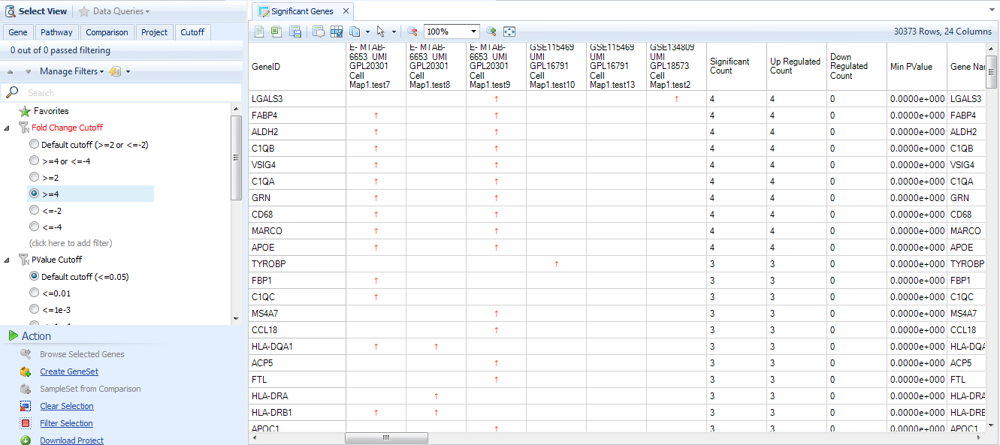

#Single Cell comparisons Views
Pre-computed comparisons are generated by comparing each cell cluster, identified by Louvain or Kmeans clustering, against all other clusters in a CellMap. These results can be used to identify top candidates for genes that are enriched or even specific to a particular cell type, or subset of a cell type.

Comparisons can be identified either by browsing the Comparison Distribution View, searching directly for a comparison ID, or by clicking "Browse Selected Comparisons" from the Comparisons Bubble Plot.

##Volcano Plot
The classic way to visualize differential expression results is with the **Volcano Plot**, which plots each significant gene by its fold change on the X-axis (log2-transformed fold-change, Up-regulation is positive, down-regulation is negative), and statistical significance on the Y-axis.

If you searched for multiple comparisons, when you select one or more genes in one plot, the genes will be highlighted in other Volcano PLots. This can be a useful way to validate the consistency of a gene's enrichment in your cell type of interest.

##Contrast table
You can see the underlying data of a Volcano plot by selecting genes and looking at the **Selection Details**, or you can open the **Comparison Table** to see the full statistical results for all selected comparisons. These data can be exported to Excel, or uploaded to **Ingenuity Pathway Analysis** by clicking the **IPA** Button.

##Venn Diagram
If you search for two or more comparisons, you can select **Venn Diagram (Significant Genes)**, to look for similarities and differences between comparisons. Use the **Cutoff** filter on the left to define cutoffs for significance for each comparison, then select intersections between the Venn Diagram ellipses to see the shared genes between two, three, or four comparisons.

##Significant Genes table
This powerful visualization displays, for each comparison you searched, whether a gene was up- or down-regulated, and provides helpful summaries of the significance count per-gene. Use this table to sort for the most consistently significant genes among comparisons of interest.

