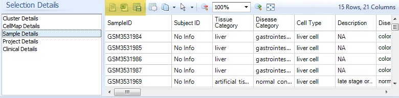
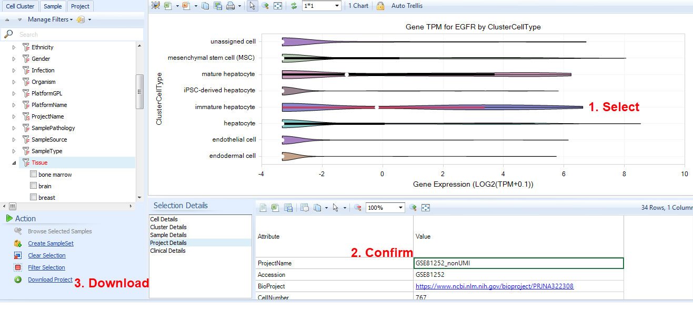
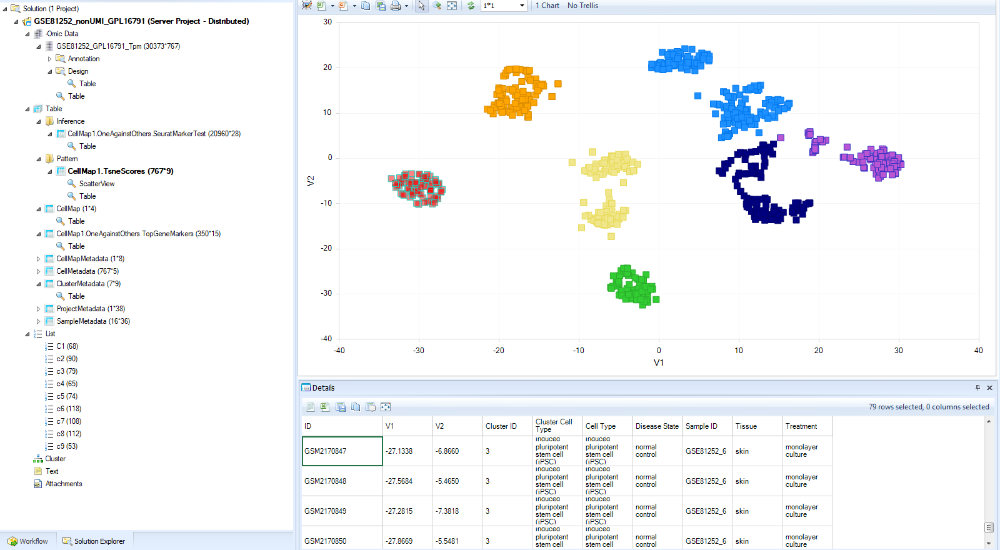

#Downloading data from Single Cell Lands
There are multiple ways to export data after browsing Single Cell Land data.

If you are interested in the metadata for selected projects, samples, or cell clusters, you can simply click the **Open in Excel** or **Open as Text** buttons.

For most Views, to export the data used for the currently plotted View, click **Open in Editor** or **Open in Excel** in the **Task** tab.

In most cases, once you have identified a project that has interesting data (samples or cell types of interest, or interesting expression of your favorite genes), you will want to download the full project with metadata, expression counts, differential expression, and marker genes used by the curators.

##Download Full Projects
Warning: Single Cell projects can be quite large (hundreds of MB to several GB), and **Download Project** will download the project to your **Server Projects** folder, so you should only keep downloaded projects while you need them to extract relevant data, then delete the project from your folder.

From any View within Single Cell Lands, select data from a project of interest, so the **Selection Details** are displayed. Then click **Project Details** to display the project-level metadata for your project of interest.

After double-checking that the selected project is interesting, click on the ProjectName in the Selection Details, then click **Download Project** in the **Action** section at the bottom-left.

You will be prompted with the details of the project, and you can select to download. If there are multiple projects available under that ProjectName (e.g. multiple platforms) you can use the dropdown dialog to select the project of interest.

After downloading, switch to the **Analysis** tab.
You should find multiple objects that contain different data.

In the **-Omic Data** section, you will find the expression matrix for all cells.

In the **Table** section, you will find the **Inference report**, Dimension Reduction **CellMap** results, **Top Gene Markers**, and metadata at the **Project**, **Sample**, **CellMap**, **Cluster**, **Cell Level**.

