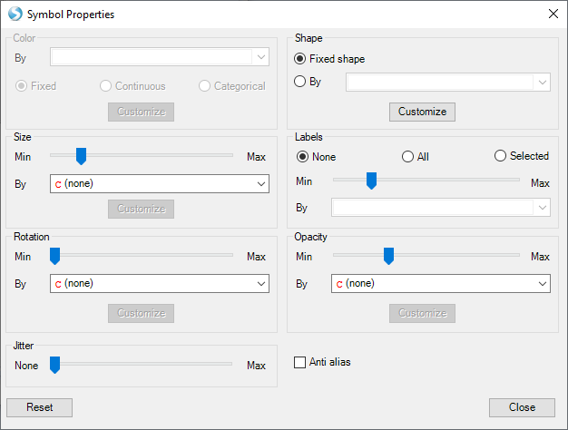
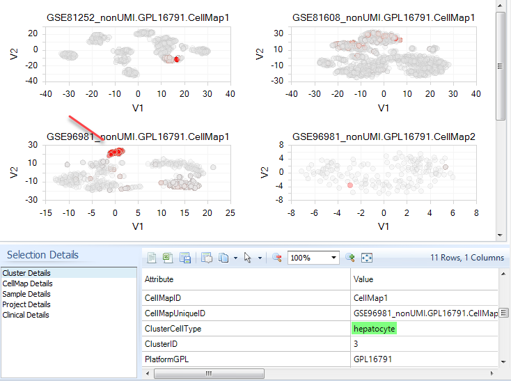
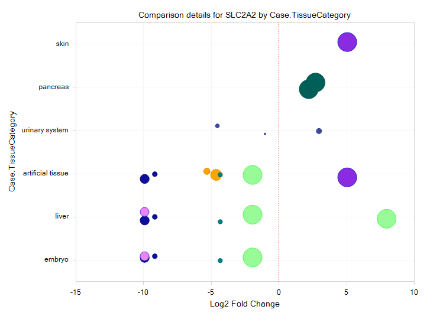

#Gene-level views
To search for a gene's expression, search for a gene in the top **Search** bar.

A new tab will open up with **Gene context** Views.

The most important Views here are the Gene TPM Violin plot, the CellMap (Expression Overlay) View, and the Comparisons View, a differential expression bubble plot.

##Gene TPM violin plot

The default visualization for single gene searches is the Violin plot.

Here you can get an overview of the expression across all cells, grouped by any metadata you specify.

After searching for a gene like SLC2A2, notice that it is somewhat sparsely expressed across the Y-axis groupings ClusterCellType.

You can take several steps to refine the plot to get a clearer view of the expression.

Filter by tissue, ClusterCellType, DiseaseState, or Projects, to only focus on the data that make sense for your work.

In the **Task** tab (right side), click **Hide non-expressing groups**, which will remove any Y-axis grouping where no cells had expression.Now you can more clearly see the ClusterCellTypes with expression.

In the **Task** tab, click **Sort Profiles**, and change sort order to **Mean Order**, which will show the top-expressing cell clusters at the top.

Now try changing **Specify Profile Columns** to select a new metadata column to group cells. This plot is showing all data, from all projects in the Land. Try grouping by **Tissue**.

## CellMap Expression Overlay
Now that you've identified some interesting expression of SLC2A2 in specific **ClusterCellTypes**, you should verify this expression at the cellular level.

Again, because of the large amount of data, we recommend pre-filtering for datasets of interest before opening CellMap plots. However, the data will be cached locally to make subsequent searches faster.

First filter for **Tissue:liver and Tissue:pancreatic islets**, then select the **CellMap (Expression Overlay)** plot.

Look for cells with Red expression, with the more intense red indicating higher expression. You can enhance the visibility of these cells by reducing opacity in **Change symbol properties** (Right).

Try reducing the opacity to about 50%.

Certain groups of cells have clusters of high expression, but what are they?

Select some of the cells to show the metadata details window. Click the **+** symbol on the left, so you can select between Cluster details, CellMap details (how the Dimension Reduction analysis was performed), Sample and Clinical details, or Project details. At the sample level, you will likely notice that the strongest-expressing cluster for SLC2A2 is from **Tissue:liver**. At the Cluster level, you can see that the specific cells you selected are **ClusterCellType:hepatocyte**.

You can also quickly toggle the CellMap to show any metadata (like the CellMap browser) instead of gene expression. In the **Task** tab, select **Switch to Color by Profile Column**. By default, it will show **ClusterCellType**, but you could also color by Tissue, CellType (sample-level metadata, if the authors purified cells), gender, DiseaseState (to help differentiate clusters with the same cell type), and more.

Notice that in a pancreas dataset, SLC2A2 is weak, but specifically expressed in pancreatic beta cells. Is there a correlation between expression in beta cells from normal vs DiseaseState:Type 2 Diabetes?

Using these two Views, you've narrowed down from all the curated cell types to two key tissues, and found that SLC2A2 is a specific biomarker for hepatocytes in liver, but is also weakly expressed in pancreatic islets, in beta cells.

## Comparisons views
With the pre-computed comparisons for each cluster vs other clusters in the same CellMap, differentially-expressed genes can be visualized in a Volcano plot or Venn Diagram.
But you can also search for specific genes, and **discover** the specific comparisons where the gene was up- or down-regulated, using the **Differential Expression Bubble Plots**.

Currently there is only one type of comparison within Single Cell Lands, so click **All Comparisons**. For any statistical comparison where your gene of interest (e.g. SLC2A2) was significantly up-or-down regulated, you will see a "bubble" representing the comparison. X-axis is fold-change between Case and Control (cluster of interest vs all others), and size of the bubble indicates the statistical significance. Sometimes you will see the same bubble on multiple rows, because the Y-axis grouping includes multiple terms, e.g. Case.TissueCategory:liver;embryo;artificial tissue.

Use the Case and Control metadata to clarify the results. Use "Specify Profile Columns" to select **Case.ClusterCellType** to group each comparison by the identified cell type.  

Now you can see that SLC2A2 is significantly upregulated in hepatocytes and pancreatic beta cells. Select one or more of these bubbles, then click **Browse Selected Comparisons ** (bottom left) to immediately open the Volcano Plots for these comparisons of interest, to discover additional differentially-expressed genes in these clusters.
