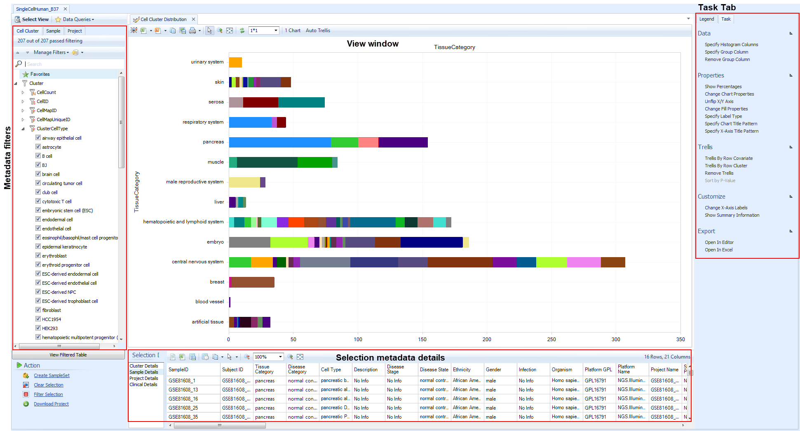
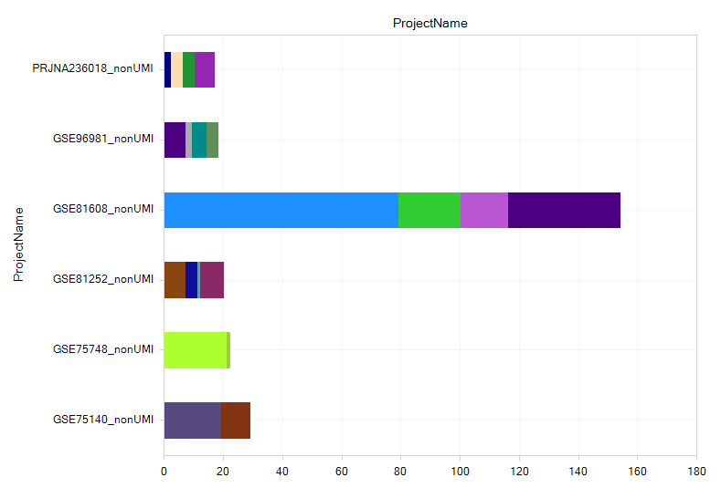

# Introduction
## Single Cell Lands

OmicSoft's new Single Cell Land framework extends the revolutionary OmicLand Framework (OncoLand and DiseaseLand) to deliver large results from curated scRNA-seq projects.
Single Cell Lands extend the DiseaseLand and OncoLand results, enabling exploration of normal expression, as well as oncology and disease-focused data.
Land files are built up based on OmicSoft File System (OFS), which stores genomics data in database files and different layers of indexes for gene/markers and samples/cell clusters.

This tutorial will introduce the key visualizations of Single Cell Lands, designed to accelerate discovery of relevant curated datasets and expression for your work.

## Curation and processing
OmicSoft's teams of biologists and bioinformaticians manually process and curate every project in Single Cell Lands to maximize the ability to discover, explor, and cross-compare data.

* Project metadata evaluation
    * Is the project compatible with the platform?
    * Are all necessary metadata available from the data submission?
    * Are results interpretable in context of the paper?
* Data retrieval
    * Are data available?
        * Preferred: Raw FASTQ files or BAM
        * Special Lands: processed quantification matrices
    * Is the data submission complete, with necessary parsing/processing information?
* Metadata curation
    * Extract/curate project, technical, sample, and clinical metadata
    *  Apply controlled vocabularies and curation standards
    *  Curate expected results from paper, such as clustering experiments, cell types, and key markers/differentially expressed genes
* Data Processing
    * Alignment, quantification, normalization, and post-processing QC
    * Dimension reduction/clustering to reproduce paper's key findings
    * Statistical comparisons between clusters
* Manual Cell type Annotation
    * Manual curation of predicted clusters
        * Overlay key marker genes
        * Confirm proper cluster isolation of expected cell types

The output of this extensive curation process, including project, sample, and curated cell cluster metadata, cell-level gene expression results, and differential expression, are all accessible through the Land interface.
## Land Organization
To enable discovery of relevant datasets that you might not be looking for, diverse projects are gathered in Single Cell Lands, separated by species (human or mouse) and technology (UMI or nonUMI).
### Non-UMI Datasets
Full transcript (non-UMI) scRNAseq datasets such as SMART-seq will be found in Lands such as "SingleCellHuman". Typically fewer cells are measured per experiment, but less gene dropout.
### UMI Datasets
3' and 5' Tag-based technologies enable highly parallel measurement of single cell expression, but does not detect full transcripts, instead only labeling the 5' or 3' end of the transcript.
### Special datasets
Some Lands, such as SingleCellHCL, were processed directly from expression matrices and fully curated, so will be on a different gene model from other Lands.

## Distribution Views
Click **Select Land** and choose SingleCellHuman_B37.

When you open a Single Cell Land, you will first see a "distribution view", indicating the number of datasets available at a level of organization, such as Project, Sample, Cluster, and Comparison.

Use these Views to get a high-level understanding of available data.

In SingleCellHuman, the default distribution View is Cluster Distribution.

You can click **Select View** to see the available visualizations for the **context**, e.g. metadata/Land context (default), gene-level context (after you search for a gene), multi-gene context (searching for more than one gene), or Comparison-level context (searching for one or more statistical comparisons). Many of the visualizations can be useful in certain circumstances, but this tutorial will focus on the most commonly used visualizations.

### Cluster Distribution

The **Clusters** view is the most important distribution View, since it shows the available manually-curated cell types within the Land. Specifically, it displays the number of Cell Clusters, groups of cells within or between samples of a project, that were identified during Dimension Reduction analysis (tSNE, UMAP, etc). The X-axis shows the number of cell clusters, counting different samples in the same cluster; a cluster that is comprised of five different samples from a dimension reduction analysis will display as 5.

The key filter is the **Cluster** filter, because it includes **ClusterCellType**, which is OmicSoft's manual annotation of the cell type based on gene expression markers. Additional filters in this level are primarily technical parameters from the clustering.

Using the ClusterCellType is generally the best way to search the available datasets using the curated metadata. Filter on sample-level metadata such as TissueCategory () or Tissue, or DiseaseState,Gender, Age, or any other clinicla parameter to refine the displayed datasets; you could also filter Project metadata such as TherapeuticArea. Try filtering for a couple tissues like Pancreas, Skin and Liver.

Then use Specify Histogram Columns to regroup the data on the Y-axis, for example ProjectName. Now you can clearly see the available cell types identified, in the datasets that passed your required filters.

### Sample Distribution

The **Samples** view shows the number of biological samples in each dataset.
In the Task tab (right side) use "Specify Histogram columns" to regroup data by Tissue, Disease, or other sample-level metadata, or aggregate by Project metadata.
Use "Specify Group column" to split each bar further by metadata.

### Project distribution

To get a higher-level view of the datasets, you can use the Projects view to see project IDs (like GSE or ArrayExpress IDs), filter on metadata keywords, and find new datasets.

### Comparison distribution
As part of the curation process, QIAGEN statisticians calculate full differential expression analyses between each cluster in a dimension reduction "CellMap" and all other clusters, revealing the genes that are most enriched and depleted in each cluster. For each comparison, a group of **Case** cells (one cluster) and a group of **Control** cells (all other clusters)

Use the comparison distribution View to identify the comparisons that are relevant to your data. For example, use Case.TissueCategory filter (left) to filter for liver cell clusters from pancreas tissue, then Specify Histogram Columns (right) to group on Case.ClusterCellType. This reveals the precomputed comparisons for pancreatic alpha cells, beta cells, PP cells, etc.

Select one or more comparisons (e.g. pancreatic beta cell) to confirm the details, then click "Browse Selected Comparisons" to open the full volcano plots.

### CellMap Browser
In Single Cell Lands, Dimension Reduction plots are called **CellMaps**, because they may be derived from multiple algorithms, and it is tedious to keep writing "Dimension Reduction". You can browse the available CellMaps in the CellMap browser.

Before you open this View, consider filtering for data most relevant to you, such as particular tissues. CellMaps contain a lot of data, so initial syncing will take a few minutes if you attempt to browse all the data, and the variety of cell types will be hard to interpret easily.

Try filtering for a few tissues, like "embryo" (often cells differentiated from ESCs) or "skin".

