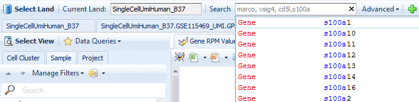
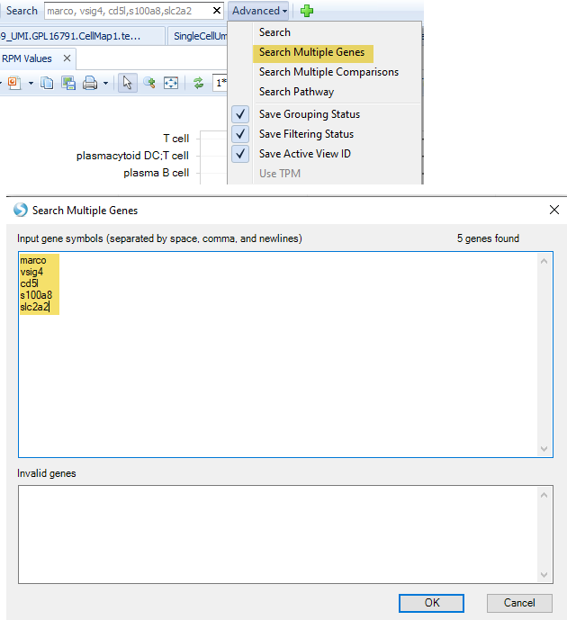
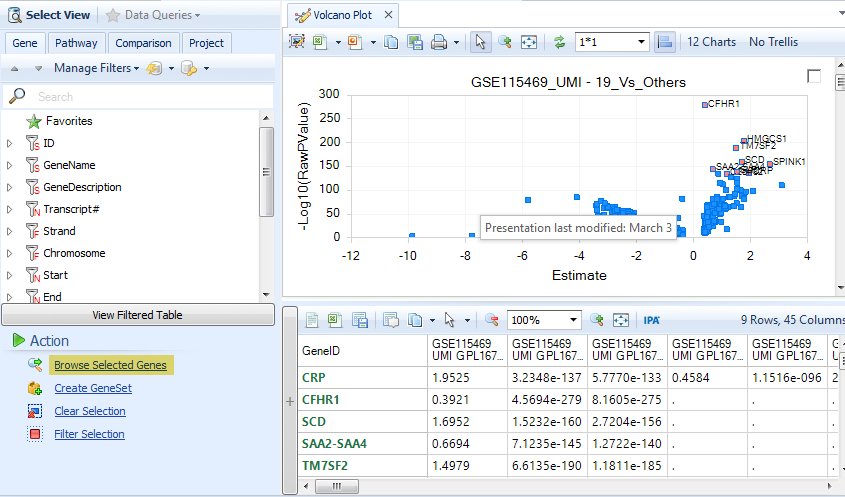
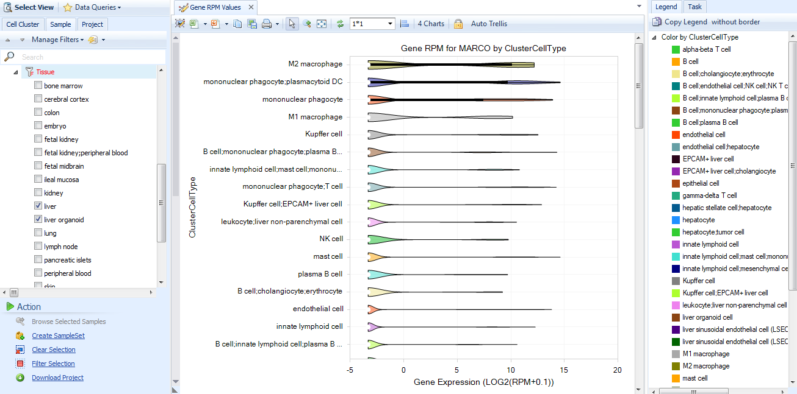
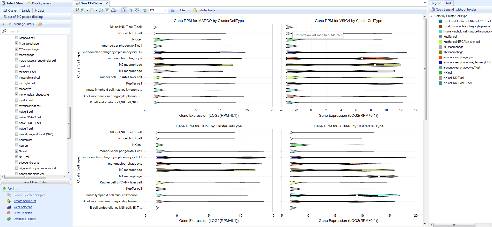

#Multi-gene views
In addition to exploring the expression of single genes, you can also search for multiple genes. You can visualize the expression of each gene in a **Violin plot**, or visualize the differential expression of each gene across all comparisons.

##Searching for multiple genes
In the **Search Bar** type in multiple gene IDs, separated by commas.

Or, you can click the **Advanced** dropdown menu and select **Search Multiple Genes**.

If you are exploring one or more comparisons, for example in a **Volcano Plot**, you can select one or more genes then select **Browse Selected Genes** at the bottom-left in the **Action** toolbar.

##Multi-gene violin plot
After searching for more than one gene, the default View is the multi-gene **Gene RPM** View. Each gene is plotted on a separate pane, so you can scroll down to see gene expression. Use the filters on the left to refine by tissue, disease, clinical metadata, or ClusterCellType. Use the **Task** tab on the right to **Specify Profile Columns**, or change the ordering in each plot by mean expression with **Sort Profiles**. You can also **Hide non-expressing groups** to hide any Y-axis groupings with no cells expressing a given gene.

Above the plot, you will see the **Layout controller**, which is set to **1*1** by default. If you would like to see multiple genes side-by-side, you can change the layout to **2*2**, **3*3**, or you can specify your own layout. Because of the space constraints, you may want to filter to a few groupings first.

For example, after filtering for **tissue=liver** and searching for **marco, vsig4, cd5l, s100a8**, notice the **ClusterCellTypes** with expression. Use the **Cell Cluster** metadata to select specific cell types like all **macrophages**, including liver-resident **Kupffer cells**. Change the layout to **2*2**.

