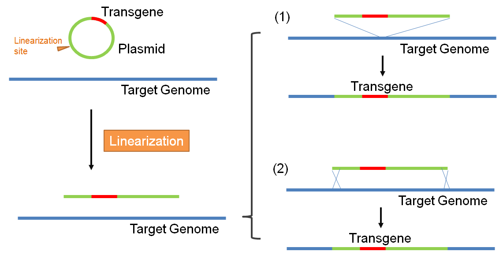

# Introduction

## Transgene

A transgene is genetic material transferred to a host genome by genetic engineering techniques, either by (1) integration by insertion or (2) integration by homologous recombination.

The transgene detection functions described here are designed to identify transgene integration. The workflow reports a list of detected transgene integration sites, statistics of supporting reads, as well as genomic locations of breakpoints, which characterize transgene sites comprehensively at base-pair resolution. Alignment files (NgsData) will also be generated to visualize transgene events in the genome browser, and variation detection of the product.

## Test Dataset

Download link: http://omicsoft.com/downloads/data/Tutorial/Transgene.zip

The test data contains files below

-   Plasmid reference sequence in FASTA format
-   Plasmid gene model in GTF format.
-   Plasmid gene location in BED format
- 	2x100bp paired end fastq.gz files containing NGS reads from regions surrounding the transgene.

It is a semi-simulated dataset mimicking enrichment of transgene regions using pull down techniques.
