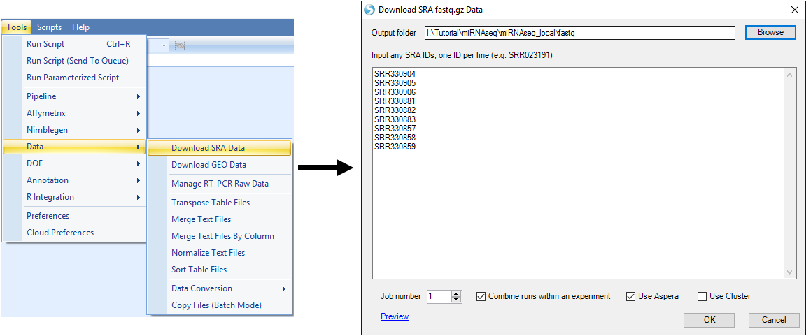

# Introduction

## ArrayStudio

Array Studio runs local NGS analysis in 64-bit mode on a Windows 64-bit computer with at least 8GB of RAM. Server-based analysis allows the user to run jobs on a remote server (Linux or Windows), which usually has more computing power than a desktop computer.
This tutorial is based on local NGS analysis using a Windows Workstation with
3.4GHz Intel® Core TM i7-6700 Processor (# of cores: 4; # of threads: 8) with 24GB RAM.

It is highly recommend that the user complete the prerequisite for this tutorial:
**the Microarray tutorial**, as a way to learn the basics in Array Studio.
This tutorial assumes working knowledge of Array Studio, standard visualizations, and different modules within the software.
As many of the downstream data types from next generation sequencing are "Microarray" datasets, the Microarray tutorial is an invaluable starting tool.

## Test Dataset

This miRNA-Seq tutorial will cover the importing and analysis of a published dataset.
This dataset was run on the Illumina HiSeq platform.
We selected three miRNA-seq files each from involved and uninvolved psoriatic skin, as well as three normal skin samples, for use in this analysis.
The full dataset is available from 'SRA SRP007825'.

SRA SRP007825: http://www.ncbi.nlm.nih.gov/sra?term=SRP007825

|         Sample Type         |    Accession IDs    |       SRA IDs       |      Run IDs      |
|:----------------------------|:--------------------|:--------------------|:------------------+
|         Normal Skin         | GSM768988-GSM768990 | SRX091742-SRX091744 |SRR330904-SRR330906|
| Uninvolved Psoriatic Skin   | GSM768965-GSM768967 | SRX091719-SRX091721 |SRR330881-SRR330883|
|  Involved Psoriatic Skin    | GSM768941-GSM768943 | SRX091695-SRX091697 |SRR330857-SRR330859|

These data can be downloaded from the NCBI web site, using SRA toolkit, or directly through Array Studio:

After retrieving these data, you can begin the tutorial.
