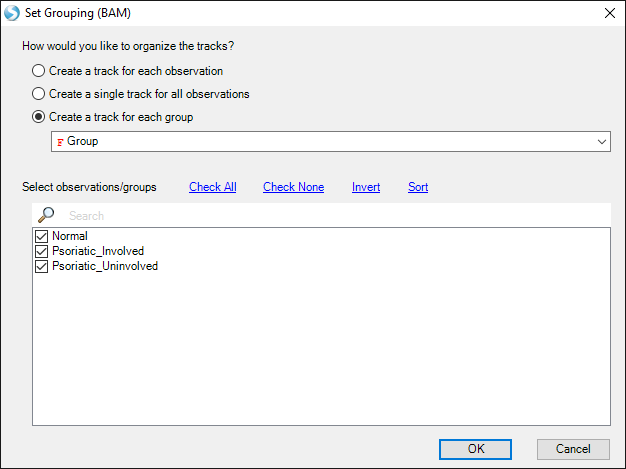

# Others

## Downstream Analyses On Quantification Values

After aligning data, there are a number of downstream analyses that can be done on the data.
In particular, the normalized *Count* **-Omic** data can be used in the analyses designed for **MicroArray Data**,
including several visualization and analysis functions.

## Build Reference and Gene Model

Omicsoft provides standard genome reference (such as Human.B37.3, hg38, mm10, Mouse.B38) and gene models (RefGene, Ensembl and UCSC).
Prebuilt index files will be downloaded from Omicsoft website and cached in local machine for all future data analysis.

If genome or gene models are not shown in the dropdown list, users can build their reference library with a FASTA file for genome reference and a GTF file for gene model.
Both functions are located in NGS menu.

More details can be found in the following two wiki articles:

1. Build reference library. [^link^](http://www.arrayserver.com/wiki/index.php?title=Ngs_BuildReferenceLibrary.pdf )

2. Build Gene model. [^link^](http://www.arrayserver.com/wiki/index.php?title=Ngs_BuildGeneModel.pdf )

## Server-based Analysis

Server-based analysis allows the user to run jobs on a remote server (Linux or Windows), which usually has more computing power than a desktop computer. The Array Studio client software, installed on a local desktop machine, is used to interact with the ArrayServer (like a server terminal). Tasks such as job submission, monitoring, file transfer and data visualization can be done through the client software. Moreover, ArrayServer has a built-in scheduling system supports high performance computing cluster (both SGE and PBS/Torque), accelerating the analysis of tremendous amounts of NGS data.

All the Array Studio modules available for local analysis are also accessible for server-based analysis. The graphic interfaces and workflow are almost the same. Please read tutorial, **Server-Based Analysis Basics**, for more details. Users are encouraged to use Server-based Analyses for larger data sets (for example, with the entire dataset used for the miRNA study here). This also allows users to easily share access to analyses to other users within the same user group. We recommend users read through the **Server Explorer** and **Server Analysis Basics** Tutorials to familiarize themselves with these features.

## Genome Browser

Omicsoft's Genome Browser is fully integrated with Omicsoft's Array Suite package (Array Server and Array Studio).

It can be used to visualize varied data types, including count/fpkm, exon/exon junction data, fusion data and many other tracks which have genomic coordinate information.

For example, you can right click a transcript ID (e.g. miR-135) in miRNA-Seq count data and view tracks in Genome Browser.

You can, by default, either view each track independently, or by *Group* (select *Create a track for each group* and choose *Group*).

By default, the coverage tracks will be auto-scaled, so differences in coverage between groups may not be apparent.

First, use the scroll wheel to zoom out.

Then, right-click a track and select *Set Track Properties*. This will open a window to control details of how each track is displayed.
Hold down shift and select *NGSData_Normal*, *NGSData_Psoriatic_Uninvolved*, and *NGSData_Psoriatic_Involved*.
This way, the changes will be applied to all three tracks.

Change *Auto Scale* to "False", change *Custom Max Value* to "500", and change *Height* to "100". Then close the *Properties* window.

Now, the **Genome Browser** shows that *Psoriatic Involved* samples express *mir-135b* much more highly (in raw reads) than the other two samples.

Please read the tutorial for the **Omicsoft Genome Browser** for more details.
