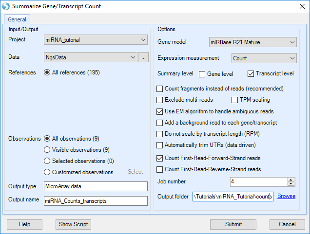
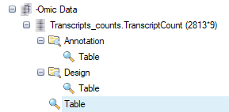

# miRNA-Seq Quantification

ArrayStudio provides modules and options for miRNA-Seq quantification.

## Report miRNA Counts

Given the alignment, one can summarize miRNA expression, using the Quantification module in **NGS | Quantification | Report Gene/Transcript Counts**.

User can choose to quantify at transcript level by selecting it in the **Expression measurement** option. At **Summary Level**, If **Gene level** is selected,
miRNA expression will be quantified at pre-miRNA gene level.  If **Transcript level** is selected, miRNA expression will be quantified at mature miRNA transcript level.  
By default, option **Count fragments instead of reads** is selected, unselect as this is not paired-end (in this case, it makes no difference).
**Exclude multi-reads** does not count non-unique mapped reads.
In the source paper, multi-reads were distributed to all matching sites, so we will also use multi-reads.
Options to count reads based on strand are design for dataset from strand-specific protocol.
In this tutorial, the  samples are strand-specific, as shown in the strand metrics from aligned QC table. Only the first strand counting option is checked. We will examine mature miRNA expression levels, so select **Transcript level**.

Click **Submit** to run the module.

The output counts can be found under the **-Omic** data header in the **Solution Explorer**.

The counts table has miRNA IDs listed down the first column, and the sample IDs listed across the top row.
**-Omic** data have an L-shaped metadata structure, where the row IDs are linked to the Annotation table (provided by the gene model),
and the column IDs are linked to the Design table (which we attached after aligning).

**-Omic** data can be treated as **MicroArray Data** and all microarray data analysis functions, such as **OmicData | Pattern | Hierarchical Clustering**,
**OmicData | QC | Principal Component Analysis**, **OmicData | Inference | General Linear Model** and other modules can be used for downstream data analyses.
Please read the Microarray tutorial to get detailed analysis information.

For this tutorial, we will look for changes between groups of samples, but first
we recommended that you normalize the data by total counts.
This normalization function can be found in **NGS | Inference | Normalize RNASeq data**.

The *Normalize RNA-Seq Data* module provides a number of different ways to normalize data; we will use TotalCount.

Select *TotalCount* in the *Normalization method* list, set the *Scale Target* to 1,000,000 and click submit.

If you choose, you can check the normalization by selecting **OmicData | Summarize | Summary Statistics**,
then summarizing by *Observation*, using *Sum* (it should equal 1,000,000).

## ANOVA to identify differentially-expressed miRNAs

Now that our miRNA-seq count data are normalized, we can now use ANOVA to identify differentially-expressed miRNAs.
Please be aware that our small sample set is not large enough to give a robust test.
If the user wishes, the full set of miRNA-seq data can be run through this tutorial, and be compared to the original paper's results.

For example, this volcano plot of a One-way ANOVA of Psoriatic Involved vs Normal samples, using all miRNA-seq data (instead of the tutorial subset),
known miRNAs that were reported as being most up- or down-regulated in Joyce *et al.* are color-coded as purple and blue, respectively.

Although using only the tutorial subset is not statistically robust, let's walk through the process.
First, we will log2-transform our scaled data, using **OmicData | Preprocess | Transform**:

Specify an output name **(otherwise the normalized count data will be over-written)**,
add a constant of 0.1 (to avoid Log2 of **0**),
and select "Log2" as the *Transformation method*.

Once we have transformed our data, several tests, including ANOVA, can be performed.
These can be found under **OmicData | Inference | Standard Tests**:

In the *One-Way ANOVA* Window, first ensure that the scaled data set is selected, and specify an output name.

Select "Group" as our *Group* (specified when we modified the *Design Table*).

Select "Pairwise" *Comparison*, to compare between each pair of groups.

We will use "FDR_BH" multiplicity correction.

Leave *FC transformation* as "Exp2", and click **Submit**.

Volcano plots will show fold-change vs P-values for the 2813 miRNAs measured, across each pairwise comparison of normal, uninvolved, and involved psoriasis samples.

Cut-off lines can be selected in **View Controller | Specify Cutoff Lines** for p value cut-offs (y-axis) and fold-change (x-axis) as shown above. Select a few dots on the Psoriatic_Involved vs Normal plot. Detailed information about the measurements will be displayed in the *Details *Window*,
including the Estimate, which is the difference in means of log2-transformed miRNA expression in the samples,
fold-change, which is unlogged Estimate, but the value's sign indicates whether the treatment sample is increased (+) or decreased (-),
as well as raw and adjusted P-values.

In the details window, hover the mouse over one of the miRNA genes; the corresponding point on the volcano plot will be indicated.

Although this tutorial used only a subset of the original study's data, this analysis detects many of the same differentially-expressed miRNAs,
including upregulation of miR-135b.

These genes can be found in the Volcano plot by searching in the search box.
(1) Type "mir-135b" in the search box, (2) click the **search** icon (binoculars).
All matches to this string (in this case, two miR-135b transcripts) will be selected in the Volcano plot,
and details will be displayed in the the *Details* window.

