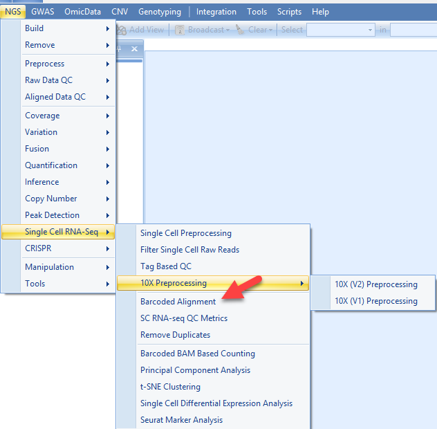

# Alignment to the Genome

After the preprocess of single cell fastq file, the major step of the SC RNASeq analysis is the alignment of the reads to the genome. For this tutorial, we will align the data using OShell (same to normal RNASeq alignment), but with a special module to include the information in the tag file. To access this module, please go to **NGS | Single Cell RNA-Seq | Barcoded Alignment:**  

## Add filtered reads

Click the **Add** button to specify the location of the files. If user has followed this tutorial to run the filtering step, use the fastq files resulted from filtering process. The associated tag.gz file will be expected in the same folder as fastq.gz file.

Although our original fastq files are paired end reads, while the read1 only contains cell barcode and UMI information, the fastq file after preprocessing is now single end reads now, so leave the option for **Reads are paired** empty.

Choose the Genome for the experiment. In this analysis, we used **Human.hg19**. Omicsoft supplies standard genome builds for common organisms, but the user can always choose to build and use their own genome. Similarly, choose the Gene Model to be used for alignment. Here we use **Ensembl.R75**, but the user can always choose to use their own gene model.

Leave the quality encoding set to automatic. However, for your information, these files were encoded using the Sanger quality scoring system. Total penalty should be left as automatic, and is described completely in Omicsoft’s white paper on alignment.
Thread number indicates the number of threads to use per alignment, and usually this number should be less than 6. Job number refers to the number of parallel jobs (independent processes). Non-unique mapping indicates how many “ties” for non-unique reads should be reported, or whether they should be excluded all together.

Different from the normal RNASeq alignment, in this module, Barcoded BAM files will be generated. Basically, there will be several extra columns in the bam file for each read, showing the corresponding information about cell barcode and UMI.

Output folder is the place if one wants to explicitly specify a location to store the alignment BAM files. Otherwise the bam files will be saved in a default location (a random number/letter folder in the project folder). In this tutorial, it is recommended to specify a folder so that BAM files can be found easily in the next step (for fusion detection).

There are a few options in the Advanced Tab (e.g. Indel detection). In general, the default values have been tuned and should work well in most cases.

Click **Send To Queue** to submit the analysis.

This could take hours, depending on the number of threads, type of computer (64-bit/32-bit), etc.

## Alignment reports and output files

After the alignment, you will see a NgsData object and an alignment report table in the solution explorer.

BAM files as well as alignment report summary files will be generated in the specified output folder:

