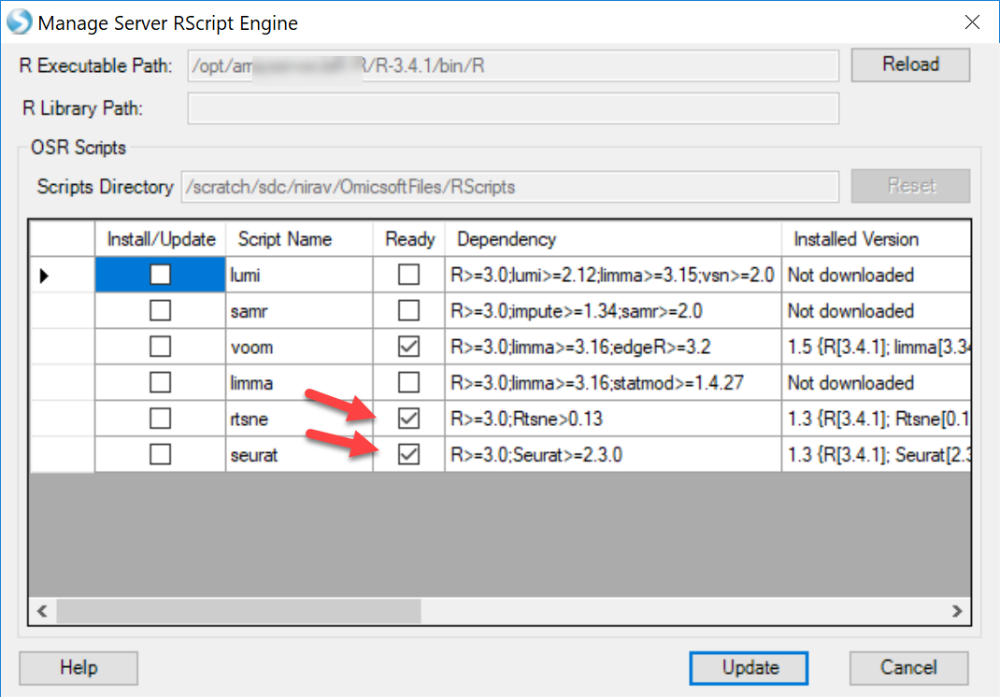

# Downstream Analysis of Single Cell Data

## Normalization

In ArrayStudio, we provide different methods for normalization. For Single cell RNA-seq data, we use TPM (transcript per million) for samples without UMI incorporated, and RPM (Counts/reads per million) for samples that contain UMI (due to the 5’ or 3’ biases). For both UMI datasets quantified in this tutorial, we will use RPM to normalize the data as we do have UMI for these samples.

If user haven’t check the option for **Convert UMI count to transcript number** in the advanced option for **Report Single Cell Counts (like for the 10X data set)**, the Quantification module will only output one ZIM file and ZIM data object in GUI, and different from microarray type data, ZIM data might not be compatible with several other modules we are going to use, so before we do the normalization, user should right click on the UMI count data object, and convert it to MicroArray Data:

While in our tutorial case, if use did check the option for **Convert UMI count to transcript number** in the advanced option for **Report Single Cell Counts**, the Quantification module will output a ZIM data object and a normal microarray type data object for the converted count in GUI, user can just use the converted count data directly to do the normalization as follows.

For RPM normalization, we can go to NGS | Inference | Normalize RNA-Seq Data:

And choose **TotalCount** for the Normalization method, setting the **scale target** to 1,000,000, so the resulted data will be reads per million:

## Interpretation of Single Cell Counts Data

The analysis of Single Cell RNA-seq analysis is a rapidly evolving field. OmicSoft has implemented several widely used R packages within ArrayStudio to allow users to conveniently use the GUI interface to interact with the data and further interpret their single cell data:

### Cluster Classification

The **Rtsne** module in Array Studio will allow the user to cluster different cells with UMI counts, using the **Rtsne** package in R: T-Distributed Stochastic Neighbor Embedding using a Barnes-Hut Implementation [RTSNE](https://cran.r-project.org/web/packages/Rtsne/index.html). To access this module, please go to **Analysis | NGS | Single Cell RNA-Seq | t-SNE Clustering**:

Most options can be saved as default. Users have the option to scale the data prior to PCA if desired. In this tutorial, we have left this option blank. We have also added an option for users to select the number of clusters expected (lower and upper bound of a range). Select the expected number of clusters, leave all other options as default and run the R t-SNE:

If user found that the **Package compatibility** is not ready for either local job or server job, please follow our instruction to set it up: R implementation of t-SNE [t-SNE Module in ArrayStudio](http://www.arrayserver.com/wiki/index.php?title=Analytic_Module_Versions#Rtsne).

Once the job is finished, user can find a table report and a scatter plot view for this table in ArrayStudio:

The table report will look like this:

And the scatter plot will use “V1” as x-axis and “V2” as y-axis based on the table report:

Users can use the *Kmeans* columns to color the cells by cluster assignment, by clicking on **Change Symbol Properties** in the **View Controller** on the right side of the screen. Simply choose
the columns to Color the view:

Clicking Close, you will now see the clustering will be shown for each cell:

### Differential expression analysis - Seurat

Seurat is an R package developed by the Satija Lab, which has gradually become a popular package for QC, analysis, and exploration of single cell RNA-seq data. The Seurat module in Array Studio has not adopted the full Seurat package, but will allow users to run several modules in the Seurat package:

**FindVariableGenes**: Identifies "noisy genes" that account for the variation among single cells.
**FindMarkers: Finds markers (differentially expressed genes)** for identified clusters.

This function is intended to use Single Cell UMI count data, and directly runs the Seurat in the R engine integrated with ArrayStudio.

To use this function, the ArrayServer admin can follow the instructions to integrate Seurat, or the user could run the analysis on their local server (http://www.arrayserver.com/wiki/index.php?title=R_packages_integration_with_ArrayStudio).

The current implementation of Seurat requires the cells used in the analysis to be present as List objects in the project. To generate lists of cells in each cluster, users can use the tSNE scores table and:

Repeat this with each cluster in the tSNE scores table, and you will have a group of lists (8 in the example above):

Now, you can input the choices in Seurat for the analysis you would like to perform:

In the screenshot above, notice how users can do pairwise comparisons of cluster to cluster (i.e. Cluster1 to Cluster3), or simply identify which genes are differentially expressed in the chosen cluster compared to all other cells. If interested in the highly variable genes, choose this option and click Send to Queue.

A number of objects will be output after the job is complete:

- **Inference Report:**

The inference report (and a volcano plot) generated will appear very similar to other differential expression modules in ArrayStudio, such as DESeq and General Linear Model:

- **HVG table**

This table is output from Seurat and shows each gene's average expression and dispersion, along with the gene's metadata (such as common gene name, genome location)

- **HVG List**

This will simply provide users a list of the highly variable genes identified by Seurat.

### Differential expression analysis - SCDE

If users want to analyze the differential gene expression across different subset of cells, for instance, in upper chart, user want to see which genes show different expression level significantly between cluster 1 cluster 2, they can use the SCDE module in ArrayStudio. This function is intended to use Single Cell count data, and directly runs the R implementation of [SCDE](http://www.arrayserver.com/wiki/index.php?title=Setup_SCDE_in_R_engine). SCDE was designed with small cell numbers in mind, such as a SMART-Seq experiment, and is not recommended for >1000 cells.

To run the SCDE to compare different clusters, user should have a design table to include the cluster information for each cell. Here are the steps to add the cluster information (based on the t-SNE result) to the design table:

Once the R-tsne is done and the scatter plot is generated, users can add the Kmeans cluster assignment from the tSNE scores table to the Design table for the Omic-Data object of SC counts.

Now user can run SCDE. To open this module, please go to **Analysis | NGS | Single Cell RNA-Seq | Single Cell Differential Expression Analysis**.

User can set the comparisons of cluster to cluster using the Group column and the newly added Kmeans assignment, and leave all other options in default and submit the job:

if user found that the package compatibility is not OK, it means that the R integrated with ArrayStudio is not ready to run scde package, please check with How to setup SCDE in R engine [SCDE in R Engine](http://www.arrayserver.com/wiki/index.php?title=Setup_SCDE_in_R_engine) to configure SCDE in ArrayStudio.

The SCDE module will generate an inference table and a volcano plot view for this table in ArrayStudio:

1.	A SCDE report table similar to DESeq Inference Report will be generated, containing fold-change and p-values for each tested variable. The default visualization, a volcano plot, will also be generated. Here is an example of output table:

2.	An example of volcano plot is shown below:

