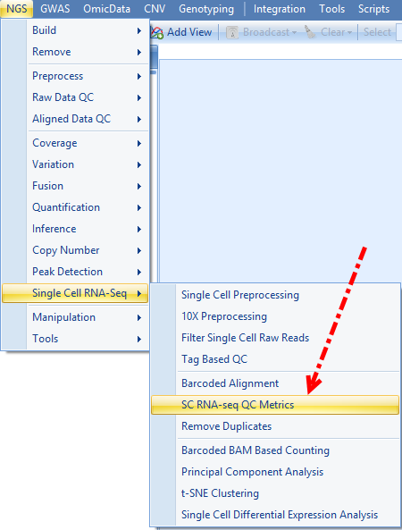
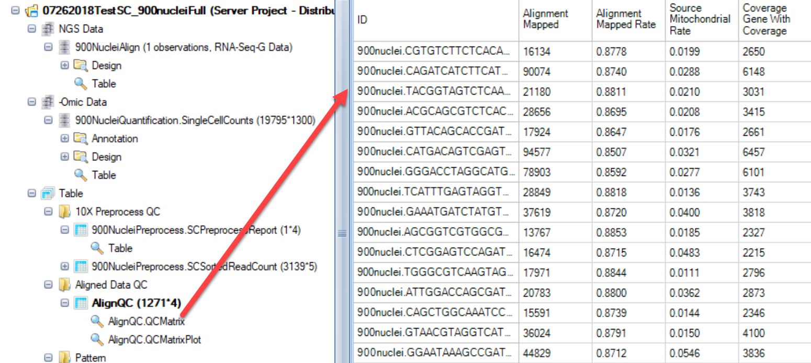
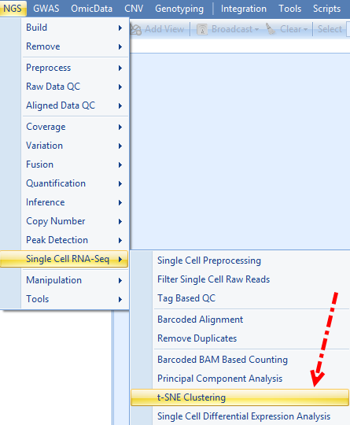
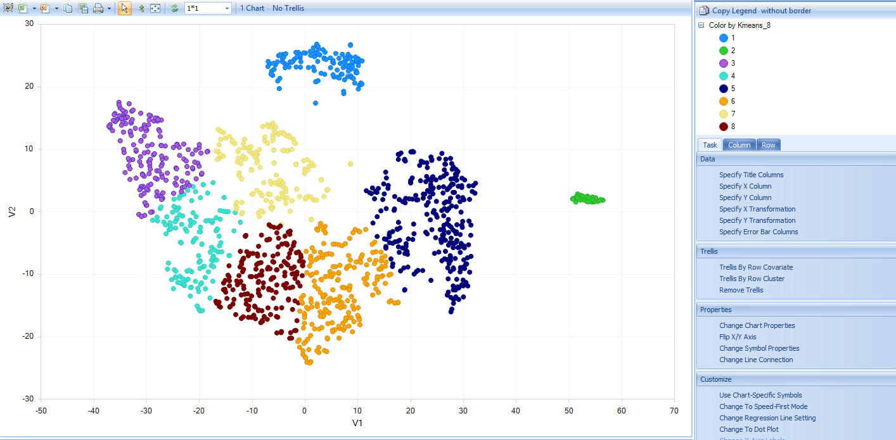
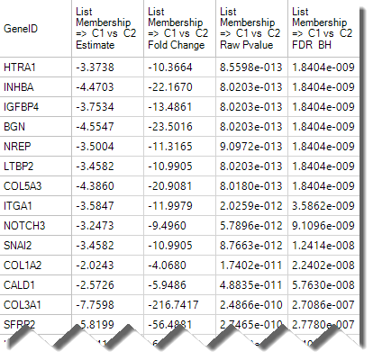
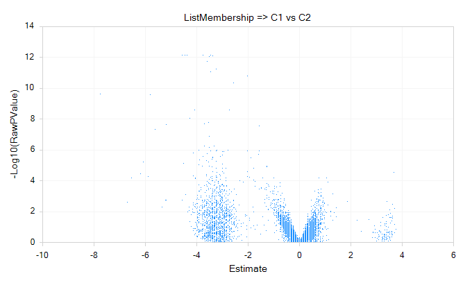

# Other Downstream Analysis

## Quality control on the cells

Single Cell alignment/quantification will result in hundreds/thousands of cells, during which there will be various qualities for different cells. Low-quality cells need to be removed to ensure that technical effects do not distort downstream analysis results. We would like to propose this criteria for filtering low quality cells, with which we have been used for curating our data for SingleCell land:

  	Mapped rate:     >=40% for **human**; >=30% for **mouse**

  	Mapped reads:     >=50,000 for Non **UMI**; >= 1000 for **UMI**

  	Gene coverage:     >=1000 for Non **UMI**; >=250 for **UMI**

  	Mitochondrial rate: < 20%

  	Spike-in RNA rate (if there is Spike-in and calculated): < 20%

Based on this criterion, we consider the cells with small number of mapped reads have low quality, as well as the alignment mapped rate. The minimal gene coverage is defined as the number of genes with non-zero counts for that cell, and we set the threshold as 1000 for reads containing UMI, 50,000 for reads don’t have UMI. Any cells with very few expressed genes are considered with poor quality, probable due to the failure of capturing the diverse transcript population.  

Besides that, we also measure the proportion of reads mapped to genes in the mitochondrial genome. High proportion of reads mapped to mitochondrial might be an indication of increased apoptosis and/or loss of cytoplasmic RNA from lysed cells. Similar consideration applies to the ratio of genes mapped to Spike-in RNA. If the portion mapped to spike-in RNA is high, these cells might have lost the major portion of endogenous RNA, thus considered as low quality. If there is no spike-in RNA included in the sample, then this part can be removed from the criteria.

## scRNA-Seq QC Metrics:

ArrayStudio has provided a module to do Alignment data QC especially designed for Single Cell RNA-seq, which can be accessed by going to NGS | Single Cell RNA-seq | SC RNA-seq QC Metrics:

This module takes bam file resulted from barcoded alignment as input file, user can click **Add** to import the formally aligned bam files, and choose the corresponding genome and gene model used for the alignment, and input the output folder to run the job:

When the job finishes, an SC RNA Seq QC Metrics Table will be generated. Different from the RNASeq QC metrics report for bulk RNASeq, this SC RNA Seq QC Metrics Table will have cell name as the row ID, and different alignment statistics as the column name. Other than that, all of the content will be same to the RNA Seq QC Metrics Table:

User can filter for these columns for the quality control accordingly:
  	Mapped rate – **Alignment_MappedRate**: >=40% for **human**; >=30% for **mouse**

  	Mapped reads – **Alignment_Mapped**: >=50,000 for **Non UMI**; >= 1000 for **UMI**

  	Gene coverage – **Coverage_GeneWithCoverage**: >=1000 for **Non UMI**; >=250 for **UMI**

  	Mitochondrial rate – **Source_MitochondrialRate**: < 20%

  	Spike-in RNA rate – **Source_SpikeInRate**: < 20%

## Normalization

In ArrayStudio, we provide different methods for normalization. For Single cell RNA-seq data, we use TPM (transcript per million) for samples without UMI incorporated, and RPM (Counts/reads per million) for samples that contain UMI (due to the 5’ or 3’ biases).  In this tutorial, we will use RPM to normalize the data as we do have UMI for these samples.

If user haven’t check the option for **Convert UMI count to transcript number** in the advanced option for **Report Single Cell Counts (which is different from what we did in this tutorial)**, the Quantification module will only output one ZIM file and ZIM data object in GUI, and different from microarray type data, ZIM data might be not compatible with several other modules we are going to use, so before we do the normalization, user should right click on the UMI count data object, and convert it to MicroArray Data:

While in our tutorial case, if use did check the option for **Convert UMI count to transcript number** in the advanced option for **Report Single Cell Counts**, the Quantification module will output a ZIM data object and a normal microarray type data object for the converted count in GUI, user can just use the converted count data directly to do the normalization as follows.

For RPM normalization, we can go to NGS | Inference | Normalize RNA-Seq Data:

And choose **TotalCount** for the Normalization method, setting the **scale target** to 1,000,000, so the resulted data will be reads per million:

## Classification for subgroup

The **Rtsne** module in Array Studio will allow the user to cluster different cells with UMI counts, using the **Rtsne** package in R: T-Distributed Stochastic Neighbor Embedding using a Barnes-Hut Implementation [RTSNE](https://cran.r-project.org/web/packages/Rtsne/index.html). To access this module, please go to **Analysis | NGS | Sing Cell RNA-Seq | t-SNE Clustering**:

Leave all other options as default and run the R t-SNE:

If user found that the **Package compatibility** is not ready for either local job or server job, please follow our instruction to set it up: R implementation of t-SNE [t-SNE Module in ArrayStudio](http://www.arrayserver.com/wiki/index.php?title=Analytic_Module_Versions#Rtsne).

Once the job is finished, user can find a table report and a scatter plot view for this table in ArrayStudio:

The table report will look like this:

And the scatter plot will use “V1” as x-axis and “V2” as y-axis based on the table report:

It’s highly recommend for users to follow the steps in our wiki [RTSNE Options](http://www.arrayserver.com/wiki/index.php?title=RTsne.pdf#Additional_Options) to go through some additional steps to achieve a figure like this:

## Differential expression analysis

If user want to analyze the differential gene expression across different subset of cells, for instance, in upper chart, user want to see which genes show different expression level significantly between cluster 1 cluster 2, they can use the SCDE module in ArrayStudio. This function is intended to use Single Cell UMI count data, and directly runs the R implementation of [SCDE](http://www.arrayserver.com/wiki/index.php?title=Setup_SCDE_in_R_engine).

To run the SCDE to compare different clusters, user should have a design table to include the cluster information for each cell. Here are the steps to add the cluster information (based on the t-SNE result) to the design table:

Once the R-TSNE is done and the scatter plot is generated, user can try to manually select cells that belongs to the same cluster, and add a list name to these clusters:

User can manually assign the cluster name to these clusters like this.

If all the cells have been assigned a list name based on their distribution in the scatter plot, user can select all the lists defined from this scatter plot and right click to choose to add the list membership to the design table of the data object that we want to do SCDE:

And choose the target design talbe:

Now user can run SCDE. To open this module, please go to **Analysis | NGS | Sing Cell RNA-Seq | Single Cell Differential Expression Analysis**.

User can set the comparisons in options like this and leave all other options in default and submit the job:

if user found that  the package compatibility is not OK, it means that the R integrated with ArrayStudio is not ready to run scde package, please check with How to setup SCDE in R engine [SCDE in R Engine](http://www.arrayserver.com/wiki/index.php?title=Setup_SCDE_in_R_engine) to configure the scde in ArrayStudio.

The Rtsne module will generate a table and a scatter plot view for this table in ArrayStudio:

1.	A SCDE report table similar to DESeq Inference Report will be generated, containing fold-change and p-values for each tested variable. The default visualization, a volcano plot, will also be generated. Here is an example of output table:

2.	An example of volcano plot is shown below:

## Other functions in the future
Our developers are still actively developing more modules for Single Cell RNA-Seq data downstream analysis.
