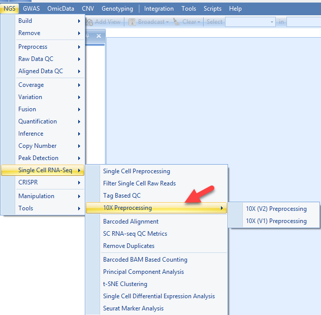
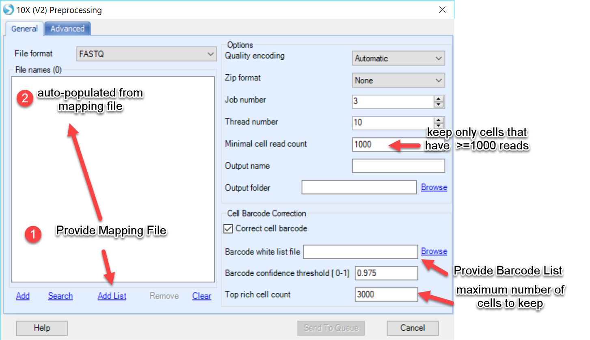
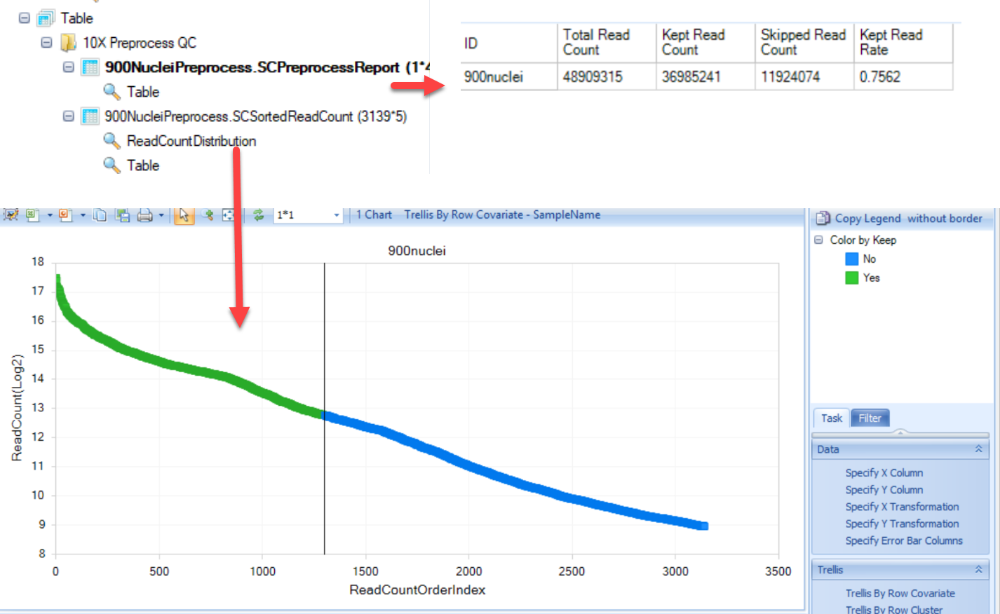

# 10X Genomics

## Test Data Set
This Single Cell RNA-Seq (scRNA-Seq) tutorial will focus on a popular platform for Single Cell RNA-seq, 10X Genomics. OmicSoft has developed two modules for handling the different chemistries of 10X Genomics datasets, V1 (now deprecated at 10X Genomics) and V2. Since the V1 method is deprecated, this tutorial will demonstrate how to analyze a dataset using the V2 chemistry. For details on how to analyze a dataset generated using V1 chemistry, please visit here: http://www.arrayserver.com/wiki/index.php?title=Ngs_10X_V1_Preprocess.pdf

This tutorial will focus on single nuclei obtained from a mouse brain using the 10X V2 platform. The expected number of nuclei for this experiment was 900. This dataset can be accessed from 10X Genomics: [here](http://omicsoft.com/downloads/data/Tutorial/SingleCell/nuclei_900_fastqs.zip). There is one sample that has been sequenced over two lanes (Illumina), using paired-end sequencing. In the case of 10X Genomics V2, the first mate from the paired-end data will contain the Cell Barcode and UMI information, while read 2 will be used to align back to the genome:

In addition to the raw fastq files in the .zip file above, there are two additional files that are available:

1. a mapping file that will be used to group multiple fastq files to samples. Please note: you will need to adjust the file path to the final location of this mapping file on ArrayServer.
2. a  barcode list provided by 10X Genomics - these are all the possible barcode combinations that would be available with the V2 chemistry.

Before processing this data in ArrayStudio, we recommend that users place these data files onto a drive mapped on ArrayServer.

## Pre-Processing

The first step in analyzing single-cell RNA-seq results is to determine how many cells and reads there are and to group reads for each cell. In ArrayStudio, this can be done in the **NGS-->Single-Cell RNA-Seq-->10X Preprocessing** menu:

In this interface, in a single-step, users can:

- Filter the cells based on the total reads number
- Do cell barcode correction with the similar logic applied by CellRanger
- Rank the cells based on the read number, extract the top N cells
- Filter the reads by cell barcode and UMI quality
- Generate a knee plot to show the reads number distribution across all cells

### Pre-Processing (General)

During the first phase of preprocessing, users can simply provide the mapping file under "Add List" and the file names in the mapping file will automatically be added to the window. Three parameters unique to single-cell analysis are also defined in this menu:

**Minimal cell read count** Users can define read quality using this parameter here by defining a minimal number of total reads a cell must have to be called a cell. Default value=1000.

**Barcode white list file** Simply provide the barcode list provided in the .zip file provided in this tutorial. Users could also download this list directly [here](http://omicsoft.com/downloads/data/Tutorial/SingleCell/WhiteListV2.txt). The white list will help filter for cells whose barcodes are provided in the list. In addition, this module will apply a logic to recover cells by correcting barcodes due to sequencing errors, using the white list as the target for barcodes.

**Top rich cell count** This parameter allows the user to input the amount of cells expected in each sample/experiment. In addition to filtering cells based on quality and total of reads per cell, this module will allow users to limit the number of cells in the analysis. Additional filtering will occur during quantification, so we recommend for input to use 25%-50% more cells than expected. For example, in the dataset provided in this tutorial, there were 900 nuclei expected. We have benchmarked this dataset using a top rich cell count of 1300.

Additional parameters will be available to adjust for the user, including:

**Thread number** indicates the number of threads to use for each sample. Increasing the thread number to 4-6 can increase the speed of processing by spreading the load of the CPU to multiple threads.

**Job number** refers to the number of parallel jobs (independent processes). If processing multiple samples, this number can be set higher

**Non-unique mapping** indicates how many "ties" for non-unique reads should be reported, or whether they should be excluded all together.

Only BAM files will be output. If users also want SAM files, there is a tool (**NGS | Tools | Convert Files**) in ArrayStudio to generate SAM files from BAM files.

**Output folder** Pre-processed files, including those from kept cells and skipped, will be output to this folder, along with an auto-generated mapping file that can be used for the alignment step.

**Output** Users can define a name for the output to distinguish the objects in the project. This name will also be assigned to the mapping file that will be output at the end of this procedure.

### Pre-Processing (Advanced)

The Advanced tab of the preprocessing menu allows users to define parameters for filtering of the 10X Genomics data and visualize the quality of reads in a knee plot.

- Filtering: By default, ArrayStudio will examine the Barcode and UMI information in read 1 of the fastq files, and discard reads where these tags have poor sequencing quality or improper length. This option can be left as default.

- Quality control/knee plot: Users can also generate a knee plot to visualize a pile-up of all individual barcodes (cells) and total reads per cell. Leaving this number lower than the Minimal cell read count on the *General* tab will allow users the opportunity to see how many "cells" will be excluded from the analysis.

When satisfied will all options chosen, click on **Send to Queue**. For reference, this process takes about two hours on our test.

## Results ##

The pre-processing step of 10X V2 data will output results in two locations that users will need, 1) the project within ArrayStudio and 2) the Output Folder.

### Results - OmicSoft project

Within the OmicSoft Project Environment, users will see two table objects:

- **SCPreprocessReport:** This table will simply provide results of the pre-processing, including the total number of reads in each sample, how many were kept, and how many filtered (skipped) during pre-processing. Finally, the last column will provide the fraction of total reads that were retained during pre-processing.

- **SCSortedReadCount:** A table will be generated to report each cell (barcode) that was identified in the raw fastq files, ranked by the number of reads per cell:

The ranking (Read Count Order Index) and the read count are plotted in the knee plot, and colored by whether the cell was kept (green) or skipped (blue) in the ReadCountDistribution view. This visualization can be used to examine the filtering conditions and reset filters if need.

### Results - Output Folder

In addition to the reports that are generated in the project, the processed fastq files can be found in the output folder:

As shown in the diagram above, the "MergedMapping" file is what is needed for the alignment step. Similar to the mapping file used for the pre-processing step, this file will provide a list of all the fastq files that will be used. Note that the kept reads from the pre-processing step will have the format: *SampleID*_prepReads_chunk(1-n).fastq.gz and *SampleID*_prepReads_chunk(1-n).tag.gz. The prepReads.fastq files will have the kept reads that will be aligned to the genome, while the tag.gz files will retain the information about the cell barcode and UMI. The skipped reads will also be retained after preprocessing if users would like to perform further analysis with them.

For users that would like to use [Oscript/Pscript](../../Oscript/Introduction.md) to submit analyses directly to ArrayServer without using the GUI menu for alignment, the *MergedChunkFiles.txt* file can be used as input.

Once these results are generated, you are ready to align reads to the genome! Please skip ahead to the [Alignment to Genome section](../Alignment_to_the_Genome.md)
