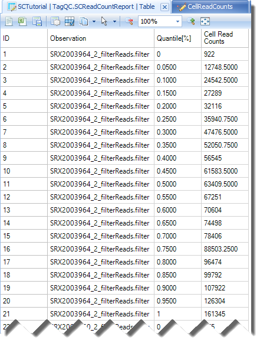
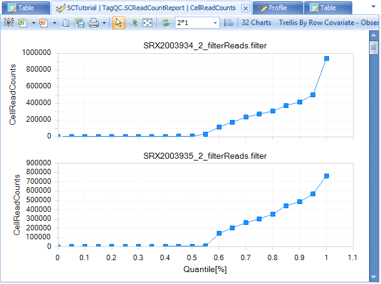

# TAG Based QC

We can use this module to summarize the data quality based on the tag file.
Go to **Analysis | NGS | Single Cell RNA-Seq | Tag Based QC:**

Click **Add** to load the tag.gz files generated from the former step; Leave **Quality encoding** as Automatic to automatically set the correct quality encoding method. Specify **Job Number** as the number of processes to run in parallel. Specify the output folder where the results files will be saved, otherwise the files will go the project folder by default.

In the box of **# of quantiles for QC summary**, set the number to be **20**, which means there will be 20 quantiles (0, 0.05, 0.10, 0.15 ……, 0.95, 1) for the cells for each sample, ranked based on the count for each cell.

## scRNA Read Count Report

Check the option for **Export all cell barcode counts**, and leave others as default. Click **Send To Queue** to run this module on server.

Once the analysis is done, user can see two tables generated under the Table section, in the folder named “SC Raw Data QC”, each has a corresponding view:

The **SCReadCountReport** table will have 3 columns, for each sample, there will be 21 rows (20 quantiles), and the Column of Cell Read Counts shows the read counts for the corresponding cells:

## Cell Read Counts View

And the CellReadCounts view is the variable view trellis by samples, which shows the read count across different quantiles of the cells for each sample in a more straightforward manner.

Similarly, the SCReadQSReport table shows the quality score for each quantile of the cells for each sample:

And the corresponding view shows a more straightforward view, during which user can see the green line for cell barcode quality (CY), and blue line for UMI quality (UY):

