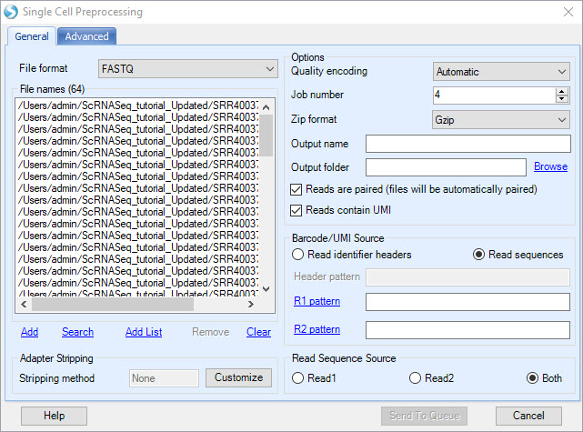
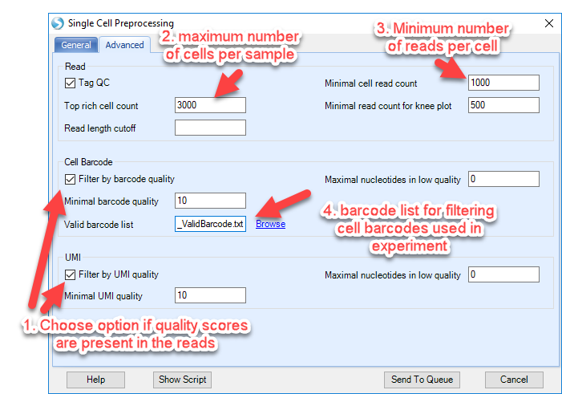
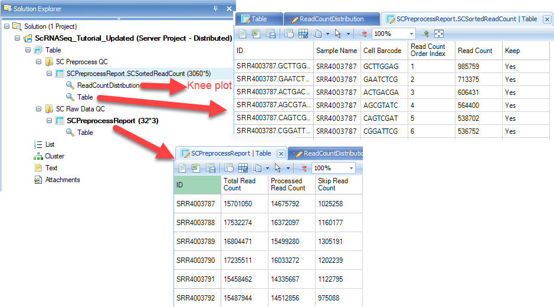

## Introduction - Non-10X UMI Experiments

## Downloading the Test Dataset

This Single Cell RNA-Seq (scRNA-Seq) tutorial will cover the importing and some analysis of a public dataset. This dataset can be accessed from NCBI GEO database: [GEO GSE85241](https://www.ncbi.nlm.nih.gov/geo/query/acc.cgi?acc=GSE85241) which was run on the Illumina NextSeq 500(GPL18573) platform, and adopting the method of CEL-Seq2. There are 32 samples in total and each sample has 2 fastq files as input, as it’s paired-end sequencing data.

As described in the document (GSE85241_readme_demultiplexing_Cel-seq_data.pdf) downloaded from GEO database, read 1 should be parsed in the following manner: “the first 8 basepairs are the Cel-Seq cell barcodes (see list at the bottom of the same document). The following four basepairs are random basepairs of the unique molecular identifier, which can be used to count individual molecules for each transcript. The rest of read 1 consists of mostly polyT and is not used. Read two is then mapped to the reference genome of choice (hg19 in our case).”

Based on this description, in this tutorial we will extract the cell barcode and UMI information from read1, then align read2 to human genome, and perform downstream quantification and clustering analysis.

If users are interested in testing with this project, the data can be downloaded from NCBI: [SRP080991](https://trace.ncbi.nlm.nih.gov/Traces/study/?acc=SRP080991), or using our GUI for downloading SRA to download the fastq files: [Download SRA in ArrayStudio](http://www.arrayserver.com/wiki/index.php?title=DownloadSRAData.pdf).
After retrieving these data, you can begin the tutorial.

## Pre-process Overview

Compared to normal fastq files, Single-Cell RNASeq fastq files contain extra information for barcode and Unique Molecular Identifiers (UMIs). The purpose of pre-processing fastq files is to extract these features, and store them in a tag file. Beginning in March 2019, OmicSoft has implemented an efficient way to extract and filter the files obtained for UMI-based studies.

In this interface, in a single step, users can:

- Extract the cell barcode and UMI information for each read pair
- Filter the cells based on the total number of reads
- Rank the cells based on the read number, extract the top N cells
- Filter the reads by cell barcode and UMI quality
- Generate a "knee plot" to show the distribution of number of reads across all cells

## Pre-process Parameters

This module can be accessed by going to **NGS | SingleCell RNA-Seq | Single Cell Preprocessing:**

Click **Add** to find all fastq files for these 32 samples (64 fastq files). Leave **Quality encoding** as Automatic to automatically detect and set the correct quality encoding method (this tutorial has fastq files with the Sanger method of quality encoding). Specify **Job Number** as the number of processes to run in parallel. Specify the output folder where the results files (.fastq.gz and .tag.gz) will be saved, otherwise the files will go to the project folder by default.

Check the option for **Reads are paired** as we are using paired end data in this tutorial, and check the option for **Reads contain UMI**.

### Barcode UMI Source

In the **Barcode/UMI Source** section, check the option for **Read Sequences** as the barcode and UMI are included in the read1 for the data, then click **R1 pattern** to bring up the regular expression window:

For the testing data, in the Read1 files, the first **8** basepairs are the Cel-Seq **cell barcodes**, and the following **4** basepairs are random basepairs of the **unique molecular identifier**. We can modify the length for barcode and UMI  in the box directly (as shown below), and click **Match**. The user can see a visual example for how the fastq read1 sequences get mapped by this regular expression pattern:

Clicking **OK** will bring this regular expression phrase to the Single Cell Preprocessing window. In the last option, choose **Read2**, as the read sequence exists in Read2 for this testing data.

### Filtering Cells/Reads

In the Advanced Tab for the Single Cell Preprocessing menu, users can select options to filter their cells based on:

1. Read quality (Barcode and/or UMI sequence quality)
2. Maximum number of cells expected: "Top rich cell count"
3. Minimum number of reads per cell: "Minimal cell read count"
4. Match to the valid barcodes used in the experiment

For this tutorial dataset, let's examine each of these parameters:

1. Since barcode and UMI quality is provided in the Read1 files, check the options to filter by quality.
2.  *Top rich cell count* The default for the cell count per sample is 3000 - In this case, since the CEL-seq sample pools cells in a 96-well plate, this number can be reduced to 100 to reflect the experiment.
3. *Minimal cell read count* This can vary from experiment to experiment depending on coverage. OmicSoft generally will filter cells that do not have at least 1000 reads as "noise" for our curated Single Cell lands.
4. *Valid Barcode List* In this window, user can provide a ValidBarcode list if they have such list to verify valid barcode sequence, and provide a barcode remap file to group different barcode sequence to be the same barcode. For the tutorial project, the valid barcode list can be found in the GEO website: https://www.ncbi.nlm.nih.gov/geo/download/?acc=GSE85241&format=file&file=GSE85241%5Freadme%5Fdemultiplexing%5FCel%2Dseq%5Fdata%2Epdf%2Egz. To make it more convenient, we have created a *validbarcode.txt* file on our server and users can go to this link (http://omicsoft.com/downloads/data/Tutorial/Help/SCTest/) to download *GSE85241_ValidBarcode.txt* to your local folder.

### QC and visualization of filtered cells

In addition to filtering, we are also generating QC information and visualizations in this preprocessing workflow. To generate a "knee plot", include these parameters:

Finally, click **Send To Queue** to run this job on server.

## Results ##

The pre-processing step will output results in two locations that users will need, 1) the project within Array Studio and 2) the Output Folder.

### Results - ArrayStudio project

####Tables
Within the OmicSoft Project Environment in ArrayStudio, users will see two table objects:

- **SCPreprocessReport:** This table will simply provide results of the pre-processing, including the total number of reads in each sample, how many were kept, and how many filtered (skipped) during pre-processing. Finally, the last column will provide the fraction of total reads that were retained during pre-processing.

- **SCSortedReadCount:** A table will be generated to report each cell (barcode) that was identified in the raw fastq files, ranked by the number of reads per cell. A second object called "ReadCountDistribution" contains a knee plot.

#### Knee Plot - QC visualization
The ranking (Read Count Order Index) and the read count are plotted in the knee plot, and colored by whether the cell was kept (green) or skipped (blue) in the ReadCountDistribution view. This visualization can be used to examine the filtering conditions and reset filters if needed:

###Results - Output Folder
When the job is done, the user can find a number of files generated for each sample in the output folder:

####Files Generated
Of the many file types, the user will see:

1. **SampleID.prepReads.fastq.gz** This file will contain the read sequence from the transcripts in the cell that will used for downstream analysis (i.e. alignment)
2. **SampleID.prepReads.tag.gz** This file contains the cell barcode (CB) and UMI barcode (UB) along with quality scores (CY and UY) for each if provided in the original fastq files.
3. **SampleID.skipReads.fastq.gz** Same principle as the prepReads file, except these reads are excluded from analysis as they fail to meet the filtering/QC criteria defined in the advanced tab above.
4. **SampleID.skipReads.tag.gz** This file contains the cell barcode (CB) and UMI barcode (UB) along with quality scores (CY and UY) for each if provided in the original fastq files.
5. Summary files that will be combined for visualization in Array Studio (*scprepct*)

Once these results are generated, you are ready to align reads to the genome! Please skip ahead to the [Alignment to Genome section](../Alignment_to_the_Genome.md)
