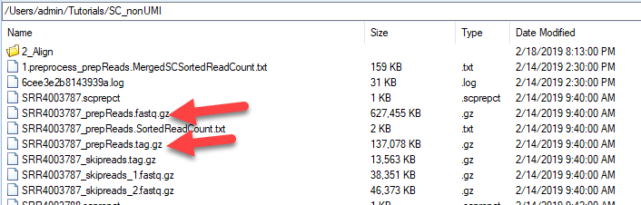

# Pre-Process

## Pre-process

Compared to normal fastq files, Single-Cell RNASeq fastq files contain extra information for barcode and Unique Molecular Identifiers (UMIs). The purpose of pre-processing fastq files is to extract these features from fastq files, and store them into a tag file.

This module can be accessed by going to **NGS | SingleCell RNA-Seq | Single Cell Preprocessing:**

Click **Add** to find all fastq files for these 32 samples (64 fastq files). Leave **Quality encoding** as Automatic to automatically set the correct quality encoding method (this tutorial has fastq files with the Sanger method of quality encoding). Specify **Job Number** as the number of processes to run in parallel. Specify the output folder where the results files (.fastq.gz and .tag.gz) will be saved, otherwise the files will go to the project folder by default.

Check the option for **Reads are paired** as we are using paired end data in this tutorial, and check the option for **Reads contain UMI**. Leave the box for **Demultiplex with cell barcode** empty here, as we don’t want to demultiplex at fastq file level, which will generate too many files.

## Barcode UMI Source

In the **Barcode/UMI Source** section, check the option for **Read Sequences** as the barcode and UMI are included in the read1 for our data, then click **R1 pattern** to bring up the regular expression window:

For our testing data, in the read 1 files, the first **8** basepairs are the Cel-Seq **cell barcodes**, and the following **4** basepairs are random basepairs of the **unique molecular identifier**. We can modify the length for barcode and UMI like this in the box, and click **Match**, user can see how the fastq read1 sequences get mapped by this regular expression pattern:

Click **OK** will bring this regular expression phrase to the Single Cell Preprocessing window. In the last option, choose **Read2** as the read sequence exists in Read2 for our testing data.

Click **Send To Queue** to run this job on server.
When the job is done, user can find four files generated for each sample in the output folder:

Mainly, we will use **\_prepReads.fastq.gz** file and **\_prepReads.tag.gz** file for the following analysis.

## Filter Raw reads

After the pre-processing of SC fastq files (resulting **prepReads.fastq.gz** and **\_prepReads.tag.gz** files), user can filter the reads based on several criteria as follows:
  1. Fastq read sequence quality
  2. A valid barcode list to filter for the barcode in the tag file for valid read
  3. A barcode remap file to group different barcode sequences (normally containing 1 mismatch) to be the same barcode
  4. Filter reads by cell barcode quality (General tab)
  5. Filter reads by UMI quality (General tab)

To open this module, user can go to **Analysis | NGS | Single Cell RNA-Seq | Filter Single Cell Raw Reads**.

Click Add to find all 32 files, pay attention to the files names, and make sure you are loading the *.prepReads.fastq.gz* files. Specify Job Number as the number of processes to run in parallel. Specify the output folder where the results files (.ngs) will be saved, otherwise the files will go the project folder by default.

In this window, user can provide a ValidBarcode list if they have such list to verify valid barcode sequence, and provide a barcode remap file to group different barcode sequence to be the same barcode. For out tutorial project, the valid barcode list can be found in the GEO website: https://www.ncbi.nlm.nih.gov/geo/download/?acc=GSE85241&format=file&file=GSE85241%5Freadme%5Fdemultiplexing%5FCel%2Dseq%5Fdata%2Epdf%2Egz. To make it more convenient, we have created a *validbarcode.txt* file on our server and user can go to this link (http://omicsoft.com/downloads/data/Tutorial/Help/SCTest/) to download the *GSE85241_ValidBarcode.txt* to your local folder.

**Browse** to load the downloaded **GSE85241_validbarcode.txt** file. Check the option for **Filter reads with cell barcode quality** and **Filter reads with UMI quality**.

Leave the box for **“Reads are paired”** empty, and check **Read2** for **Single end read source**, as our fastq data is originated from paired end data and Read2 is read source.

Click **Send To Queue** to run the module on server.

When the job is done, user will be able to see 5 files generated for each sample:

The **prepReads.filter.fastq.gz** file and **filterReads.filter.tag.gz** files will be used for the following analysis. User can move the rest of the files into a sub-folder for better management.
